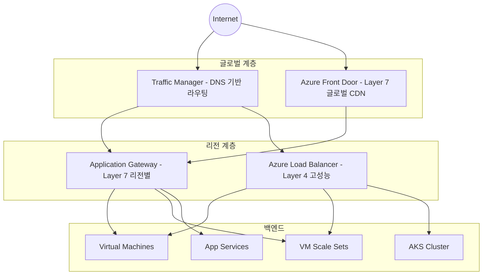
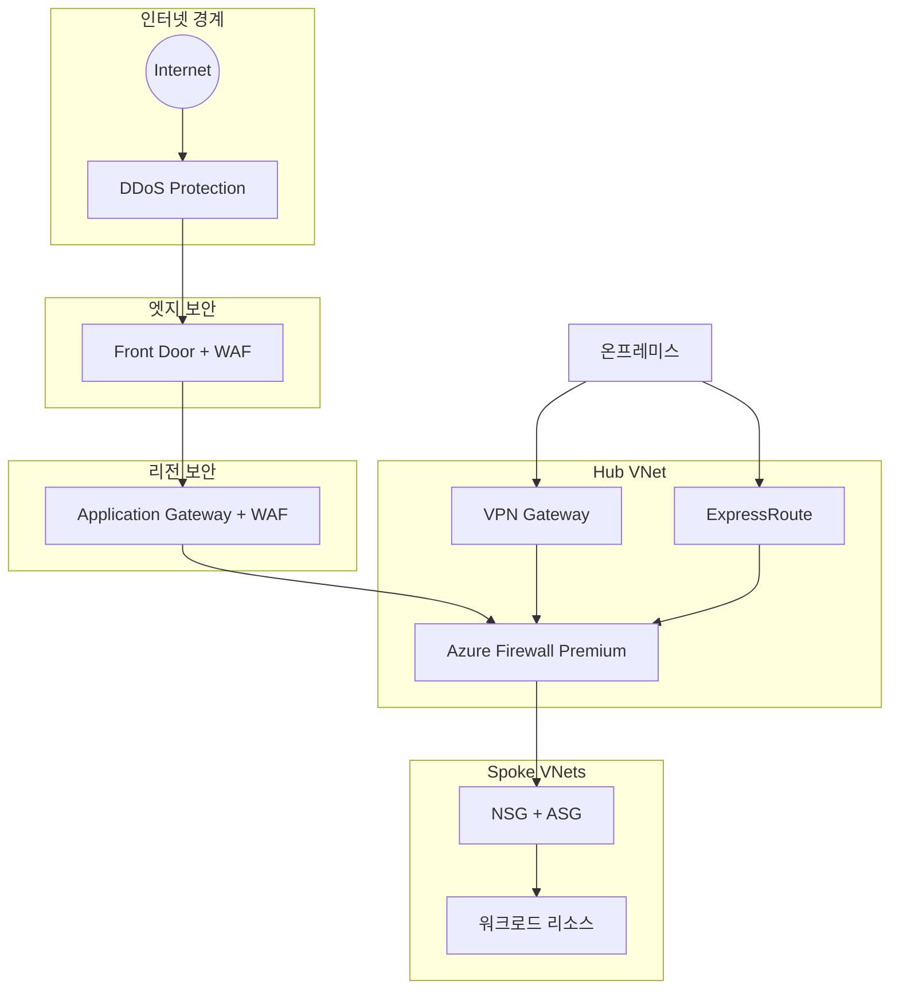
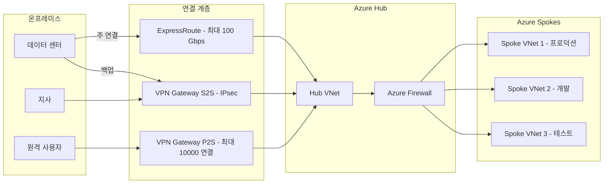
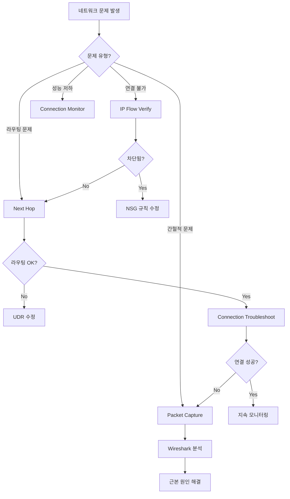
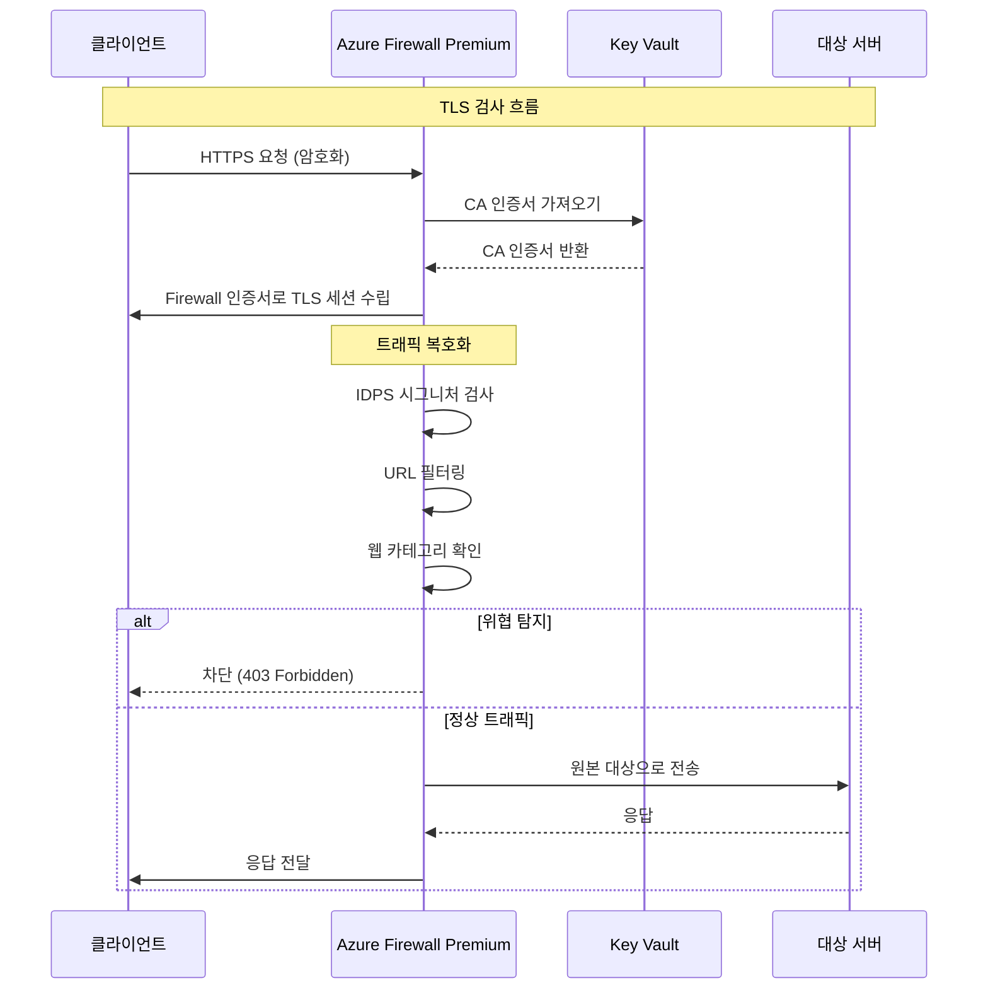
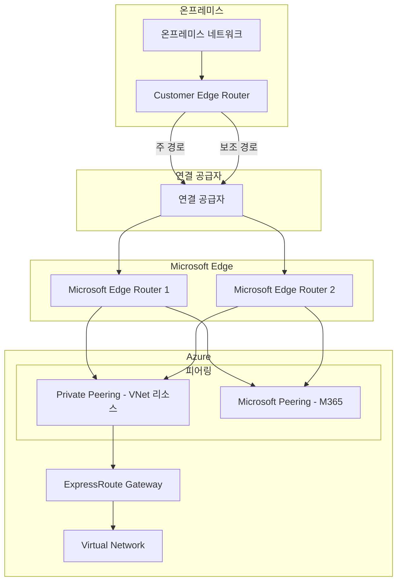
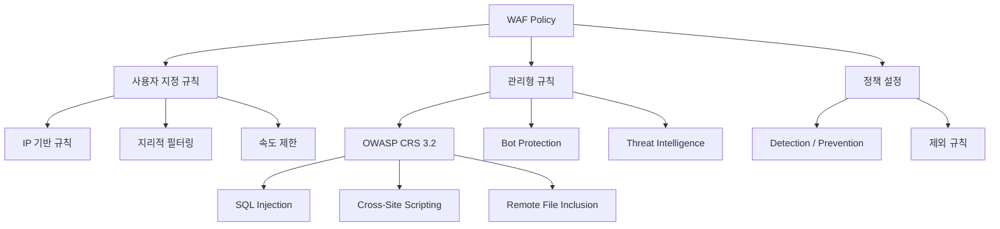
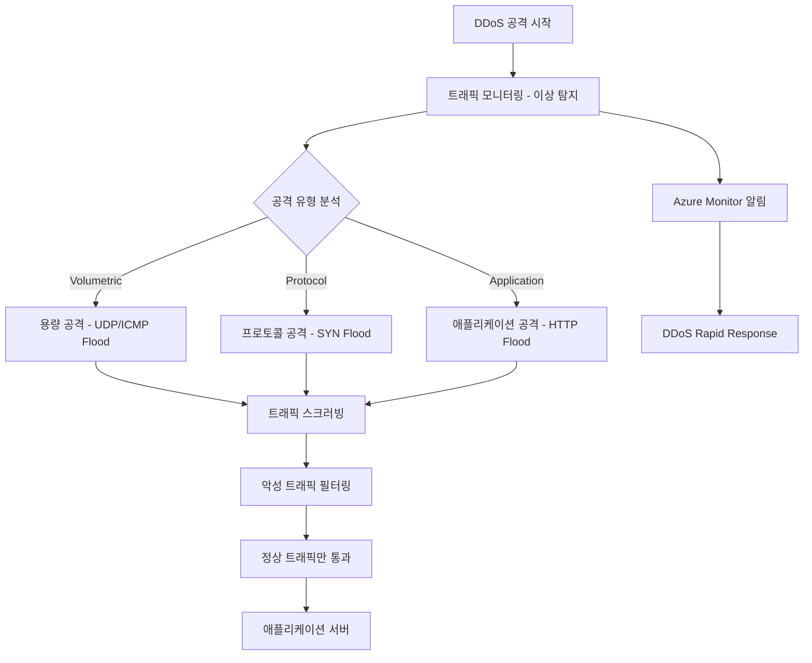

## 개요

Azure 네트워킹 서비스의 핵심 개념과 아키텍처를 Mermaid 다이어그램으로 시각화합니다.

## 1. 부하분산 서비스 계층 구조



## 2. 보안 서비스 통합 아키텍처



## 3. 하이브리드 네트워크 연결



## 4. Network Watcher 진단 흐름



## 5. Azure Firewall Premium TLS 검사 흐름



## 6. ExpressRoute 아키텍처



## 7. WAF 정책 구조



## 8. DDoS Protection 완화 흐름



## 네트워크 설계 모범 사례

### IP 주소 계획

```
Hub VNet: 10.0.0.0/16
  - GatewaySubnet: 10.0.255.0/27
  - AzureFirewallSubnet: 10.0.254.0/26
  - Management: 10.0.1.0/24

Spoke VNet 1: 10.1.0.0/16
  - Web Tier: 10.1.1.0/24
  - App Tier: 10.1.2.0/24
  - Data Tier: 10.1.3.0/24
```

### NSG 규칙 설계 원칙

```
Priority 100: Allow HTTPS from Internet
Priority 200: Allow RDP from Management Subnet
Priority 300: Allow SQL from App Subnet
Priority 4096: Deny All (기본 규칙)
```

## 참고 자료

- [Azure 네트워킹 문서](https://learn.microsoft.com/azure/networking/)
- [Azure 아키텍처 센터](https://learn.microsoft.com/azure/architecture/)
- [AZ-700: Azure 네트워크 엔지니어 인증](https://learn.microsoft.com/certifications/azure-network-engineer-associate/)
- [Mermaid Live Editor](https://mermaid.live/)
