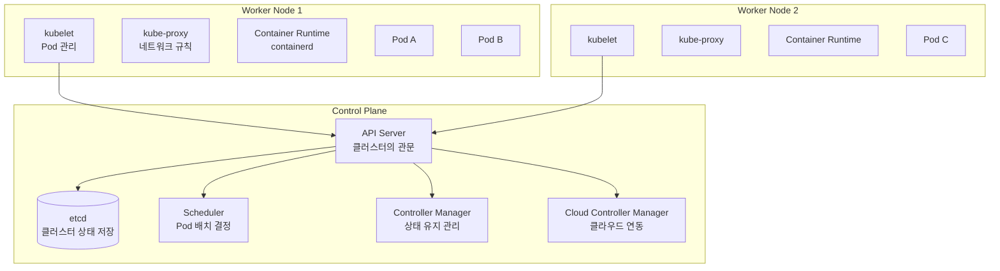
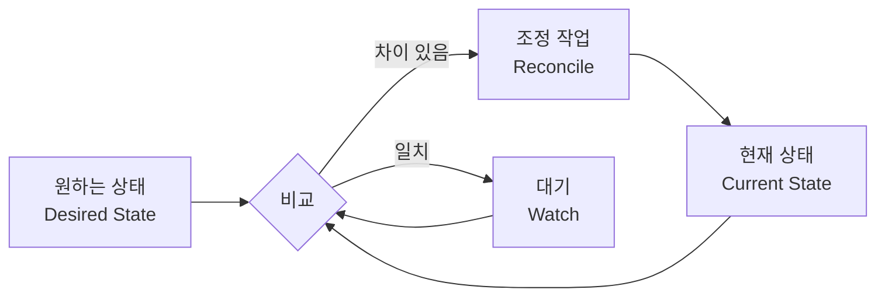
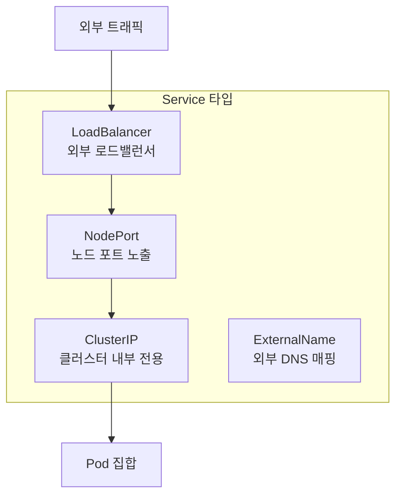
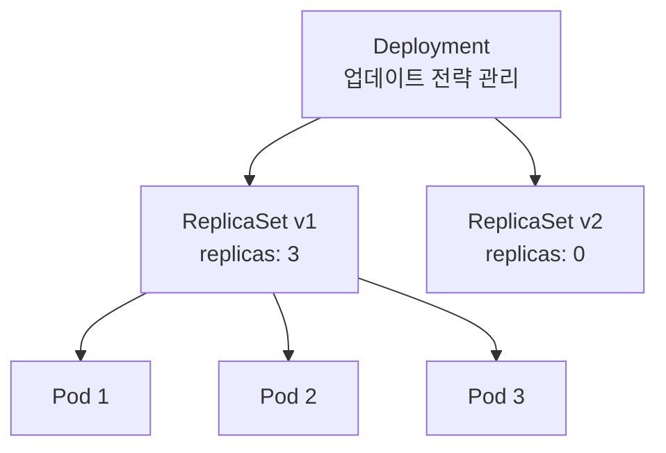
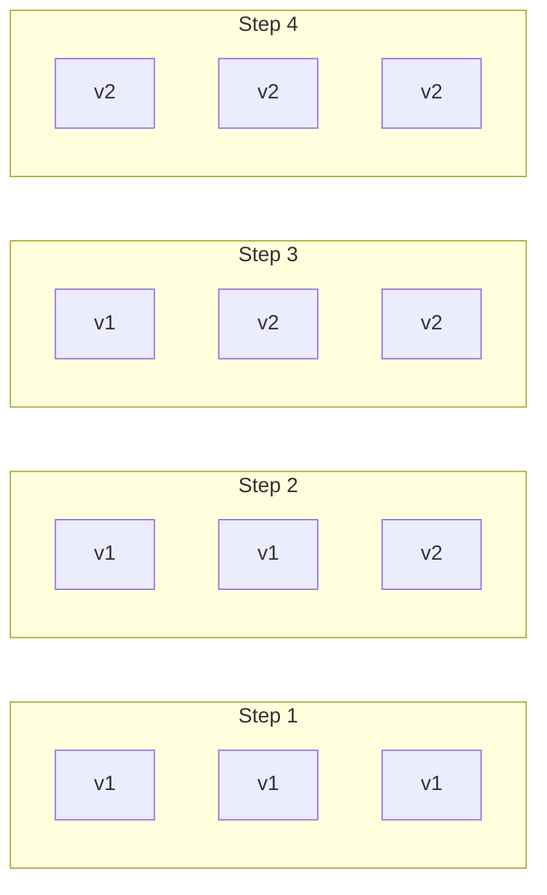

## 쿠버네티스란?

쿠버네티스(Kubernetes, K8s)는 컨테이너화된 애플리케이션의 배포, 확장, 관리를 자동화하는 오픈소스 컨테이너 오케스트레이션 플랫폼입니다. Google이 내부에서 사용하던 Borg 시스템을 기반으로 개발했으며, 현재 CNCF(Cloud Native Computing Foundation)에서 관리합니다.

## 아키텍처 개요

쿠버네티스 클러스터는 **컨트롤 플레인(Control Plane)**과 **워커 노드(Worker Node)**로 구성됩니다.



### 컨트롤 플레인 컴포넌트

| 컴포넌트 | 역할 |
|----------|------|
| **API Server** | 모든 요청의 진입점. REST API를 통해 클러스터와 상호작용 |
| **etcd** | 클러스터의 모든 상태를 저장하는 분산 키-값 저장소 |
| **Scheduler** | 새로운 Pod를 어떤 노드에 배치할지 결정 |
| **Controller Manager** | Deployment, ReplicaSet 등의 상태를 원하는 상태로 유지 |
| **Cloud Controller Manager** | 클라우드 제공자(AWS, Azure, GCP)와 연동 |

### 워커 노드 컴포넌트

| 컴포넌트 | 역할 |
|----------|------|
| **kubelet** | 노드에서 Pod의 생명주기를 관리하는 에이전트 |
| **kube-proxy** | 서비스의 네트워크 규칙을 관리 (iptables/IPVS) |
| **Container Runtime** | 실제 컨테이너를 실행 (containerd, CRI-O) |

### 선언적 구성과 컨트롤 루프

쿠버네티스의 핵심 철학은 **선언적(Declarative)** 구성입니다. "3개의 nginx Pod를 실행해라"라고 원하는 상태를 선언하면, 컨트롤러가 현재 상태를 지속적으로 감시하며 원하는 상태로 맞춥니다.



---

## Pod: 가장 작은 배포 단위

**Pod**는 쿠버네티스에서 생성하고 관리할 수 있는 가장 작은 배포 단위입니다. 하나 이상의 컨테이너를 포함하며, 같은 Pod 내의 컨테이너들은 네트워크와 스토리지를 공유합니다.

### Pod의 특징

- 같은 Pod 내 컨테이너는 `localhost`로 통신
- 같은 Pod 내 컨테이너는 볼륨을 공유
- Pod는 일시적(ephemeral) — 언제든 삭제되고 재생성될 수 있음
- 각 Pod는 고유한 IP 주소를 가짐

### Pod 정의 예제

```yaml
apiVersion: v1
kind: Pod
metadata:
  name: nginx-pod
  labels:
    app: nginx
spec:
  containers:
  - name: nginx
    image: nginx:1.21
    ports:
    - containerPort: 80
    resources:
      requests:
        cpu: 100m
        memory: 128Mi
      limits:
        cpu: 250m
        memory: 256Mi
```

### Pod 라이프사이클

| 상태 | 설명 |
|------|------|
| **Pending** | Pod가 생성되었지만 아직 스케줄링되지 않음 |
| **Running** | Pod가 노드에 바인딩되고 컨테이너가 실행 중 |
| **Succeeded** | 모든 컨테이너가 성공적으로 종료 |
| **Failed** | 하나 이상의 컨테이너가 실패로 종료 |
| **Unknown** | Pod 상태를 확인할 수 없음 (노드 통신 장애) |

### 멀티 컨테이너 패턴

하나의 Pod에 여러 컨테이너를 넣는 대표적인 패턴:

| 패턴 | 설명 | 예시 |
|------|------|------|
| **Sidecar** | 메인 컨테이너를 보조 | 로그 수집기, 프록시 |
| **Ambassador** | 외부 통신을 대리 | DB 프록시, API 게이트웨이 |
| **Adapter** | 출력 형식을 변환 | 로그 포맷 변환, 메트릭 변환 |

### Init Container

메인 컨테이너 실행 전에 초기화 작업을 수행하는 컨테이너입니다.

```yaml
spec:
  initContainers:
  - name: init-db
    image: busybox
    command: ['sh', '-c', 'until nslookup mydb; do echo waiting; sleep 2; done']
  containers:
  - name: app
    image: myapp:1.0
```

---

## Service: 네트워킹과 서비스 디스커버리

Pod는 일시적이므로 IP가 변할 수 있습니다. **Service**는 Pod 집합에 대한 안정적인 네트워크 엔드포인트를 제공합니다.

### Service가 필요한 이유

- Pod IP는 재시작 시 변경됨
- 여러 Pod에 대한 로드 밸런싱 필요
- 서비스 디스커버리 (이름으로 접근)

### Service 타입



| 타입 | 설명 | 사용 사례 |
|------|------|----------|
| **ClusterIP** | 클러스터 내부에서만 접근 가능 (기본값) | 내부 마이크로서비스 간 통신 |
| **NodePort** | 모든 노드의 특정 포트로 외부 노출 (30000-32767) | 개발/테스트 환경 |
| **LoadBalancer** | 클라우드 로드밸런서를 자동 프로비저닝 | 프로덕션 외부 서비스 |
| **ExternalName** | 외부 DNS 이름을 클러스터 내부 이름으로 매핑 | 외부 서비스 참조 |

### Service 정의 예제

```yaml
apiVersion: v1
kind: Service
metadata:
  name: nginx-service
spec:
  type: ClusterIP
  selector:
    app: nginx          # 이 레이블을 가진 Pod에 트래픽 전달
  ports:
  - protocol: TCP
    port: 80            # Service 포트
    targetPort: 80      # Pod 컨테이너 포트
```

### 서비스 디스커버리

쿠버네티스는 두 가지 서비스 디스커버리 방식을 제공합니다:

1. **DNS**: `<서비스명>.<네임스페이스>.svc.cluster.local`
2. **환경 변수**: Pod 생성 시 같은 네임스페이스의 Service 정보가 환경 변수로 주입

```bash
# DNS로 서비스 접근
$ curl http://nginx-service.default.svc.cluster.local

# 다른 네임스페이스의 서비스 접근 (FQDN)
$ curl http://nginx-service.production.svc.cluster.local
```

### Headless Service

`clusterIP: None`으로 설정하면 로드밸런싱 없이 개별 Pod IP를 직접 반환합니다. StatefulSet과 함께 사용하여 각 Pod에 직접 접근할 때 유용합니다.

```yaml
apiVersion: v1
kind: Service
metadata:
  name: db-headless
spec:
  clusterIP: None
  selector:
    app: database
  ports:
  - port: 5432
```

---

## Deployment: 애플리케이션 라이프사이클 관리

**Deployment**는 Pod의 선언적 업데이트를 관리합니다. ReplicaSet을 통해 원하는 수의 Pod를 유지하고, 롤링 업데이트와 롤백을 지원합니다.

### Deployment → ReplicaSet → Pod 계층 구조



### Deployment 정의 예제

```yaml
apiVersion: apps/v1
kind: Deployment
metadata:
  name: nginx-deployment
spec:
  replicas: 3
  selector:
    matchLabels:
      app: nginx
  strategy:
    type: RollingUpdate
    rollingUpdate:
      maxSurge: 1            # 업데이트 중 추가 생성 가능한 Pod 수
      maxUnavailable: 1      # 업데이트 중 사용 불가능한 Pod 수
  template:
    metadata:
      labels:
        app: nginx
    spec:
      containers:
      - name: nginx
        image: nginx:1.21
        ports:
        - containerPort: 80
```

### 업데이트 전략

| 전략 | 설명 | 다운타임 |
|------|------|---------|
| **RollingUpdate** | 점진적으로 새 버전으로 교체 (기본값) | 없음 |
| **Recreate** | 기존 Pod를 모두 삭제 후 새로 생성 | 있음 |

### 롤링 업데이트 과정



### 주요 명령어

```bash
# 이미지 업데이트
$ kubectl set image deployment/nginx-deployment nginx=nginx:1.22

# 롤아웃 상태 확인
$ kubectl rollout status deployment/nginx-deployment

# 롤아웃 히스토리
$ kubectl rollout history deployment/nginx-deployment

# 이전 버전으로 롤백
$ kubectl rollout undo deployment/nginx-deployment

# 특정 리비전으로 롤백
$ kubectl rollout undo deployment/nginx-deployment --to-revision=2

# 스케일링
$ kubectl scale deployment/nginx-deployment --replicas=5

# 일시 중지 / 재개
$ kubectl rollout pause deployment/nginx-deployment
$ kubectl rollout resume deployment/nginx-deployment
```

---

## kubectl: 쿠버네티스 명령줄 도구

**kubectl**은 쿠버네티스 클러스터와 상호작용하는 CLI 도구입니다.

### 명령어 구조

```
kubectl [command] [TYPE] [NAME] [flags]
```

### 주요 명령어 분류

#### 조회 명령어

```bash
# 리소스 목록 조회
$ kubectl get pods
$ kubectl get pods -o wide              # 상세 정보 (노드, IP)
$ kubectl get pods -o yaml              # YAML 형식
$ kubectl get pods -l app=nginx         # 레이블 필터링
$ kubectl get all                       # 모든 리소스

# 리소스 상세 정보
$ kubectl describe pod nginx-pod

# 리소스 사용량
$ kubectl top pods
$ kubectl top nodes
```

#### 생성/수정 명령어

```bash
# 리소스 생성 (선언적)
$ kubectl apply -f deployment.yaml

# 리소스 생성 (명령적)
$ kubectl create deployment nginx --image=nginx

# 리소스 삭제
$ kubectl delete pod nginx-pod
$ kubectl delete -f deployment.yaml

# 리소스 수정
$ kubectl edit deployment nginx-deployment
$ kubectl patch deployment nginx-deployment -p '{"spec":{"replicas":5}}'
```

#### 디버깅 명령어

```bash
# 로그 확인
$ kubectl logs nginx-pod
$ kubectl logs nginx-pod -c sidecar     # 특정 컨테이너
$ kubectl logs nginx-pod -f             # 실시간 로그
$ kubectl logs nginx-pod --previous     # 이전 컨테이너 로그

# 컨테이너 접속
$ kubectl exec -it nginx-pod -- /bin/bash

# 포트 포워딩
$ kubectl port-forward pod/nginx-pod 8080:80
$ kubectl port-forward svc/nginx-service 8080:80

# 파일 복사
$ kubectl cp nginx-pod:/var/log/nginx/access.log ./access.log
```

#### 유용한 명령어

```bash
# API 리소스 목록
$ kubectl api-resources

# 리소스 설명
$ kubectl explain pod.spec.containers

# 컨텍스트 관리
$ kubectl config get-contexts
$ kubectl config use-context my-cluster

# 출력 형식
$ kubectl get pods -o json
$ kubectl get pods -o jsonpath='{.items[*].metadata.name}'
$ kubectl get pods -o custom-columns=NAME:.metadata.name,STATUS:.status.phase
```

---

## Namespace: 리소스 격리와 관리

**Namespace**는 하나의 클러스터를 논리적으로 분리하여 리소스를 격리하는 메커니즘입니다.

### 기본 네임스페이스

| 네임스페이스 | 용도 |
|-------------|------|
| **default** | 네임스페이스를 지정하지 않으면 사용되는 기본 공간 |
| **kube-system** | 쿠버네티스 시스템 컴포넌트 (CoreDNS, kube-proxy 등) |
| **kube-public** | 모든 사용자가 읽을 수 있는 공개 리소스 |
| **kube-node-lease** | 노드 하트비트를 위한 Lease 객체 |

### 네임스페이스 활용

```bash
# 네임스페이스 생성
$ kubectl create namespace production

# 특정 네임스페이스에 리소스 생성
$ kubectl apply -f deployment.yaml -n production

# 기본 네임스페이스 변경
$ kubectl config set-context --current --namespace=production
```

### 네임스페이스 간 통신

같은 네임스페이스 내에서는 서비스 이름만으로 접근 가능하지만, 다른 네임스페이스의 서비스에 접근하려면 FQDN을 사용합니다:

```
<서비스명>.<네임스페이스>.svc.cluster.local
```

### ResourceQuota와 LimitRange

네임스페이스별로 리소스 사용량을 제한할 수 있습니다:

```yaml
# ResourceQuota: 네임스페이스 전체 리소스 제한
apiVersion: v1
kind: ResourceQuota
metadata:
  name: compute-quota
  namespace: production
spec:
  hard:
    requests.cpu: "4"
    requests.memory: 8Gi
    limits.cpu: "8"
    limits.memory: 16Gi
    pods: "20"
---
# LimitRange: 개별 Pod/Container 기본값 및 제한
apiVersion: v1
kind: LimitRange
metadata:
  name: default-limits
  namespace: production
spec:
  limits:
  - default:
      cpu: 500m
      memory: 512Mi
    defaultRequest:
      cpu: 100m
      memory: 128Mi
    type: Container
```

---

## 정리

쿠버네티스의 기초 개념을 정리하면:

| 개념 | 핵심 역할 |
|------|----------|
| **Pod** | 컨테이너를 실행하는 가장 작은 단위 |
| **Service** | Pod에 대한 안정적인 네트워크 엔드포인트 |
| **Deployment** | Pod의 선언적 업데이트와 롤링 배포 |
| **kubectl** | 클러스터와 상호작용하는 CLI 도구 |
| **Namespace** | 리소스를 논리적으로 격리하는 가상 클러스터 |

이 기초 개념을 바탕으로 중급 주제(ConfigMap, Volume, StatefulSet, Ingress, HPA 등)로 확장해 나갈 수 있습니다.
