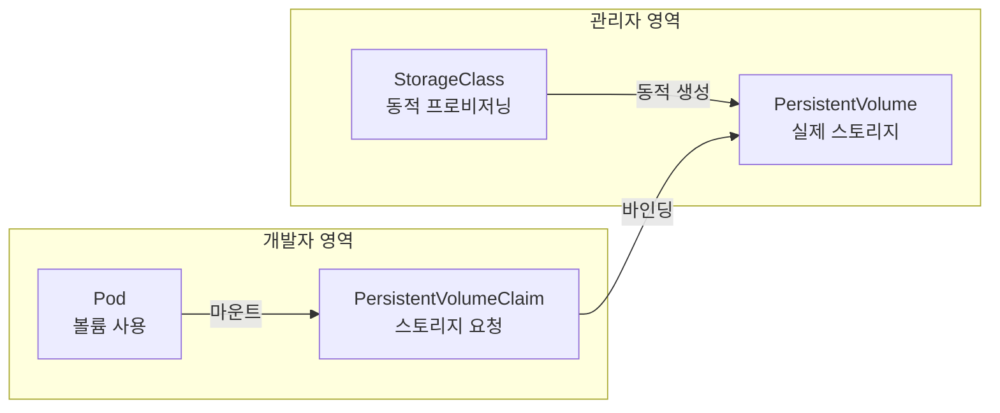
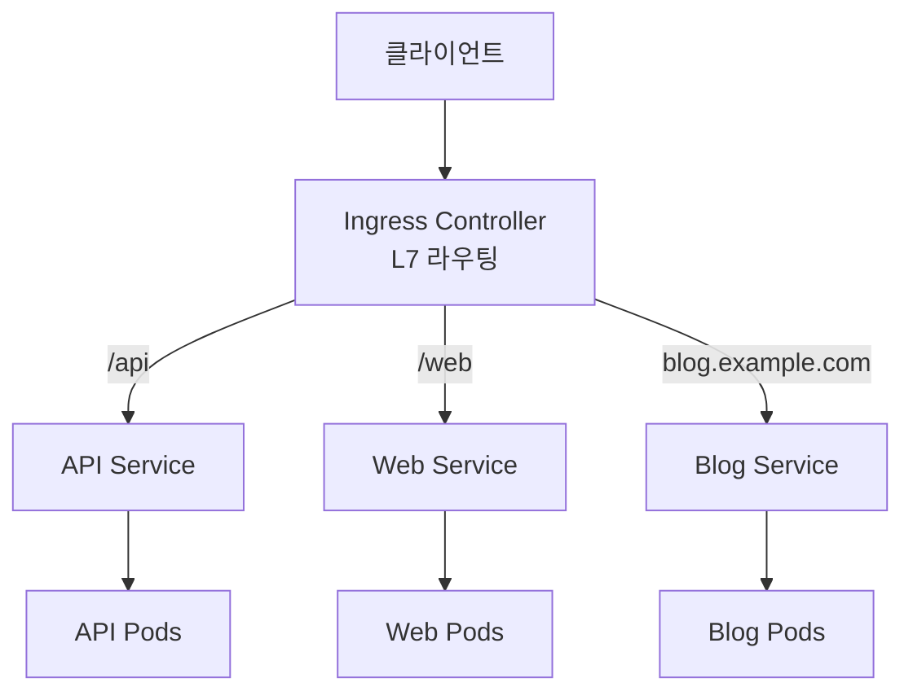
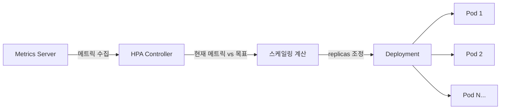

## ConfigMap과 Secret: 설정 관리

애플리케이션의 설정 데이터를 컨테이너 이미지와 분리하여 관리하는 것은 12-Factor App의 핵심 원칙입니다. 쿠버네티스는 **ConfigMap**과 **Secret**을 통해 이를 구현합니다.

### ConfigMap

ConfigMap은 키-값 쌍으로 비밀이 아닌 설정 데이터를 저장합니다.

#### 생성 방법

```bash
# 리터럴 값으로 생성
$ kubectl create configmap app-config \
    --from-literal=DB_HOST=mysql.default.svc \
    --from-literal=DB_PORT=3306

# 파일에서 생성
$ kubectl create configmap nginx-config --from-file=nginx.conf

# env 파일에서 생성
$ kubectl create configmap env-config --from-env-file=app.env
```

#### YAML 정의

```yaml
apiVersion: v1
kind: ConfigMap
metadata:
  name: app-config
data:
  DB_HOST: "mysql.default.svc"
  DB_PORT: "3306"
  app.properties: |
    server.port=8080
    logging.level=INFO
    cache.ttl=300
```

#### 사용 방법

**환경 변수로 주입:**

```yaml
spec:
  containers:
  - name: app
    image: myapp:1.0
    envFrom:
    - configMapRef:
        name: app-config    # 모든 키를 환경 변수로 주입
    env:
    - name: DATABASE_HOST
      valueFrom:
        configMapKeyRef:
          name: app-config
          key: DB_HOST       # 특정 키만 선택적으로 주입
```

**볼륨으로 마운트:**

```yaml
spec:
  containers:
  - name: app
    image: myapp:1.0
    volumeMounts:
    - name: config-volume
      mountPath: /etc/config
    - name: config-file
      mountPath: /etc/nginx/nginx.conf
      subPath: nginx.conf    # 특정 파일만 마운트 (디렉토리 덮어쓰기 방지)
  volumes:
  - name: config-volume
    configMap:
      name: app-config
  - name: config-file
    configMap:
      name: nginx-config
```

#### Immutable ConfigMap

`immutable: true`로 설정하면 변경이 불가능해지며, kubelet의 Watch 부하를 줄여 성능이 향상됩니다.

```yaml
apiVersion: v1
kind: ConfigMap
metadata:
  name: stable-config
immutable: true
data:
  VERSION: "2.1.0"
```

### Secret

Secret은 비밀번호, 토큰, 인증서 등 민감한 데이터를 저장합니다. Base64로 인코딩되어 저장되며, etcd에서 암호화할 수 있습니다.

#### Secret 타입

| 타입 | 용도 |
|------|------|
| `Opaque` | 일반적인 키-값 쌍 (기본값) |
| `kubernetes.io/dockerconfigjson` | Docker 레지스트리 인증 정보 |
| `kubernetes.io/tls` | TLS 인증서와 키 |
| `kubernetes.io/basic-auth` | 기본 인증 자격 증명 |
| `kubernetes.io/ssh-auth` | SSH 인증 자격 증명 |

#### 생성 및 사용

```bash
# 리터럴 값으로 생성
$ kubectl create secret generic db-secret \
    --from-literal=username=admin \
    --from-literal=password=s3cur3P@ss

# TLS Secret 생성
$ kubectl create secret tls tls-secret \
    --cert=tls.crt --key=tls.key

# Docker 레지스트리 Secret
$ kubectl create secret docker-registry regcred \
    --docker-server=myregistry.azurecr.io \
    --docker-username=user \
    --docker-password=pass
```

```yaml
apiVersion: v1
kind: Secret
metadata:
  name: db-secret
type: Opaque
data:
  username: YWRtaW4=          # echo -n 'admin' | base64
  password: czNjdXIzUEBzcw==  # echo -n 's3cur3P@ss' | base64
```

#### Secret 보안 모범 사례

- etcd 암호화 활성화 (`EncryptionConfiguration`)
- RBAC으로 Secret 접근 제한
- 외부 Secret 관리 도구 연동 (Azure Key Vault, HashiCorp Vault)
- `stringData` 필드를 사용하면 Base64 인코딩 없이 평문으로 작성 가능

---

## Volume과 Storage: 영구 데이터 관리

컨테이너는 기본적으로 일시적(ephemeral)입니다. Pod가 삭제되면 컨테이너 내부의 데이터도 사라집니다. 쿠버네티스의 볼륨 시스템은 이 문제를 해결합니다.

### 볼륨 타입

#### emptyDir

Pod가 노드에 할당될 때 생성되고, Pod가 삭제되면 함께 삭제됩니다. 같은 Pod 내 컨테이너 간 데이터 공유에 사용합니다.

```yaml
spec:
  containers:
  - name: app
    volumeMounts:
    - name: shared-data
      mountPath: /data
  - name: sidecar
    volumeMounts:
    - name: shared-data
      mountPath: /logs
  volumes:
  - name: shared-data
    emptyDir:
      medium: Memory    # 메모리 기반 (tmpfs), 생략하면 디스크
      sizeLimit: 256Mi
```

#### hostPath

노드의 파일 시스템을 Pod에 마운트합니다. 노드 종속적이므로 프로덕션에서는 권장하지 않습니다.

```yaml
volumes:
- name: host-volume
  hostPath:
    path: /var/log/containers
    type: DirectoryOrCreate  # Directory, File, FileOrCreate 등
```

### PersistentVolume (PV)과 PersistentVolumeClaim (PVC)

PV/PVC는 스토리지의 프로비저닝과 소비를 분리하는 추상화 계층입니다.



#### PV/PVC 라이프사이클

1. **Provisioning**: 정적(수동 생성) 또는 동적(StorageClass 자동 생성)
2. **Binding**: PVC의 요청과 PV의 용량/접근 모드가 일치하면 바인딩
3. **Using**: Pod에서 PVC를 볼륨으로 마운트하여 사용
4. **Reclaiming**: PVC 삭제 후 PV 처리 정책 적용

#### 접근 모드

| 모드 | 약어 | 설명 |
|------|------|------|
| ReadWriteOnce | RWO | 단일 노드에서 읽기/쓰기 |
| ReadOnlyMany | ROX | 여러 노드에서 읽기 전용 |
| ReadWriteMany | RWX | 여러 노드에서 읽기/쓰기 |
| ReadWriteOncePod | RWOP | 단일 Pod에서만 읽기/쓰기 (K8s 1.22+) |

#### Reclaim Policy

| 정책 | 동작 |
|------|------|
| **Retain** | PVC 삭제 후 PV와 데이터 보존 (수동 정리 필요) |
| **Delete** | PVC 삭제 시 PV와 외부 스토리지도 함께 삭제 |
| **Recycle** | 데이터 삭제 후 PV 재사용 (deprecated) |

#### StorageClass와 동적 프로비저닝

```yaml
apiVersion: storage.k8s.io/v1
kind: StorageClass
metadata:
  name: azure-premium
provisioner: disk.csi.azure.com
parameters:
  skuName: Premium_LRS
  cachingmode: ReadOnly
reclaimPolicy: Delete
allowVolumeExpansion: true    # 볼륨 확장 허용
volumeBindingMode: WaitForFirstConsumer  # Pod 스케줄링 후 바인딩
---
apiVersion: v1
kind: PersistentVolumeClaim
metadata:
  name: data-pvc
spec:
  accessModes: [ReadWriteOnce]
  storageClassName: azure-premium
  resources:
    requests:
      storage: 50Gi
```

#### 볼륨 스냅샷

```yaml
apiVersion: snapshot.storage.k8s.io/v1
kind: VolumeSnapshot
metadata:
  name: data-snapshot
spec:
  volumeSnapshotClassName: azure-snapshot-class
  source:
    persistentVolumeClaimName: data-pvc
```

---

## StatefulSet: 상태 유지 워크로드

**StatefulSet**은 데이터베이스, 메시지 큐 등 상태를 유지해야 하는 애플리케이션을 위한 워크로드 리소스입니다.

### Deployment vs StatefulSet

| 특성 | Deployment | StatefulSet |
|------|-----------|-------------|
| Pod 이름 | 랜덤 해시 (nginx-7d4f8b) | 순차 인덱스 (mysql-0, mysql-1) |
| 네트워크 ID | 불안정 | 안정적 (Headless Service) |
| 스토리지 | 공유 또는 없음 | Pod별 전용 PVC |
| 배포 순서 | 동시 | 순차적 (0 → 1 → 2) |
| 종료 순서 | 동시 | 역순 (2 → 1 → 0) |
| 스케일 다운 | 임의 Pod 삭제 | 가장 높은 인덱스부터 |

### StatefulSet 정의

```yaml
apiVersion: v1
kind: Service
metadata:
  name: mysql-headless
spec:
  clusterIP: None          # Headless Service
  selector:
    app: mysql
  ports:
  - port: 3306
---
apiVersion: apps/v1
kind: StatefulSet
metadata:
  name: mysql
spec:
  serviceName: mysql-headless    # Headless Service 연결
  replicas: 3
  selector:
    matchLabels:
      app: mysql
  template:
    metadata:
      labels:
        app: mysql
    spec:
      containers:
      - name: mysql
        image: mysql:8.0
        ports:
        - containerPort: 3306
        volumeMounts:
        - name: data
          mountPath: /var/lib/mysql
        env:
        - name: MYSQL_ROOT_PASSWORD
          valueFrom:
            secretKeyRef:
              name: mysql-secret
              key: root-password
  volumeClaimTemplates:          # Pod별 전용 PVC 자동 생성
  - metadata:
      name: data
    spec:
      accessModes: [ReadWriteOnce]
      storageClassName: azure-premium
      resources:
        requests:
          storage: 20Gi
```

### 안정적인 네트워크 ID

각 Pod는 예측 가능한 DNS 이름을 가집니다:

```
<pod-name>.<headless-service>.<namespace>.svc.cluster.local

# 예시
mysql-0.mysql-headless.default.svc.cluster.local
mysql-1.mysql-headless.default.svc.cluster.local
mysql-2.mysql-headless.default.svc.cluster.local
```

### Pod 관리 정책

| 정책 | 동작 |
|------|------|
| `OrderedReady` (기본) | 순차적 생성/삭제, 이전 Pod가 Ready여야 다음 생성 |
| `Parallel` | 모든 Pod를 동시에 생성/삭제 |

### 업데이트 전략

```yaml
spec:
  updateStrategy:
    type: RollingUpdate
    rollingUpdate:
      partition: 2    # 인덱스 2 이상만 업데이트 (카나리 배포)
```

---

## DaemonSet과 Job/CronJob

### DaemonSet

**DaemonSet**은 모든 (또는 특정) 노드에 Pod를 하나씩 실행합니다. 노드가 추가되면 자동으로 Pod가 배포됩니다.

#### 사용 사례

- 로그 수집 에이전트 (Fluentd, Filebeat)
- 모니터링 에이전트 (Prometheus Node Exporter)
- 네트워크 플러그인 (Calico, Cilium)
- 스토리지 데몬

```yaml
apiVersion: apps/v1
kind: DaemonSet
metadata:
  name: fluentd
spec:
  selector:
    matchLabels:
      app: fluentd
  template:
    metadata:
      labels:
        app: fluentd
    spec:
      tolerations:
      - key: node-role.kubernetes.io/control-plane
        effect: NoSchedule     # 컨트롤 플레인에도 배포
      containers:
      - name: fluentd
        image: fluentd:v1.16
        resources:
          limits:
            memory: 200Mi
          requests:
            cpu: 100m
            memory: 200Mi
        volumeMounts:
        - name: varlog
          mountPath: /var/log
      volumes:
      - name: varlog
        hostPath:
          path: /var/log
```

#### 업데이트 전략

| 전략 | 동작 |
|------|------|
| `RollingUpdate` (기본) | 한 번에 하나씩 교체 (`maxUnavailable` 설정 가능) |
| `OnDelete` | 수동으로 Pod 삭제 시에만 업데이트 |

### Job

**Job**은 한 번 실행하고 완료되는 작업을 관리합니다.

```yaml
apiVersion: batch/v1
kind: Job
metadata:
  name: data-migration
spec:
  completions: 5        # 총 5번 성공해야 완료
  parallelism: 2        # 동시에 2개 Pod 실행
  backoffLimit: 3       # 최대 3번 재시도
  activeDeadlineSeconds: 600  # 10분 타임아웃
  template:
    spec:
      restartPolicy: Never    # Job에서는 Never 또는 OnFailure
      containers:
      - name: migration
        image: migration-tool:1.0
        command: ["python", "migrate.py"]
```

#### Job 완료 패턴

| 패턴 | completions | parallelism | 설명 |
|------|-------------|-------------|------|
| 단일 실행 | 1 | 1 | 하나의 Pod가 한 번 실행 |
| 고정 완료 횟수 | N | M | N번 성공할 때까지 M개씩 병렬 실행 |
| 작업 큐 | 미설정 | M | 외부 큐가 빌 때까지 실행 |

### CronJob

**CronJob**은 스케줄에 따라 Job을 반복 실행합니다.

```yaml
apiVersion: batch/v1
kind: CronJob
metadata:
  name: daily-backup
spec:
  schedule: "0 2 * * *"          # 매일 새벽 2시
  concurrencyPolicy: Forbid       # 이전 Job 실행 중이면 건너뜀
  successfulJobsHistoryLimit: 3   # 성공 Job 히스토리 보관 수
  failedJobsHistoryLimit: 1       # 실패 Job 히스토리 보관 수
  startingDeadlineSeconds: 200    # 스케줄 시간 후 200초 내 시작 못하면 건너뜀
  jobTemplate:
    spec:
      template:
        spec:
          restartPolicy: OnFailure
          containers:
          - name: backup
            image: backup-tool:1.0
            command: ["sh", "-c", "backup.sh"]
```

#### concurrencyPolicy

| 정책 | 동작 |
|------|------|
| `Allow` (기본) | 동시 실행 허용 |
| `Forbid` | 이전 Job 실행 중이면 새 Job 건너뜀 |
| `Replace` | 이전 Job을 취소하고 새 Job 실행 |

---

## Ingress: HTTP/HTTPS 라우팅

**Ingress**는 클러스터 외부에서 내부 서비스로의 HTTP/HTTPS 라우팅을 관리합니다. L7 로드밸런서 역할을 합니다.

### Ingress vs Service



| 구분 | Service (LoadBalancer) | Ingress |
|------|----------------------|---------|
| 계층 | L4 (TCP/UDP) | L7 (HTTP/HTTPS) |
| 라우팅 | IP + 포트 | 호스트명 + 경로 |
| TLS 종료 | 별도 설정 필요 | 내장 지원 |
| 비용 | 서비스당 로드밸런서 | 하나의 로드밸런서로 여러 서비스 |

### Ingress Controller

Ingress 리소스만으로는 동작하지 않습니다. 반드시 **Ingress Controller**가 필요합니다.

| 컨트롤러 | 특징 |
|----------|------|
| **NGINX Ingress** | 가장 널리 사용, 풍부한 어노테이션 |
| **Traefik** | 자동 서비스 디스커버리, Let's Encrypt 통합 |
| **HAProxy** | 고성능, 엔터프라이즈급 |
| **Azure Application Gateway** | Azure 네이티브, WAF 통합 |

### 경로 기반 라우팅

```yaml
apiVersion: networking.k8s.io/v1
kind: Ingress
metadata:
  name: app-ingress
  annotations:
    nginx.ingress.kubernetes.io/rewrite-target: /
spec:
  ingressClassName: nginx
  rules:
  - host: myapp.example.com
    http:
      paths:
      - path: /api
        pathType: Prefix
        backend:
          service:
            name: api-service
            port:
              number: 8080
      - path: /
        pathType: Prefix
        backend:
          service:
            name: web-service
            port:
              number: 80
```

### 호스트 기반 라우팅

```yaml
spec:
  rules:
  - host: api.example.com
    http:
      paths:
      - path: /
        pathType: Prefix
        backend:
          service:
            name: api-service
            port:
              number: 8080
  - host: blog.example.com
    http:
      paths:
      - path: /
        pathType: Prefix
        backend:
          service:
            name: blog-service
            port:
              number: 80
```

### TLS/SSL 설정

```yaml
apiVersion: networking.k8s.io/v1
kind: Ingress
metadata:
  name: tls-ingress
  annotations:
    cert-manager.io/cluster-issuer: letsencrypt-prod
spec:
  tls:
  - hosts:
    - myapp.example.com
    secretName: myapp-tls-secret
  rules:
  - host: myapp.example.com
    http:
      paths:
      - path: /
        pathType: Prefix
        backend:
          service:
            name: web-service
            port:
              number: 80
```

### pathType

| 타입 | 동작 |
|------|------|
| `Exact` | 정확히 일치하는 경로만 매칭 |
| `Prefix` | 경로 접두사로 매칭 (`/api`는 `/api/v1`도 매칭) |
| `ImplementationSpecific` | Ingress Controller 구현에 따라 다름 |

---

## 리소스 관리: Requests, Limits, QoS

쿠버네티스에서 리소스 관리는 클러스터의 안정성과 효율성을 결정하는 핵심 요소입니다.

### Requests와 Limits

```yaml
spec:
  containers:
  - name: app
    resources:
      requests:
        cpu: 250m        # 스케줄링 기준 (보장량)
        memory: 256Mi
      limits:
        cpu: 500m        # 최대 사용량 (초과 시 스로틀링)
        memory: 512Mi    # 초과 시 OOMKilled
```

| 구분 | Requests | Limits |
|------|----------|--------|
| 역할 | 스케줄러가 노드 선택 시 사용 | 런타임 최대 사용량 제한 |
| CPU 초과 | - | 스로틀링 (느려짐) |
| Memory 초과 | - | OOMKilled (Pod 재시작) |
| 미설정 시 | 스케줄링 보장 없음 | 무제한 사용 가능 |

### CPU vs Memory 특성

| 특성 | CPU | Memory |
|------|-----|--------|
| 단위 | 밀리코어 (1000m = 1 core) | Mi, Gi |
| 초과 동작 | 스로틀링 (압축 가능) | OOMKill (비압축) |
| 성격 | Compressible | Incompressible |

### QoS (Quality of Service) 클래스

쿠버네티스는 리소스 설정에 따라 자동으로 QoS 클래스를 부여합니다. 메모리 부족 시 낮은 QoS부터 퇴거(eviction)됩니다.

| QoS 클래스 | 조건 | 퇴거 우선순위 |
|-----------|------|-------------|
| **Guaranteed** | 모든 컨테이너에 requests = limits 설정 | 가장 마지막 |
| **Burstable** | requests < limits 또는 일부만 설정 | 중간 |
| **BestEffort** | requests/limits 모두 미설정 | 가장 먼저 |

### ResourceQuota

네임스페이스 전체의 리소스 사용량을 제한합니다.

```yaml
apiVersion: v1
kind: ResourceQuota
metadata:
  name: compute-quota
  namespace: production
spec:
  hard:
    requests.cpu: "10"
    requests.memory: 20Gi
    limits.cpu: "20"
    limits.memory: 40Gi
    pods: "50"
    persistentvolumeclaims: "10"
    services.loadbalancers: "2"
```

### LimitRange

개별 컨테이너/Pod의 기본값과 최소/최대 리소스를 설정합니다.

```yaml
apiVersion: v1
kind: LimitRange
metadata:
  name: resource-limits
  namespace: production
spec:
  limits:
  - type: Container
    default:           # limits 기본값
      cpu: 500m
      memory: 512Mi
    defaultRequest:    # requests 기본값
      cpu: 100m
      memory: 128Mi
    min:
      cpu: 50m
      memory: 64Mi
    max:
      cpu: "2"
      memory: 2Gi
  - type: Pod
    max:
      cpu: "4"
      memory: 4Gi
```

### VPA (Vertical Pod Autoscaler)

실행 중인 Pod의 리소스 requests/limits를 자동으로 조정합니다.

```yaml
apiVersion: autoscaling.k8s.io/v1
kind: VerticalPodAutoscaler
metadata:
  name: app-vpa
spec:
  targetRef:
    apiVersion: apps/v1
    kind: Deployment
    name: my-app
  updatePolicy:
    updateMode: Auto    # Off, Initial, Recreate, Auto
  resourcePolicy:
    containerPolicies:
    - containerName: app
      minAllowed:
        cpu: 100m
        memory: 128Mi
      maxAllowed:
        cpu: "2"
        memory: 2Gi
```

---

## Health Check: Probe 설정

쿠버네티스는 3가지 프로브를 통해 컨테이너의 상태를 모니터링합니다.

### 프로브 종류

| 프로브 | 목적 | 실패 시 동작 |
|--------|------|-------------|
| **Liveness** | 컨테이너가 살아있는지 확인 | 컨테이너 재시작 |
| **Readiness** | 트래픽을 받을 준비가 되었는지 확인 | Service 엔드포인트에서 제거 |
| **Startup** | 초기 시작이 완료되었는지 확인 | 완료 전까지 다른 프로브 비활성화 |

### 프로브 메커니즘

| 메커니즘 | 설명 | 사용 사례 |
|----------|------|----------|
| **httpGet** | HTTP GET 요청, 200-399 응답이면 성공 | 웹 애플리케이션 |
| **tcpSocket** | TCP 연결 시도, 연결되면 성공 | 데이터베이스, 캐시 |
| **exec** | 컨테이너 내 명령 실행, 종료 코드 0이면 성공 | 커스텀 헬스체크 |
| **grpc** | gRPC 헬스체크 프로토콜 | gRPC 서비스 |

### 종합 예제

```yaml
spec:
  containers:
  - name: app
    image: myapp:1.0
    ports:
    - containerPort: 8080
    startupProbe:              # 시작 완료 확인 (최대 5분)
      httpGet:
        path: /healthz
        port: 8080
      failureThreshold: 30
      periodSeconds: 10
    livenessProbe:             # 생존 확인
      httpGet:
        path: /healthz
        port: 8080
      initialDelaySeconds: 0   # startupProbe가 있으므로 0
      periodSeconds: 10
      timeoutSeconds: 5
      failureThreshold: 3
    readinessProbe:            # 트래픽 수신 준비 확인
      httpGet:
        path: /ready
        port: 8080
      periodSeconds: 5
      timeoutSeconds: 3
      failureThreshold: 3
      successThreshold: 1
```

### 프로브 파라미터

| 파라미터 | 기본값 | 설명 |
|----------|--------|------|
| `initialDelaySeconds` | 0 | 컨테이너 시작 후 첫 프로브까지 대기 시간 |
| `periodSeconds` | 10 | 프로브 실행 간격 |
| `timeoutSeconds` | 1 | 프로브 타임아웃 |
| `failureThreshold` | 3 | 연속 실패 횟수 (이후 조치 실행) |
| `successThreshold` | 1 | 연속 성공 횟수 (실패 → 성공 전환) |

### 프로브 설계 모범 사례

- Liveness와 Readiness에 **같은 엔드포인트를 사용하지 마세요** — Liveness는 "살아있는가", Readiness는 "준비되었는가"
- 느린 시작 애플리케이션에는 **Startup Probe**를 사용하여 Liveness의 `initialDelaySeconds`를 길게 잡지 않아도 됩니다
- Liveness 프로브에 **외부 의존성 체크를 넣지 마세요** — DB 장애 시 모든 Pod가 재시작되는 연쇄 장애 발생

---

## Autoscaling: HPA와 KEDA

### HPA (Horizontal Pod Autoscaler)

**HPA**는 메트릭 기반으로 Pod 수를 자동 조정합니다.



#### 스케일링 알고리즘

```
desiredReplicas = ceil(currentReplicas × (currentMetricValue / desiredMetricValue))
```

예: 현재 3개 Pod, CPU 사용률 80%, 목표 50%
→ `ceil(3 × 80/50) = ceil(4.8) = 5`개로 스케일 아웃

#### HPA 정의

```yaml
apiVersion: autoscaling/v2
kind: HorizontalPodAutoscaler
metadata:
  name: app-hpa
spec:
  scaleTargetRef:
    apiVersion: apps/v1
    kind: Deployment
    name: my-app
  minReplicas: 2
  maxReplicas: 20
  metrics:
  - type: Resource
    resource:
      name: cpu
      target:
        type: Utilization
        averageUtilization: 70
  - type: Resource
    resource:
      name: memory
      target:
        type: Utilization
        averageUtilization: 80
  behavior:
    scaleUp:
      stabilizationWindowSeconds: 60
      policies:
      - type: Percent
        value: 100           # 최대 100% 증가
        periodSeconds: 60
    scaleDown:
      stabilizationWindowSeconds: 300    # 5분 안정화 기간
      policies:
      - type: Percent
        value: 10            # 최대 10%씩 감소
        periodSeconds: 60
```

#### 커스텀 메트릭 HPA

```yaml
metrics:
- type: Pods
  pods:
    metric:
      name: requests_per_second
    target:
      type: AverageValue
      averageValue: "1000"
- type: Object
  object:
    metric:
      name: queue_length
    describedObject:
      apiVersion: v1
      kind: Service
      name: message-queue
    target:
      type: Value
      value: "100"
```

### KEDA (Kubernetes Event-Driven Autoscaling)

KEDA는 이벤트 기반 오토스케일링을 제공하며, 0개까지 스케일 다운이 가능합니다.

```yaml
apiVersion: keda.sh/v1alpha1
kind: ScaledObject
metadata:
  name: azure-queue-scaler
spec:
  scaleTargetRef:
    name: queue-processor
  minReplicaCount: 0          # 0까지 스케일 다운 가능
  maxReplicaCount: 50
  triggers:
  - type: azure-servicebus
    metadata:
      queueName: orders
      messageCount: "5"       # 메시지 5개당 Pod 1개
      connectionFromEnv: SB_CONNECTION
```

#### KEDA 지원 트리거 (일부)

| 트리거 | 설명 |
|--------|------|
| Azure Service Bus | 큐/토픽 메시지 수 기반 |
| Azure Storage Queue | 큐 메시지 수 기반 |
| Kafka | 컨슈머 그룹 랙 기반 |
| Prometheus | PromQL 쿼리 결과 기반 |
| Cron | 시간 기반 스케줄링 |
| HTTP | HTTP 요청 수 기반 |

### HPA vs KEDA 비교

| 특성 | HPA | KEDA |
|------|-----|------|
| 스케일 범위 | 1 ~ N | 0 ~ N |
| 메트릭 소스 | Metrics Server, Custom Metrics | 60+ 외부 이벤트 소스 |
| 이벤트 기반 | 제한적 | 네이티브 지원 |
| 설치 | 기본 내장 | 별도 설치 필요 |

---

## 정리

쿠버네티스 중급 개념을 정리하면:

| 개념 | 핵심 역할 |
|------|----------|
| **ConfigMap/Secret** | 설정과 민감 데이터를 이미지와 분리하여 관리 |
| **PV/PVC** | 영구 스토리지의 프로비저닝과 소비를 추상화 |
| **StatefulSet** | 안정적인 네트워크 ID와 전용 스토리지가 필요한 워크로드 |
| **DaemonSet** | 모든 노드에 에이전트를 배포 |
| **Job/CronJob** | 일회성 또는 반복 배치 작업 |
| **Ingress** | L7 HTTP/HTTPS 라우팅과 TLS 종료 |
| **Resource Management** | Requests/Limits로 QoS 보장과 클러스터 안정성 확보 |
| **Health Check** | Liveness/Readiness/Startup 프로브로 자가 치유 |
| **HPA/KEDA** | 메트릭/이벤트 기반 자동 수평 확장 |

이 중급 개념을 바탕으로 고급 주제(RBAC, Network Policy, CRD, Operator, Helm, Service Mesh 등)로 확장해 나갈 수 있습니다.
