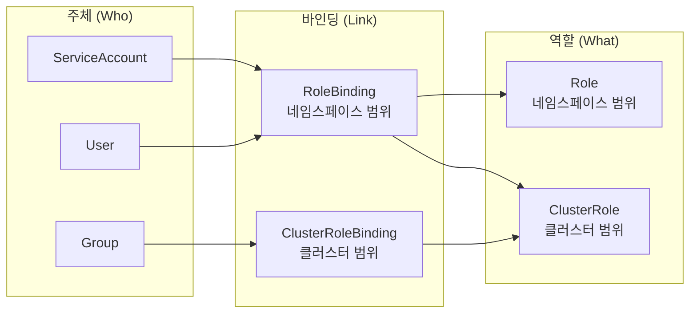
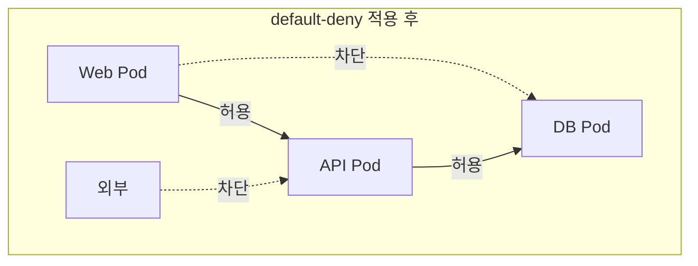
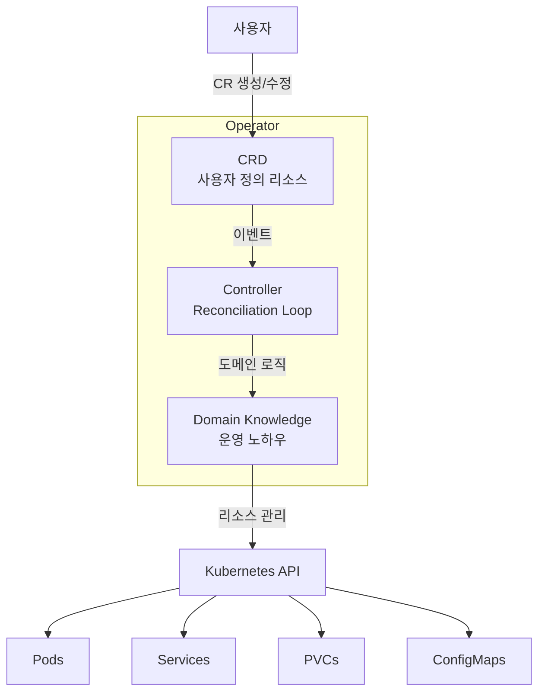
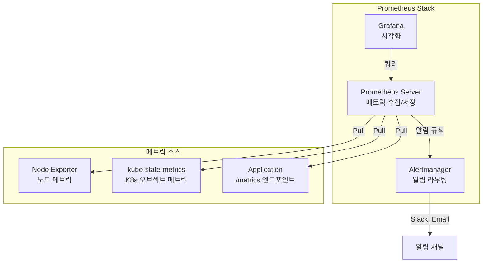
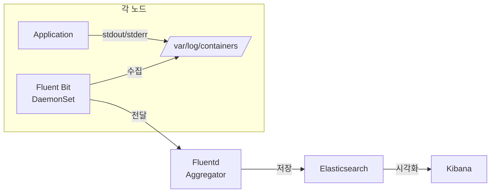
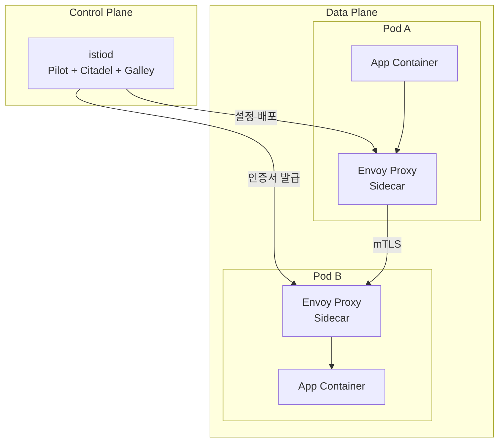
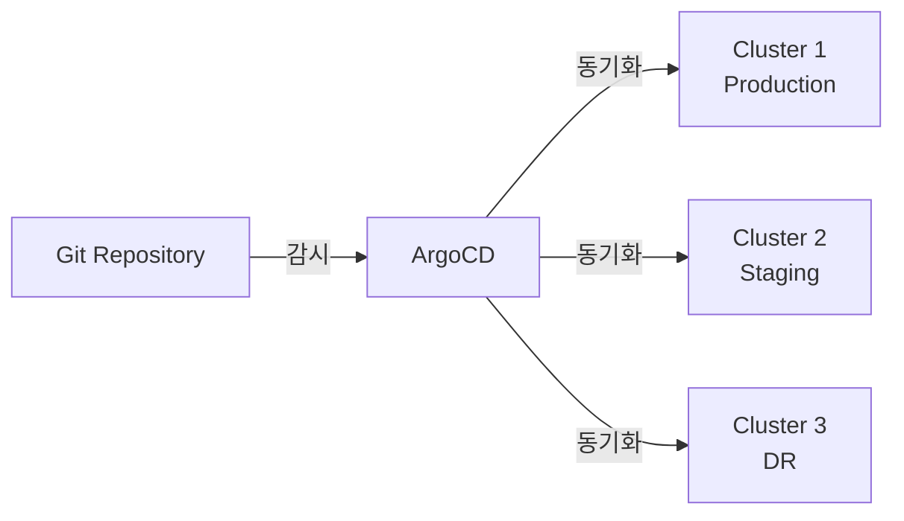
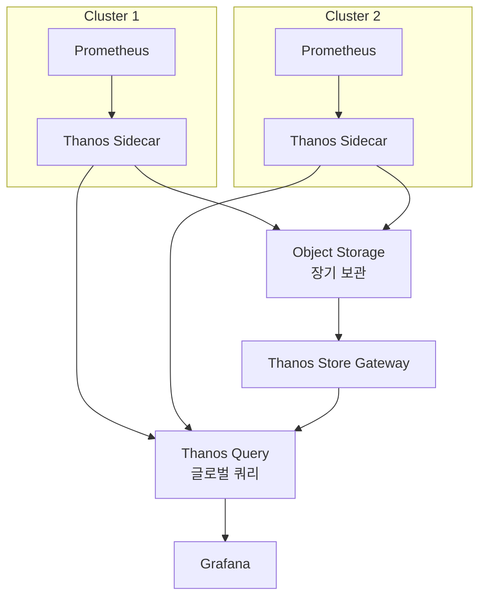

## RBAC: 역할 기반 접근 제어

**RBAC(Role-Based Access Control)**은 쿠버네티스 API에 대한 접근을 역할 기반으로 제어하는 메커니즘입니다.

### RBAC 구성 요소



### Role과 ClusterRole

```yaml
# Role: 특정 네임스페이스 내 권한
apiVersion: rbac.authorization.k8s.io/v1
kind: Role
metadata:
  name: pod-reader
  namespace: production
rules:
- apiGroups: [""]           # core API 그룹
  resources: ["pods"]
  verbs: ["get", "list", "watch"]
- apiGroups: [""]
  resources: ["pods/log"]
  verbs: ["get"]
---
# ClusterRole: 클러스터 전체 권한
apiVersion: rbac.authorization.k8s.io/v1
kind: ClusterRole
metadata:
  name: node-reader
rules:
- apiGroups: [""]
  resources: ["nodes"]
  verbs: ["get", "list", "watch"]
- apiGroups: [""]
  resources: ["namespaces"]
  verbs: ["get", "list"]
```

### RBAC Verbs

| Verb | 설명 | HTTP 메서드 |
|------|------|------------|
| `get` | 단일 리소스 조회 | GET |
| `list` | 리소스 목록 조회 | GET |
| `watch` | 리소스 변경 감시 | GET (watch) |
| `create` | 리소스 생성 | POST |
| `update` | 리소스 전체 수정 | PUT |
| `patch` | 리소스 부분 수정 | PATCH |
| `delete` | 리소스 삭제 | DELETE |
| `deletecollection` | 리소스 일괄 삭제 | DELETE |

### RoleBinding과 ClusterRoleBinding

```yaml
# RoleBinding: 네임스페이스 내에서 Role 또는 ClusterRole 바인딩
apiVersion: rbac.authorization.k8s.io/v1
kind: RoleBinding
metadata:
  name: read-pods
  namespace: production
subjects:
- kind: User
  name: developer@example.com
  apiGroup: rbac.authorization.k8s.io
- kind: ServiceAccount
  name: monitoring-sa
  namespace: monitoring
roleRef:
  kind: Role
  name: pod-reader
  apiGroup: rbac.authorization.k8s.io
---
# ClusterRoleBinding: 클러스터 전체에서 ClusterRole 바인딩
apiVersion: rbac.authorization.k8s.io/v1
kind: ClusterRoleBinding
metadata:
  name: read-nodes-global
subjects:
- kind: Group
  name: ops-team
  apiGroup: rbac.authorization.k8s.io
roleRef:
  kind: ClusterRole
  name: node-reader
  apiGroup: rbac.authorization.k8s.io
```

### ServiceAccount

Pod가 API Server와 통신할 때 사용하는 ID입니다.

```yaml
apiVersion: v1
kind: ServiceAccount
metadata:
  name: app-sa
  namespace: production
automountServiceAccountToken: false  # 불필요한 토큰 마운트 방지
---
apiVersion: apps/v1
kind: Deployment
spec:
  template:
    spec:
      serviceAccountName: app-sa
      automountServiceAccountToken: true  # 필요한 경우만 활성화
```

### Aggregated ClusterRole

레이블 기반으로 여러 ClusterRole을 자동 병합합니다.

```yaml
apiVersion: rbac.authorization.k8s.io/v1
kind: ClusterRole
metadata:
  name: monitoring-aggregate
aggregationRule:
  clusterRoleSelectors:
  - matchLabels:
      rbac.example.com/aggregate-to-monitoring: "true"
rules: []  # 자동으로 채워짐
```

### RBAC 보안 모범 사례

- **최소 권한 원칙**: 필요한 최소한의 권한만 부여
- **와일드카드 금지**: `resources: ["*"]`, `verbs: ["*"]` 사용 자제
- **ServiceAccount 분리**: 워크로드별 전용 ServiceAccount 사용
- **정기 감사**: `kubectl auth can-i --list --as=user@example.com`으로 권한 확인

---

## Network Policy: 네트워크 접근 제어

**Network Policy**는 Pod 간 네트워크 트래픽을 제어하는 방화벽 규칙입니다. CNI 플러그인(Calico, Cilium 등)이 지원해야 합니다.

### 기본 개념

Network Policy가 없으면 모든 Pod 간 통신이 허용됩니다. Policy를 적용하면 **화이트리스트** 방식으로 동작합니다.



### Default Deny 정책

```yaml
# 모든 인바운드 트래픽 차단
apiVersion: networking.k8s.io/v1
kind: NetworkPolicy
metadata:
  name: default-deny-ingress
  namespace: production
spec:
  podSelector: {}          # 네임스페이스의 모든 Pod에 적용
  policyTypes:
  - Ingress
---
# 모든 아웃바운드 트래픽 차단
apiVersion: networking.k8s.io/v1
kind: NetworkPolicy
metadata:
  name: default-deny-egress
  namespace: production
spec:
  podSelector: {}
  policyTypes:
  - Egress
```

### 3-Tier 아키텍처 Network Policy

```yaml
# Web → API 허용
apiVersion: networking.k8s.io/v1
kind: NetworkPolicy
metadata:
  name: allow-web-to-api
  namespace: production
spec:
  podSelector:
    matchLabels:
      tier: api
  policyTypes:
  - Ingress
  ingress:
  - from:
    - podSelector:
        matchLabels:
          tier: web
    ports:
    - protocol: TCP
      port: 8080
---
# API → DB 허용
apiVersion: networking.k8s.io/v1
kind: NetworkPolicy
metadata:
  name: allow-api-to-db
  namespace: production
spec:
  podSelector:
    matchLabels:
      tier: db
  policyTypes:
  - Ingress
  ingress:
  - from:
    - podSelector:
        matchLabels:
          tier: api
    ports:
    - protocol: TCP
      port: 5432
```

### 네임스페이스 간 통신 제어

```yaml
spec:
  podSelector:
    matchLabels:
      app: api
  ingress:
  - from:
    - namespaceSelector:
        matchLabels:
          env: production
      podSelector:
        matchLabels:
          role: frontend    # AND 조건: production 네임스페이스의 frontend Pod만
    - namespaceSelector:
        matchLabels:
          env: monitoring   # OR 조건: monitoring 네임스페이스의 모든 Pod
```

### DNS Egress 허용

Egress를 차단하면 DNS도 차단되므로, DNS 트래픽은 반드시 허용해야 합니다.

```yaml
spec:
  podSelector:
    matchLabels:
      app: web
  policyTypes:
  - Egress
  egress:
  - to:                    # DNS 허용
    - namespaceSelector: {}
      podSelector:
        matchLabels:
          k8s-app: kube-dns
    ports:
    - protocol: UDP
      port: 53
    - protocol: TCP
      port: 53
  - to:                    # API 서비스만 허용
    - podSelector:
        matchLabels:
          tier: api
    ports:
    - protocol: TCP
      port: 8080
```

### ipBlock을 이용한 외부 IP 제어

```yaml
ingress:
- from:
  - ipBlock:
      cidr: 10.0.0.0/8
      except:
      - 10.0.1.0/24       # 특정 서브넷 제외
```

---

## CRD: Custom Resource Definition

**CRD**를 사용하면 쿠버네티스 API를 확장하여 사용자 정의 리소스를 만들 수 있습니다.

### CRD 정의

```yaml
apiVersion: apiextensions.k8s.io/v1
kind: CustomResourceDefinition
metadata:
  name: databases.example.com
spec:
  group: example.com
  versions:
  - name: v1
    served: true
    storage: true
    schema:
      openAPIV3Schema:
        type: object
        properties:
          spec:
            type: object
            required: ["engine", "version", "storage"]
            properties:
              engine:
                type: string
                enum: ["mysql", "postgresql", "mongodb"]
              version:
                type: string
              replicas:
                type: integer
                minimum: 1
                maximum: 10
                default: 1
              storage:
                type: string
                pattern: "^[0-9]+(Gi|Ti)$"
          status:
            type: object
            properties:
              phase:
                type: string
              readyReplicas:
                type: integer
    subresources:
      status: {}           # /status 서브리소스 활성화
      scale:               # /scale 서브리소스 (HPA 연동)
        specReplicasPath: .spec.replicas
        statusReplicasPath: .status.readyReplicas
    additionalPrinterColumns:
    - name: Engine
      type: string
      jsonPath: .spec.engine
    - name: Version
      type: string
      jsonPath: .spec.version
    - name: Replicas
      type: integer
      jsonPath: .spec.replicas
    - name: Phase
      type: string
      jsonPath: .status.phase
    - name: Age
      type: date
      jsonPath: .metadata.creationTimestamp
  scope: Namespaced
  names:
    plural: databases
    singular: database
    kind: Database
    shortNames: ["db"]
    categories: ["all"]
```

### Custom Resource 사용

```yaml
apiVersion: example.com/v1
kind: Database
metadata:
  name: my-postgres
  namespace: production
spec:
  engine: postgresql
  version: "15.4"
  replicas: 3
  storage: 100Gi
```

```bash
$ kubectl get databases
NAME          ENGINE       VERSION   REPLICAS   PHASE    AGE
my-postgres   postgresql   15.4      3          Ready    5m

$ kubectl get db    # shortName 사용
```

### CRD 버전 관리와 Conversion Webhook

여러 API 버전을 지원하고 자동 변환할 수 있습니다.

```yaml
spec:
  versions:
  - name: v1
    served: true
    storage: true
  - name: v1beta1
    served: true
    storage: false
  conversion:
    strategy: Webhook
    webhook:
      conversionReviewVersions: ["v1"]
      clientConfig:
        service:
          name: database-converter
          namespace: system
          path: /convert
```

---

## Operator: 도메인 지식의 자동화

**Operator**는 CRD + Controller + 도메인 지식을 결합하여 복잡한 애플리케이션의 운영을 자동화합니다.

### Operator = CRD + Controller + Domain Knowledge



### Reconciliation Loop

Operator의 핵심은 **Reconciliation Loop**입니다. 원하는 상태(CR)와 현재 상태를 지속적으로 비교하고 조정합니다.

```
Observe → Analyze → Act → Observe → ...
```

### Operator 성숙도 모델

| 레벨 | 이름 | 기능 |
|------|------|------|
| 1 | Basic Install | 자동 설치, 설정 관리 |
| 2 | Seamless Upgrades | 패치/마이너 버전 업그레이드 |
| 3 | Full Lifecycle | 백업/복원, 장애 복구 |
| 4 | Deep Insights | 메트릭, 알림, 로그 분석 |
| 5 | Auto Pilot | 자동 스케일링, 자동 튜닝, 이상 감지 |

### 대표적인 Operator 예시

| Operator | 관리 대상 | 주요 기능 |
|----------|----------|----------|
| **Prometheus Operator** | Prometheus 스택 | ServiceMonitor, PrometheusRule 자동 관리 |
| **Cert-Manager** | TLS 인증서 | Let's Encrypt 자동 발급/갱신 |
| **Strimzi** | Apache Kafka | Kafka 클러스터 자동 운영 |
| **CloudNativePG** | PostgreSQL | HA, 백업, 복원 자동화 |

### Operator 개발 프레임워크

| 프레임워크 | 언어 | 특징 |
|-----------|------|------|
| **Kubebuilder** | Go | 공식 추천, controller-runtime 기반 |
| **Operator SDK** | Go, Ansible, Helm | Red Hat 주도, OLM 통합 |
| **KUDO** | YAML | 선언적 Operator 개발 |
| **Metacontroller** | 모든 언어 | Webhook 기반, 간단한 구현 |

### Operator 설계 패턴

- **Owner References**: 부모 리소스 삭제 시 자식 리소스 자동 정리 (Garbage Collection)
- **Finalizers**: 리소스 삭제 전 정리 작업 수행 (외부 리소스 정리)
- **Status Subresource**: 상태 업데이트를 spec 변경과 분리
- **Conditions**: 리소스의 다양한 상태를 표준화된 형식으로 표현

```yaml
status:
  conditions:
  - type: Ready
    status: "True"
    lastTransitionTime: "2026-03-15T10:00:00Z"
    reason: AllReplicasReady
    message: "All 3 replicas are running"
  - type: Degraded
    status: "False"
    lastTransitionTime: "2026-03-15T09:55:00Z"
```

---

## Helm: 쿠버네티스 패키지 매니저

**Helm**은 쿠버네티스 애플리케이션을 패키징, 배포, 관리하는 도구입니다.

### Helm 핵심 개념

| 개념 | 설명 |
|------|------|
| **Chart** | 쿠버네티스 리소스를 정의하는 패키지 (템플릿 + 기본값) |
| **Values** | Chart의 설정을 커스터마이징하는 값 |
| **Release** | Chart의 실행 인스턴스 (같은 Chart를 여러 번 설치 가능) |
| **Repository** | Chart를 저장하고 공유하는 저장소 |

### Chart 구조

```
mychart/
├── Chart.yaml          # Chart 메타데이터
├── values.yaml         # 기본 설정값
├── charts/             # 의존성 Chart
├── templates/          # 쿠버네티스 매니페스트 템플릿
│   ├── deployment.yaml
│   ├── service.yaml
│   ├── ingress.yaml
│   ├── _helpers.tpl    # 템플릿 헬퍼 함수
│   ├── NOTES.txt       # 설치 후 안내 메시지
│   └── tests/
│       └── test-connection.yaml
└── .helmignore
```

### Go 템플릿 문법

```yaml
# templates/deployment.yaml
apiVersion: apps/v1
kind: Deployment
metadata:
  name: {{ include "mychart.fullname" . }}
  labels:
    {{- include "mychart.labels" . | nindent 4 }}
spec:
  replicas: {{ .Values.replicaCount }}
  selector:
    matchLabels:
      {{- include "mychart.selectorLabels" . | nindent 6 }}
  template:
    spec:
      containers:
      - name: {{ .Chart.Name }}
        image: "{{ .Values.image.repository }}:{{ .Values.image.tag }}"
        ports:
        - containerPort: {{ .Values.service.port }}
        {{- if .Values.resources }}
        resources:
          {{- toYaml .Values.resources | nindent 10 }}
        {{- end }}
        {{- range .Values.env }}
        env:
        - name: {{ .name }}
          value: {{ .value | quote }}
        {{- end }}
```

### Helm 주요 명령어

```bash
# 저장소 관리
$ helm repo add bitnami https://charts.bitnami.com/bitnami
$ helm repo update
$ helm search repo nginx

# 설치
$ helm install my-release bitnami/nginx
$ helm install my-release ./mychart -f custom-values.yaml
$ helm install my-release bitnami/nginx --set replicaCount=3

# 업그레이드 / 롤백
$ helm upgrade my-release bitnami/nginx --set image.tag=1.22
$ helm rollback my-release 1

# 조회
$ helm list
$ helm status my-release
$ helm history my-release

# 템플릿 렌더링 (디버깅)
$ helm template my-release ./mychart --debug

# 삭제
$ helm uninstall my-release
```

### Helm Hooks

특정 릴리스 라이프사이클 이벤트에 작업을 실행합니다.

```yaml
apiVersion: batch/v1
kind: Job
metadata:
  name: db-migration
  annotations:
    "helm.sh/hook": pre-upgrade
    "helm.sh/hook-weight": "0"
    "helm.sh/hook-delete-policy": hook-succeeded
spec:
  template:
    spec:
      restartPolicy: Never
      containers:
      - name: migrate
        image: migration-tool:1.0
        command: ["python", "migrate.py"]
```

| Hook | 실행 시점 |
|------|----------|
| `pre-install` | 설치 전 |
| `post-install` | 설치 후 |
| `pre-upgrade` | 업그레이드 전 |
| `post-upgrade` | 업그레이드 후 |
| `pre-delete` | 삭제 전 |
| `pre-rollback` | 롤백 전 |

### Chart 의존성

```yaml
# Chart.yaml
dependencies:
- name: postgresql
  version: "12.x.x"
  repository: "https://charts.bitnami.com/bitnami"
  condition: postgresql.enabled
- name: redis
  version: "17.x.x"
  repository: "https://charts.bitnami.com/bitnami"
  condition: redis.enabled
```

```bash
$ helm dependency update ./mychart
$ helm dependency build ./mychart
```

---

## Monitoring과 Logging: 관측 가능성

클라우드 네이티브 환경에서 **관측 가능성(Observability)**의 3가지 축은 메트릭, 로그, 트레이스입니다.

### Prometheus: 메트릭 수집과 알림



#### ServiceMonitor (Prometheus Operator)

```yaml
apiVersion: monitoring.coreos.com/v1
kind: ServiceMonitor
metadata:
  name: app-monitor
  labels:
    release: prometheus
spec:
  selector:
    matchLabels:
      app: my-app
  endpoints:
  - port: metrics
    interval: 15s
    path: /metrics
  namespaceSelector:
    matchNames:
    - production
```

#### PromQL 주요 쿼리

```promql
# CPU 사용률 (%)
100 - (avg by(instance) (rate(node_cpu_seconds_total{mode="idle"}[5m])) * 100)

# Pod 메모리 사용량 (MB)
container_memory_working_set_bytes{namespace="production"} / 1024 / 1024

# HTTP 요청 에러율
sum(rate(http_requests_total{status=~"5.."}[5m])) / sum(rate(http_requests_total[5m])) * 100

# P99 응답 시간
histogram_quantile(0.99, sum(rate(http_request_duration_seconds_bucket[5m])) by (le))
```

#### PrometheusRule (알림 규칙)

```yaml
apiVersion: monitoring.coreos.com/v1
kind: PrometheusRule
metadata:
  name: app-alerts
spec:
  groups:
  - name: app.rules
    rules:
    - alert: HighErrorRate
      expr: |
        sum(rate(http_requests_total{status=~"5.."}[5m])) 
        / sum(rate(http_requests_total[5m])) > 0.05
      for: 5m
      labels:
        severity: critical
      annotations:
        summary: "High error rate detected"
        description: "Error rate is {{ $value | humanizePercentage }}"
    - alert: PodCrashLooping
      expr: rate(kube_pod_container_status_restarts_total[15m]) > 0
      for: 5m
      labels:
        severity: warning
```

### EFK Stack: 로그 수집

| 컴포넌트 | 역할 |
|----------|------|
| **Elasticsearch** | 로그 저장 및 검색 엔진 |
| **Fluentd/Fluent Bit** | 로그 수집 및 전달 에이전트 |
| **Kibana** | 로그 시각화 및 분석 대시보드 |



### Grafana 대시보드

Grafana는 Prometheus, Elasticsearch 등 다양한 데이터 소스를 시각화합니다.

주요 대시보드:
- **Kubernetes Cluster Overview**: 노드/Pod 리소스 사용량
- **Namespace Workloads**: 네임스페이스별 워크로드 상태
- **Pod Details**: 개별 Pod의 CPU, 메모리, 네트워크
- **NGINX Ingress**: 요청 수, 에러율, 응답 시간

---

## Service Mesh: Istio

**Service Mesh**는 마이크로서비스 간 통신을 인프라 레벨에서 관리합니다. 애플리케이션 코드 변경 없이 트래픽 관리, 보안, 관측 가능성을 제공합니다.

### Istio 아키텍처



### VirtualService: 트래픽 라우팅

```yaml
apiVersion: networking.istio.io/v1beta1
kind: VirtualService
metadata:
  name: reviews-route
spec:
  hosts:
  - reviews
  http:
  - match:
    - headers:
        end-user:
          exact: jason
    route:
    - destination:
        host: reviews
        subset: v2              # 특정 사용자는 v2로
  - route:
    - destination:
        host: reviews
        subset: v1
      weight: 90                # 90% → v1
    - destination:
        host: reviews
        subset: v2
      weight: 10                # 10% → v2 (카나리 배포)
```

### DestinationRule: 트래픽 정책

```yaml
apiVersion: networking.istio.io/v1beta1
kind: DestinationRule
metadata:
  name: reviews-destination
spec:
  host: reviews
  trafficPolicy:
    connectionPool:
      tcp:
        maxConnections: 100
      http:
        h2UpgradePolicy: DEFAULT
        http1MaxPendingRequests: 100
    outlierDetection:           # Circuit Breaker
      consecutive5xxErrors: 5
      interval: 30s
      baseEjectionTime: 30s
      maxEjectionPercent: 50
  subsets:
  - name: v1
    labels:
      version: v1
  - name: v2
    labels:
      version: v2
```

### Gateway: 외부 트래픽 진입점

```yaml
apiVersion: networking.istio.io/v1beta1
kind: Gateway
metadata:
  name: app-gateway
spec:
  selector:
    istio: ingressgateway
  servers:
  - port:
      number: 443
      name: https
      protocol: HTTPS
    tls:
      mode: SIMPLE
      credentialName: app-tls-cert
    hosts:
    - "*.example.com"
```

### mTLS와 AuthorizationPolicy

```yaml
# PeerAuthentication: mTLS 설정
apiVersion: security.istio.io/v1beta1
kind: PeerAuthentication
metadata:
  name: default
  namespace: production
spec:
  mtls:
    mode: STRICT              # 모든 통신에 mTLS 강제
---
# AuthorizationPolicy: 서비스 간 접근 제어
apiVersion: security.istio.io/v1beta1
kind: AuthorizationPolicy
metadata:
  name: api-access
  namespace: production
spec:
  selector:
    matchLabels:
      app: api
  action: ALLOW
  rules:
  - from:
    - source:
        principals: ["cluster.local/ns/production/sa/web-sa"]
    to:
    - operation:
        methods: ["GET", "POST"]
        paths: ["/api/*"]
```

### Istio 트래픽 관리 패턴

| 패턴 | 설명 |
|------|------|
| **카나리 배포** | weight 기반으로 새 버전에 점진적 트래픽 전환 |
| **A/B 테스트** | 헤더/쿠키 기반으로 특정 사용자를 다른 버전으로 라우팅 |
| **Circuit Breaker** | outlierDetection으로 장애 서비스 자동 격리 |
| **트래픽 미러링** | 프로덕션 트래픽을 새 버전에 복제하여 테스트 |
| **Fault Injection** | 의도적 지연/오류 주입으로 복원력 테스트 |

### Istio vs Linkerd

| 특성 | Istio | Linkerd |
|------|-------|---------|
| 프록시 | Envoy (C++) | linkerd2-proxy (Rust) |
| 리소스 사용량 | 상대적으로 높음 | 매우 가벼움 |
| 기능 범위 | 매우 풍부 | 핵심 기능에 집중 |
| 학습 곡선 | 가파름 | 완만함 |
| 멀티 클러스터 | 네이티브 지원 | 지원 |

---

## Multi-cluster: 멀티 클러스터 관리

프로덕션 환경에서는 단일 클러스터의 한계를 넘어 여러 클러스터를 운영해야 하는 경우가 많습니다.

### 멀티 클러스터 패턴

| 패턴 | 설명 | 사용 사례 |
|------|------|----------|
| **독립 클러스터** | 각 클러스터가 독립적으로 운영 | 팀별/환경별 격리 |
| **Federation** | 중앙에서 여러 클러스터를 통합 관리 | 글로벌 배포 |
| **Service Mesh** | 서비스 메시로 클러스터 간 통신 | 마이크로서비스 |

### 멀티 클러스터 관리 도구

| 도구 | 역할 |
|------|------|
| **KubeFed** | 쿠버네티스 공식 Federation v2 |
| **Rancher** | 멀티 클러스터 관리 플랫폼 |
| **ArgoCD** | GitOps 기반 멀티 클러스터 배포 |
| **Cluster API** | 선언적 클러스터 프로비저닝 |

### ArgoCD: GitOps 기반 배포



```yaml
apiVersion: argoproj.io/v1alpha1
kind: Application
metadata:
  name: my-app
  namespace: argocd
spec:
  project: default
  source:
    repoURL: https://github.com/org/k8s-manifests.git
    targetRevision: main
    path: overlays/production
  destination:
    server: https://kubernetes.default.svc
    namespace: production
  syncPolicy:
    automated:
      prune: true
      selfHeal: true
    syncOptions:
    - CreateNamespace=true
```

### 크로스 클러스터 네트워킹

| 솔루션 | 방식 |
|--------|------|
| **Submariner** | IPsec 터널로 클러스터 간 Pod 네트워크 연결 |
| **Istio Multi-primary** | 각 클러스터에 Istio 설치, 공유 Root CA |
| **Cilium Cluster Mesh** | eBPF 기반 클러스터 간 네트워킹 |

### DR (재해 복구) 전략

| 전략 | RTO | RPO | 비용 |
|------|-----|-----|------|
| **Active-Passive** | 분~시간 | 분 | 중간 |
| **Active-Active** | 초~분 | 거의 0 | 높음 |
| **Backup-Restore** | 시간 | 시간 | 낮음 |

### Velero: 백업과 복원

```bash
# 백업 생성
$ velero backup create production-backup \
    --include-namespaces production \
    --storage-location azure-blob

# 스케줄 백업
$ velero schedule create daily-backup \
    --schedule="0 2 * * *" \
    --include-namespaces production \
    --ttl 168h

# 복원
$ velero restore create --from-backup production-backup \
    --namespace-mappings production:production-restored
```

### Thanos: 멀티 클러스터 모니터링

Thanos는 여러 클러스터의 Prometheus 메트릭을 통합하여 글로벌 뷰를 제공합니다.



---

## 정리

쿠버네티스 고급 개념을 정리하면:

| 개념 | 핵심 역할 |
|------|----------|
| **RBAC** | API 접근을 역할 기반으로 세밀하게 제어 |
| **Network Policy** | Pod 간 네트워크 트래픽을 화이트리스트 방식으로 제어 |
| **CRD** | 쿠버네티스 API를 확장하여 사용자 정의 리소스 생성 |
| **Operator** | CRD + Controller로 복잡한 운영 자동화 |
| **Helm** | 쿠버네티스 애플리케이션 패키징과 배포 관리 |
| **Prometheus/Grafana** | 메트릭 수집, 알림, 시각화 |
| **EFK Stack** | 로그 수집, 저장, 분석 |
| **Istio** | 서비스 간 통신의 보안, 라우팅, 관측 가능성 |
| **Multi-cluster** | 여러 클러스터의 통합 관리, DR, 글로벌 배포 |

이 고급 개념을 바탕으로 쿠버네티스 내부 동작 원리(API Server, etcd, Scheduler 등)를 심층적으로 이해할 수 있습니다.
