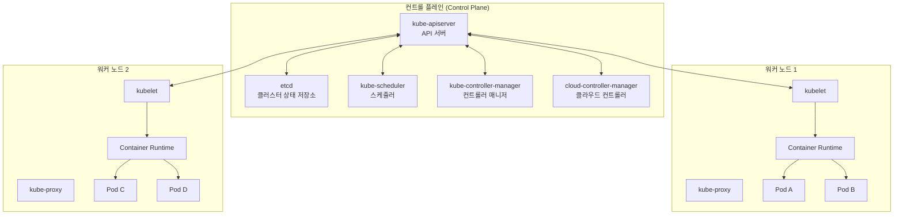
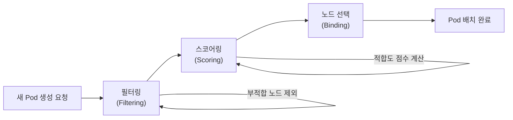
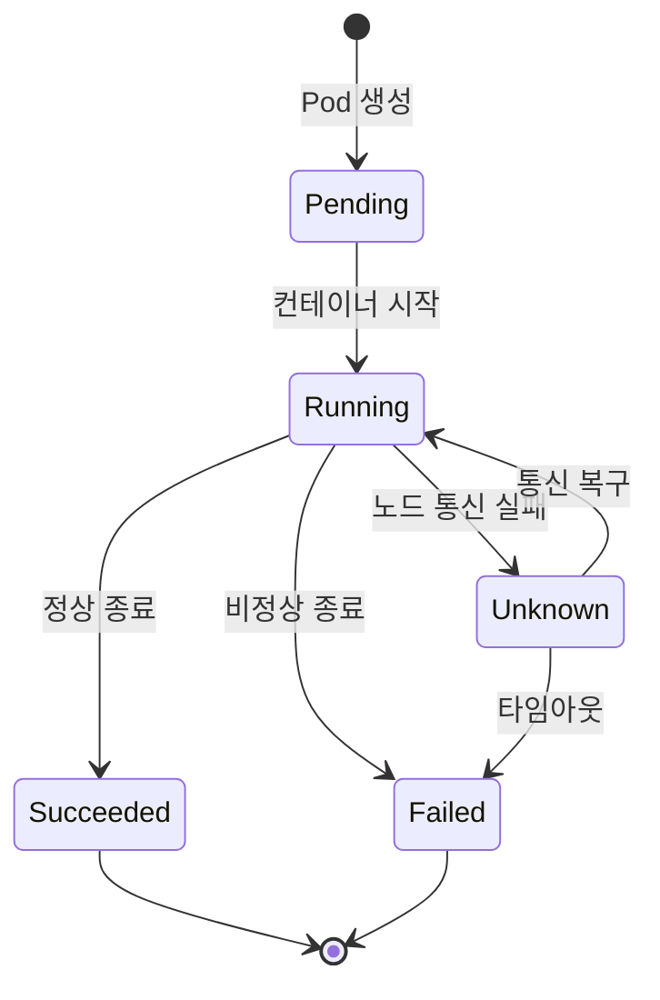

## 개요

Kubernetes(K8s)는 컨테이너화된 워크로드와 서비스를 관리하기 위한 오픈소스 오케스트레이션 플랫폼입니다. 이 포스트에서는 Kubernetes 클러스터의 핵심 아키텍처와 각 컴포넌트의 역할을 살펴봅니다.

## 클러스터 아키텍처 개요

Kubernetes 클러스터는 크게 **컨트롤 플레인(Control Plane)**과 **워커 노드(Worker Node)**로 구성됩니다.



## 컨트롤 플레인 컴포넌트

### kube-apiserver

API 서버는 Kubernetes 컨트롤 플레인의 **프론트엔드**입니다. 모든 컴포넌트 간 통신은 API 서버를 통해 이루어집니다.

```yaml
# kubectl을 통한 API 서버 접근 예시
apiVersion: v1
kind: Pod
metadata:
  name: nginx-pod
  labels:
    app: nginx
spec:
  containers:
  - name: nginx
    image: nginx:1.25
    ports:
    - containerPort: 80
    resources:
      requests:
        memory: "64Mi"
        cpu: "250m"
      limits:
        memory: "128Mi"
        cpu: "500m"
```

### etcd

etcd는 클러스터의 모든 상태 데이터를 저장하는 **분산 키-값 저장소**입니다.

```bash
# etcd 클러스터 상태 확인
ETCDCTL_API=3 etcdctl \
  --endpoints=https://127.0.0.1:2379 \
  --cacert=/etc/kubernetes/pki/etcd/ca.crt \
  --cert=/etc/kubernetes/pki/etcd/server.crt \
  --key=/etc/kubernetes/pki/etcd/server.key \
  endpoint health
```

### kube-scheduler

스케줄러는 새로 생성된 Pod를 적절한 노드에 배치하는 역할을 합니다.

스케줄링 과정:



스케줄러가 고려하는 주요 요소:
- 리소스 요구사항 (CPU, 메모리)
- 하드웨어/소프트웨어 제약 조건
- Affinity / Anti-Affinity 규칙
- Taint / Toleration
- 데이터 지역성

## 워커 노드 컴포넌트

### kubelet

각 노드에서 실행되는 에이전트로, Pod의 컨테이너가 정상적으로 실행되도록 관리합니다.

```bash
# kubelet 상태 확인
systemctl status kubelet

# 노드 상태 확인
kubectl get nodes -o wide
kubectl describe node <node-name>
```

### kube-proxy

네트워크 규칙을 관리하여 Pod 간 통신 및 외부 트래픽 라우팅을 처리합니다.

```bash
# kube-proxy 모드 확인 (iptables 또는 IPVS)
kubectl get configmap kube-proxy -n kube-system -o yaml
```

### Container Runtime

컨테이너를 실제로 실행하는 소프트웨어입니다. Kubernetes는 CRI(Container Runtime Interface)를 통해 다양한 런타임을 지원합니다.

| 런타임 | 특징 | 사용 사례 |
|--------|------|----------|
| containerd | 경량, 산업 표준 | 대부분의 프로덕션 환경 |
| CRI-O | OCI 호환, 경량 | OpenShift, 보안 중시 환경 |
| Docker Engine | 개발 친화적 | 로컬 개발 환경 (K8s 1.24부터 직접 지원 중단) |

## Pod 생명주기



## 핵심 kubectl 명령어

```bash
# 클러스터 정보 확인
kubectl cluster-info

# 모든 네임스페이스의 리소스 조회
kubectl get all --all-namespaces

# Pod 로그 확인
kubectl logs <pod-name> -f

# Pod 내부 접속
kubectl exec -it <pod-name> -- /bin/bash

# 리소스 사용량 확인
kubectl top nodes
kubectl top pods
```

## 다음 단계

Kubernetes 아키텍처의 기초를 이해했다면, 다음 주제로 넘어가 보세요:

1. **Pod 심화** — 멀티 컨테이너 패턴, Init Container
2. **Service와 네트워킹** — ClusterIP, NodePort, LoadBalancer
3. **Deployment 전략** — Rolling Update, Blue-Green, Canary

## 참고 자료

- [Kubernetes 공식 문서 - 클러스터 아키텍처](https://kubernetes.io/ko/docs/concepts/architecture/)
- [Kubernetes Components](https://kubernetes.io/docs/concepts/overview/components/)
