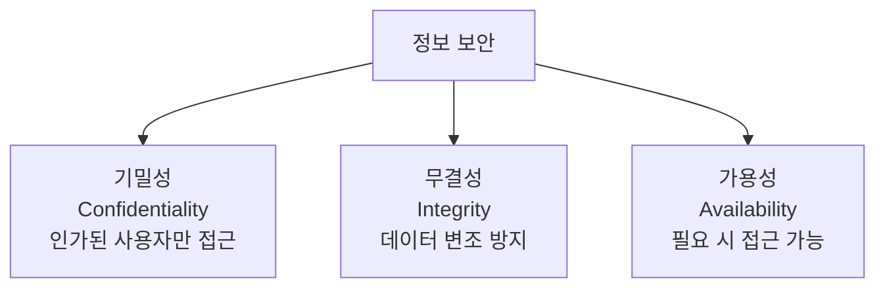
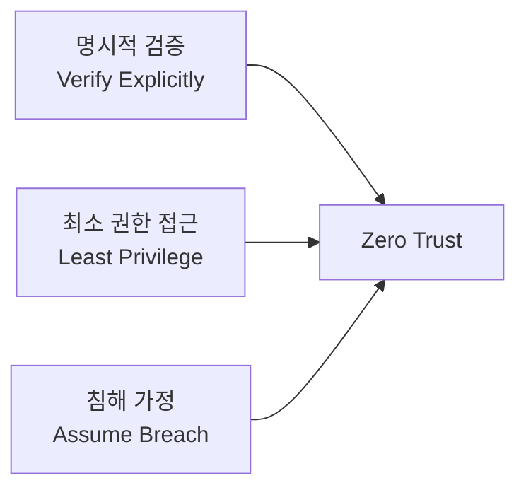

## 개요

클라우드 환경에서의 보안은 온프레미스와는 다른 접근 방식이 필요합니다. 이 포스트에서는 클라우드 보안의 기초 개념과 핵심 원칙을 정리하고, 실무에서 적용할 수 있는 모범 사례를 살펴봅니다.

## CIA Triad (보안의 3요소)

정보 보안의 핵심은 **기밀성(Confidentiality)**, **무결성(Integrity)**, **가용성(Availability)** 세 가지 요소의 균형입니다.



## 암호화 기초

### 대칭키 암호화

대칭키 암호화에서는 동일한 키 $K$를 사용하여 암호화와 복호화를 수행합니다.

$$
C = E_K(P), \quad P = D_K(C)
$$

여기서:
- $P$ : 평문 (Plaintext)
- $C$ : 암호문 (Ciphertext)
- $E_K$ : 키 $K$를 사용한 암호화 함수
- $D_K$ : 키 $K$를 사용한 복호화 함수

대표적인 대칭키 알고리즘: **AES-256**

### 비대칭키 암호화 (공개키 암호화)

비대칭키 암호화는 공개키 $K_{pub}$와 개인키 $K_{priv}$의 쌍을 사용합니다.

$$
C = E_{K_{pub}}(P), \quad P = D_{K_{priv}}(C)
$$

RSA 알고리즘의 핵심은 큰 소수의 곱을 인수분해하기 어렵다는 수학적 성질에 기반합니다.

$$
n = p \times q
$$

여기서 $p$와 $q$는 매우 큰 소수이며, $n$이 주어졌을 때 $p$와 $q$를 찾는 것은 계산적으로 매우 어렵습니다.

### 해시 함수

해시 함수 $H$는 임의 길이의 입력을 고정 길이의 출력으로 변환합니다.

$$
h = H(m), \quad |h| = \text{고정 길이}
$$

좋은 해시 함수의 조건:
- **역상 저항성**: $h$가 주어졌을 때 $H(m) = h$인 $m$을 찾기 어려움
- **제2 역상 저항성**: $m_1$이 주어졌을 때 $H(m_1) = H(m_2)$인 $m_2 \neq m_1$을 찾기 어려움
- **충돌 저항성**: $H(m_1) = H(m_2)$인 서로 다른 $m_1, m_2$를 찾기 어려움

```bash
# SHA-256 해시 생성 예시
echo -n "Hello, Security!" | sha256sum
# 출력: a1b2c3d4e5f6... (64자리 16진수)

# 파일 무결성 검증
sha256sum important-file.tar.gz
```

## Zero Trust 보안 모델

Zero Trust는 **"절대 신뢰하지 말고, 항상 검증하라"**는 원칙에 기반한 보안 모델입니다.

### 핵심 원칙



### 보안 점수 계산

조직의 보안 수준을 정량적으로 평가할 때, 다음과 같은 가중 평균 모델을 사용할 수 있습니다.

$$
S = \sum_{i=1}^{n} w_i \cdot s_i, \quad \text{where} \sum_{i=1}^{n} w_i = 1
$$

여기서:
- $S$ : 전체 보안 점수
- $w_i$ : $i$번째 보안 영역의 가중치
- $s_i$ : $i$번째 보안 영역의 점수 ($0 \leq s_i \leq 100$)

| 보안 영역 | 가중치 ($w_i$) | 평가 항목 |
|-----------|:-------------:|----------|
| ID 및 접근 관리 | 0.25 | MFA, 조건부 액세스, PIM |
| 네트워크 보안 | 0.20 | NSG, 방화벽, DDoS 보호 |
| 데이터 보호 | 0.25 | 암호화, DLP, 백업 |
| 엔드포인트 보안 | 0.15 | EDR, 패치 관리 |
| 로깅 및 모니터링 | 0.15 | SIEM, 알림, 감사 로그 |

## 클라우드 보안 모범 사례

### 1. ID 및 접근 관리

```yaml
# Azure Policy 예시 - MFA 강제
{
  "if": {
    "field": "type",
    "equals": "Microsoft.Authorization/roleAssignments"
  },
  "then": {
    "effect": "audit",
    "details": {
      "type": "Microsoft.Authorization/roleAssignments",
      "existenceCondition": {
        "field": "Microsoft.Authorization/roleAssignments/principalType",
        "equals": "User"
      }
    }
  }
}
```

### 2. 네트워크 보안

```bash
# Azure NSG 규칙 생성 - SSH 접근 제한
az network nsg rule create \
  --resource-group myRG \
  --nsg-name myNSG \
  --name AllowSSH \
  --priority 100 \
  --direction Inbound \
  --access Allow \
  --protocol Tcp \
  --destination-port-ranges 22 \
  --source-address-prefixes "10.0.0.0/8"
```

### 3. 데이터 암호화

데이터 보호의 핵심은 **저장 시(at rest)**와 **전송 중(in transit)** 모두 암호화하는 것입니다.

| 구분 | 방법 | Azure 서비스 |
|------|------|-------------|
| 저장 시 암호화 | AES-256 | Azure Storage SSE, Disk Encryption |
| 전송 중 암호화 | TLS 1.2+ | App Gateway, Front Door |
| 사용 중 암호화 | 기밀 컴퓨팅 | Azure Confidential Computing |

### 4. 위험 평가 공식

보안 위험도는 다음과 같이 계산할 수 있습니다.

$$
\text{Risk} = \text{Threat} \times \text{Vulnerability} \times \text{Impact}
$$

위험을 줄이기 위한 전략:
- **위협(Threat) 감소**: 공격 표면 최소화
- **취약점(Vulnerability) 감소**: 패치 관리, 보안 설정 강화
- **영향(Impact) 감소**: 데이터 분류, 백업, 재해 복구 계획

> **중요:** 보안은 한 번 설정하고 끝나는 것이 아닙니다. 지속적인 모니터링과 개선이 필요합니다.
{: .notice--warning }

## 참고 자료

- [Microsoft Zero Trust 가이드](https://learn.microsoft.com/ko-kr/security/zero-trust/)
- [NIST Cybersecurity Framework](https://www.nist.gov/cyberframework)
- [Azure Security Best Practices](https://learn.microsoft.com/ko-kr/azure/security/fundamentals/best-practices-and-patterns)
