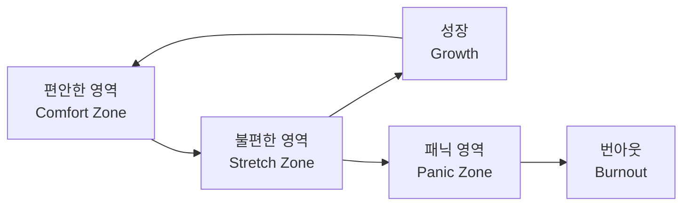

## 개요

AWS의 VP이자 Distinguished Engineer인 Andy Warfield가 Werner Vogels의 블로그 [All Things Distributed](https://www.allthingsdistributed.com/2025/12/a-little-bit-uncomfortable.html)에 기고한 글 "A Little Bit Uncomfortable"은 기술 블로그에서 보기 드문 주제를 다룹니다.

**두려움과 성장의 관계.**

이 글은 단순한 자기계발 이야기가 아닙니다. 수백 조 개의 객체를 관리하는 Amazon S3를 이끄는 시니어 엔지니어가, 자신의 커리어를 관통한 불안과 두려움을 솔직하게 고백하며, 그것이 어떻게 성장의 원동력이 되었는지를 이야기합니다.


*Photo by [Annie Spratt](https://unsplash.com/@anniespratt) on [Unsplash](https://unsplash.com) — 불확실한 길 위에서도 한 발짝 내딛는 것이 성장의 시작입니다.*

---

## 1. 이탈리아 워크숍에서의 참사

Andy Warfield의 이야기는 석사 과정 시절로 거슬러 올라갑니다.

이탈리아 베르티노로에서 열린 소규모 워크숍에서 자신의 논문을 발표해야 했던 그는, 월요일부터 목요일까지 매일 점심 후 방에 돌아가 구토를 했습니다. 발표가 얼마나 망할지 상상하는 것만으로도 불안이 극에 달했기 때문입니다.

그리고 실제 발표는 — 정말로 망했습니다.

운영체제를 다르게 설계해야 한다는 그의 아이디어에 대해, 청중석에 앉아 있던 Bell Labs의 Plan 9 운영체제 저자들이 10분간 그의 논리의 허점을 조목조목 지적했습니다. Warfield 본인의 표현을 빌리면, 그것은 "bloodbath(대학살)"였습니다.

> 무대를 내려오면서, 다시는 공개 발표를 하고 싶지 않다고 확신했습니다.

---

## 2. 그럼에도 불구하고

하지만 Warfield는 시스템을 만드는 것을 사랑했고, 연구와 최신 기술을 탐구하는 것에 열정이 있었습니다. 그리고 그 커리어에서 발표를 피할 방법은 없었습니다.

그래서 그는 발표를 망치는 다양한 방법을 탐험했습니다:

| 실패 유형 | 상황 |
|---|---|
| 질문 공포 | 질의응답 중 얼어붙어 아무 말도 못 함 |
| 테니스공 발표 | 녹화 중 좌우로 왔다갔다하며 화면에 테니스공처럼 스쳐 지나감 |
| 무대 추락 | 발표 중 뒤로 넘어져 커튼 속으로 사라짐 |

이 모든 실패에도 불구하고, 그는 계속했습니다. 그리고 지금은 AWS re:Invent 같은 대규모 컨퍼런스에서 발표하는 시니어 리더가 되었습니다.


*Photo by [Headway](https://unsplash.com/@headwayio) on [Unsplash](https://unsplash.com) — 팀 앞에서 발표하는 것은 여전히 많은 엔지니어에게 도전입니다.*

---

## 3. 두려움은 성장의 신호

Warfield가 전하는 핵심 메시지는 명확합니다:

> 내 기술과 인격이 앞으로 나아간 모든 순간에는, 최소한 약간의 불편함이 수반되었습니다.

이것은 발표에만 국한되지 않습니다. 그가 두려움을 느꼈던 순간들:

- 컨퍼런스 복도에서 낯선 사람과 대화하기
- 시니어 리더와의 미팅
- 인터뷰 받기
- 그룹 토론에서 발언하기
- 시스템 설계에서 중요한 변경을 밀어붙이기
- 사업 시작하기
- 팀에 문제가 있다고 에스컬레이션하기

이 모든 것이 불편했지만, 돌이켜보면 가장 많이 배운 순간들이었습니다.

---

## 4. Yerkes-Dodson 법칙

이 관찰은 100년 이상 된 심리학 법칙으로 뒷받침됩니다.

**Yerkes-Dodson 법칙**은 각성(스트레스) 수준과 수행 능력 사이에 역U자형 관계가 있다는 것을 보여줍니다.

```
수행 능력
    ↑
    │        ╭──────╮
    │       ╱        ╲
    │      ╱   최적    ╲
    │     ╱   수행 영역   ╲
    │    ╱                ╲
    │   ╱                  ╲
    │  ╱                    ╲
    │ ╱                      ╲
    │╱                        ╲
    └──────────────────────────→ 각성(스트레스) 수준
   낮음                        높음
```

| 영역 | 각성 수준 | 수행 능력 | 상태 |
|---|---|---|---|
| 좌측 | 낮음 | 낮음 | 무기력, 동기 부족 |
| 정점 | 적정 | 최고 | 아드레날린 기반 집중 |
| 우측 | 과도 | 급락 | 패닉, 터널 비전 |

핵심은 이것입니다: **두려움은 미지의 영역으로 나아가고 있다는 신호**이며, 진정한 성장은 그 불편함 없이는 일어나지 않습니다.


*Photo by [Jukan Tateisi](https://unsplash.com/@tateisimikito) on [Unsplash](https://unsplash.com) — 성장은 편안한 영역의 경계에서 일어납니다.*

---

## 5. 리더로서의 두려움 관리

커리어가 진행되고 리더십 역할을 맡게 되면, 두려움과의 관계가 변합니다. 더 이상 자신의 용기만의 문제가 아니라, **다른 사람이 리스크를 감수할 수 있도록 돕는 것**이 됩니다.

### 리더가 할 수 있는 질문

```
"지금 무엇이 두렵나요?"
"어떤 방식으로 자신을 확장하고 있나요?"
```

이 간단한 질문들이 멘토링의 출발점이 될 수 있습니다.

### 두려움의 신호 읽기

| 반응 패턴 | 의미 | 리더의 역할 |
|---|---|---|
| 얼어붙음 (Freeze) | 압도당한 상태 | 안전한 공간 제공 |
| 공격적 반응 (Fight) | 방어 기제 작동 | 감정이 아닌 내용에 집중 유도 |
| 주제 전환 (Flight) | 회피 | 부드럽게 원래 주제로 복귀 |

Warfield는 이렇게 말합니다: **사람들은 결과에 열정이 있을 때만 불안 속으로 들어갑니다.** 따라서 두려움의 신호는 거의 항상 무언가 중요한 것이 걸려 있다는 뜻입니다.

---

## 6. 용기는 조용하다

> Bravery isn't loud. It's a quiet sort of persistence.

용기는 충동적이거나 무모한 것이 아닙니다. 어려운 길을 **눈을 뜨고 선택하는 것**, 그것이 바로 개선하려는 노력의 정의입니다.

Warfield는 이런 순간을 주변에서 관찰하라고 권합니다:

> 회의에서 평소 질문을 잘 하지 않던 사람이 도전적인 질문을 던지는 순간을 지켜보세요. 그것을 발견하면, 그 자리에서 지지하거나 나중에 칭찬해주세요.

이것은 엔지니어링 조직에서 심리적 안전감(Psychological Safety)을 구축하는 가장 실질적인 방법 중 하나입니다.

---

## 7. 엔지니어에게 주는 시사점

### 개인 성장 관점



- 불편함을 느낄 때, 그것을 **회피 신호가 아닌 성장 신호**로 재해석하기
- 발표, 코드 리뷰, 설계 토론에서의 긴장감은 정상이며 건강한 것
- 완벽한 준비를 기다리지 말고, 불완전한 상태에서 시작하기

### 팀/조직 관점

- 실패를 허용하는 문화가 혁신의 전제 조건
- 시니어 엔지니어도 두려움을 느낀다는 것을 공유하면 팀의 심리적 안전감이 높아짐
- "무엇이 두렵나요?"는 1:1 미팅에서 가장 강력한 질문 중 하나

---

## 정리

Andy Warfield의 글은 기술적 인사이트가 아닌, 엔지니어로서의 **태도와 마인드셋**에 대한 이야기입니다.

이탈리아 워크숍에서 구토하던 석사생이 AWS S3를 이끄는 Distinguished Engineer가 되기까지, 그 여정의 모든 전환점에는 불편함이 있었습니다. 그리고 그 불편함을 회피하지 않고 직면한 것이 성장의 핵심이었습니다.

> 성장은 불편함의 경계에서 일어납니다. 이번 주에 당신을 두렵게 하는 한 가지가 무엇인지 스스로에게 물어보세요. 그리고 그것을 해보세요.

---

## 참고 자료

- [Werner Vogels - A little bit uncomfortable (All Things Distributed)](https://www.allthingsdistributed.com/2025/12/a-little-bit-uncomfortable.html)
- [Andy Warfield - Building and operating a pretty big storage system called S3](https://allthingsdistributed.com/2023/07/building-and-operating-a-pretty-big-storage-system.html)
- [Andy Warfield - In S3 simplicity is table stakes](https://allthingsdistributed.com/2025/03/in-s3-simplicity-is-table-stakes.html)
- [Yerkes-Dodson Law - Wikipedia](https://en.wikipedia.org/wiki/Yerkes%E2%80%93Dodson_law)
- [The Kernel by AWS](https://www.allthingsdistributed.com/2024/11/the-kernel.html)
