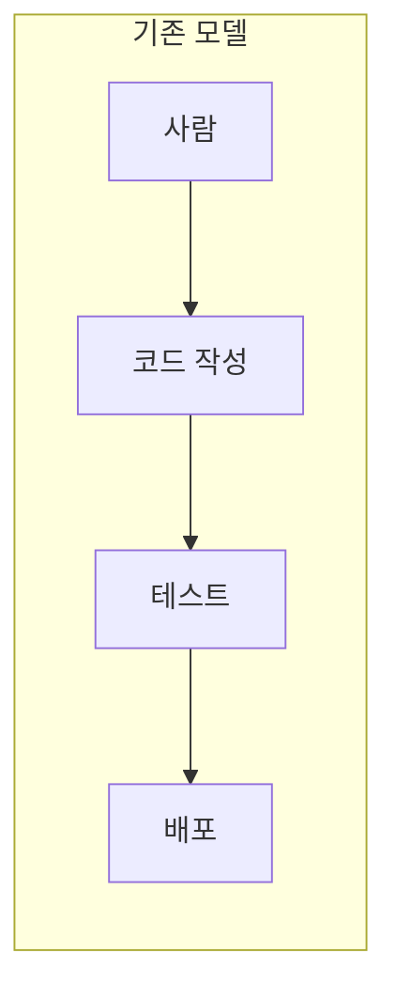
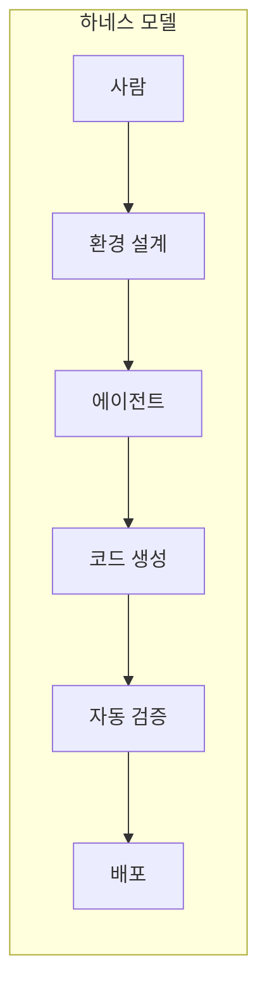
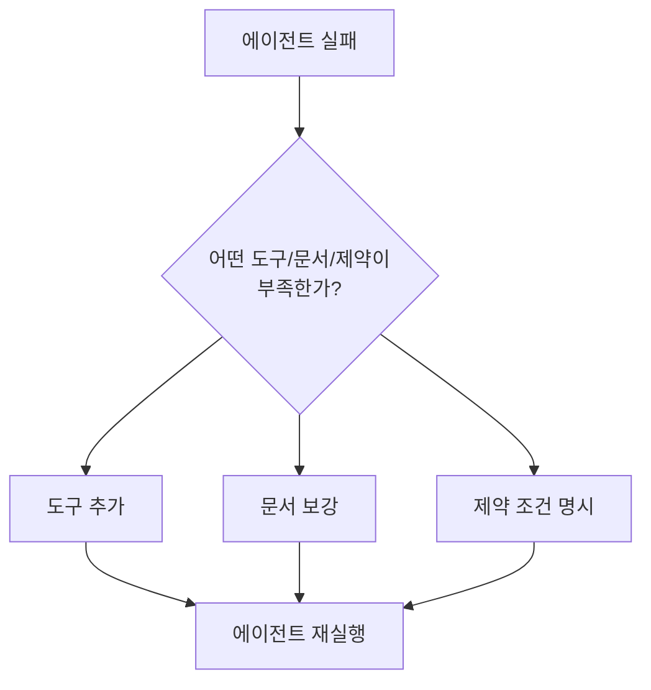
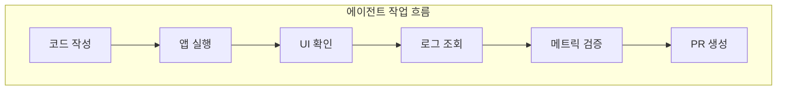
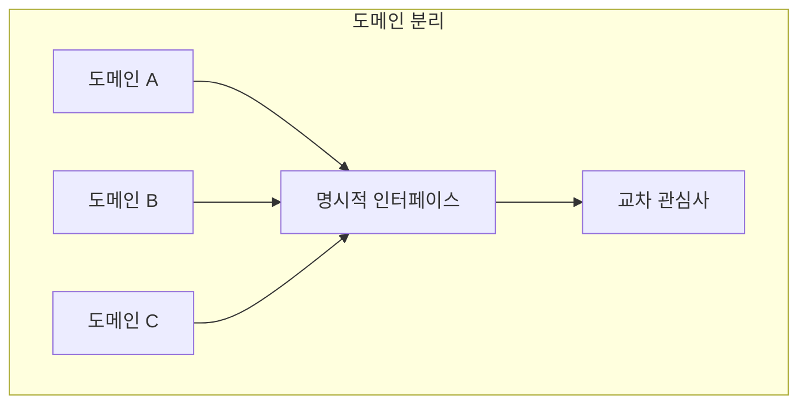
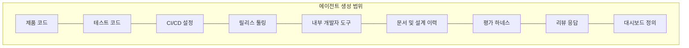
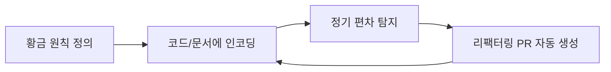

## 개요

2025년 8월, OpenAI는 하나의 실험을 시작했습니다. 빈 리포지터리에서 출발하여 **수동으로 작성한 코드 0줄**이라는 제약 조건 아래, Codex 에이전트만으로 내부 베타 제품을 구축하는 프로젝트였습니다.

5개월 후 결과는 다음과 같습니다:

| 지표 | 수치 |
|---|---|
| 코드베이스 규모 | ~100만 줄 |
| 병합된 PR | ~1,500개 |
| 초기 엔지니어 수 | 3명 |
| 엔지니어당 일일 PR | 평균 3.5개 |
| 개발 속도 | 수동 대비 약 1/10 시간 |

이 글은 OpenAI가 공개한 [Harness engineering: leveraging Codex in an agent-first world](https://openai.com/index/harness-engineering/) 포스트의 핵심 내용을 분석하고, 실무 관점에서 시사점을 정리합니다.

> 본 포스트는 OpenAI 원문의 내용을 기반으로 재구성하였으며, 직접 인용이 아닌 분석과 해석을 중심으로 작성되었습니다.


*Photo by [Possessed Photography](https://unsplash.com/@possessedphotography) on [Unsplash](https://unsplash.com) — AI 에이전트가 소프트웨어 개발의 실행 주체로 부상하고 있습니다.*

---

## 1. 하네스 엔지니어링이란?

### 개념 정의

**하네스 엔지니어링(Harness Engineering)**은 AI 에이전트가 안정적으로 작업을 수행할 수 있도록 환경, 도구, 피드백 루프, 검증 체계를 설계하는 엔지니어링 분야입니다.

기존 소프트웨어 엔지니어링에서 사람이 직접 코드를 작성했다면, 하네스 엔지니어링에서는 사람이 **에이전트가 일할 수 있는 구조**를 만듭니다.





### 핵심 원칙

> **"Humans steer. Agents execute."**

이 한 문장이 하네스 엔지니어링의 본질입니다. 사람은 방향을 잡고, 에이전트가 실행합니다.


*Photo by [Alvaro Reyes](https://unsplash.com/@alvarordesign) on [Unsplash](https://unsplash.com) — 엔지니어의 역할이 직접 코딩에서 방향 설정과 환경 설계로 전환됩니다.*

---

## 2. 엔지니어의 역할 전환

### 코더에서 하네스 설계자로

OpenAI 실험에서 가장 중요한 발견은, 에이전트 중심 개발에서 엔지니어의 주 업무가 **코드 작성이 아니라는 점**입니다.

엔지니어의 새로운 역할:

| 기존 역할 | 새로운 역할 |
|---|---|
| 코드 작성 | 의도(Intent) 명세 |
| 디버깅 | 피드백 루프 설계 |
| 코드 리뷰 | 검증 체계 구축 |
| 아키텍처 설계 | 에이전트 실행 환경 설계 |
| 문서 작성 | 에이전트 가독성 최적화 |

### 실패 시 접근 방식의 변화

기존 개발에서 에이전트가 실패하면 "더 잘 해봐"라고 재시도하는 것이 아니라, **"어떤 능력이 부족한가? 어떻게 하면 에이전트가 이해하고 실행할 수 있게 만들 수 있는가?"**를 묻는 것이 핵심입니다.



---

## 3. 에이전트 중심 리포지터리 설계

### 좋은 모델보다 좋은 환경이 먼저

OpenAI 팀은 초기에 진도가 느렸던 원인이 Codex의 능력 부족이 아니라, **에이전트가 목표를 달성할 수 있는 도구와 추상화가 부족**했기 때문이라고 밝혔습니다.

에이전트는 실행 시점에 접근 가능한 정보만 활용할 수 있습니다. Google Docs, Slack, 사람의 머릿속 지식은 에이전트에게 존재하지 않는 것과 같습니다.

### 리포지터리에 담아야 할 것들

```
repo/
├── AGENTS.md              # 에이전트 행동 지침 (목차/지도 역할)
├── docs/
│   ├── design/            # 설계 문서
│   ├── plans/             # 실행 계획
│   ├── specs/             # 제품 스펙
│   └── tech-debt/         # 기술 부채 기록
├── src/                   # 소스 코드
├── tests/                 # 테스트
└── .ci/                   # CI 설정
```

모든 설계, 계획, 품질 기준, 제품 스펙을 **버전 관리되는 리포지터리 안의 문서와 아티팩트**로 옮겨야 합니다.


*Photo by [Roman Synkevych](https://unsplash.com/@synkevych) on [Unsplash](https://unsplash.com) — 리포지터리가 에이전트의 유일한 정보 소스가 됩니다. 코드뿐 아니라 설계, 스펙, 계획까지 모두 담아야 합니다.*

---

## 4. AGENTS.md 설계 전략

### 백과사전이 아닌 지도

OpenAI는 초기에 하나의 큰 `AGENTS.md` 파일에 모든 정보를 담는 방식을 시도했지만 실패했습니다.

실패 원인:

| 문제 | 설명 |
|---|---|
| 컨텍스트 낭비 | 불필요한 정보가 에이전트의 컨텍스트 윈도우를 차지 |
| 제약 희석 | 중요한 규칙이 대량의 텍스트 속에 묻힘 |
| 규칙 축적 | 오래된 규칙이 정리되지 않고 계속 쌓임 |
| 점검 어려움 | 문서의 정확성과 최신성을 검증하기 어려움 |

### 개선된 구조

```
AGENTS.md (짧은 목차/지도)
  ├── → docs/design/auth-system.md
  ├── → docs/plans/q1-roadmap.md
  ├── → docs/specs/api-contract.md
  └── → docs/standards/code-style.md
```

`AGENTS.md`는 짧은 목차이자 지도 역할만 하고, 실제 지식은 `docs/` 아래에 구조화된 문서로 분리합니다. 이 문서들은 린터와 CI로 최신성, 상호 링크, 구조 적합성까지 자동 검증합니다.

---

## 5. 에이전트의 자기 검증 환경

### 코드 작성을 넘어선 에이전트의 역할

OpenAI는 Codex가 단순히 코드만 작성하는 것이 아니라, 앱을 직접 실행하고 검증하도록 환경을 구축했습니다.



구체적인 검증 환경:

| 검증 영역 | 구현 방식 |
|---|---|
| UI 검증 | Chrome DevTools Protocol로 DOM 스냅샷, 스크린샷 캡처 |
| 로그 분석 | 로컬 관측성 스택에서 LogQL로 로그 조회 |
| 메트릭 확인 | PromQL로 성능 메트릭 추적 |
| 앱 실행 | worktree별 독립 앱 인스턴스 구동 |

에이전트가 자신이 만든 결과물을 스스로 검증할 수 있어야, 사람의 개입 없이도 품질을 유지할 수 있습니다.


*Photo by [Luke Chesser](https://unsplash.com/@lukechesser) on [Unsplash](https://unsplash.com) — 에이전트가 로그, 메트릭, UI를 직접 확인하며 자기 검증을 수행합니다.*

---

## 6. 아키텍처 제약의 중요성

### 선택이 아닌 필수 전제

에이전트 개발에서 엄격한 아키텍처 제약은 사치가 아니라 **필수 전제 조건**입니다.



OpenAI가 적용한 제약:

- 각 도메인을 **고정된 계층**으로 분리
- 교차 관심사는 **명시적 인터페이스**를 통해서만 주입
- 맞춤형 **린터와 구조 테스트**로 제약을 자동 강제

사람 입장에서는 과도하게 느껴질 수 있지만, 에이전트 환경에서는 이런 제약이 있어야 속도와 일관성을 동시에 유지할 수 있습니다.


*Photo by [Sigmund](https://unsplash.com/@sigmund) on [Unsplash](https://unsplash.com) — 엄격한 아키텍처 제약이 에이전트의 속도와 일관성을 동시에 보장합니다.*

---

## 7. 병합 철학의 전환

### 수정 비용은 싸고, 대기 비용은 비싸다

Codex의 PR 처리량이 커지면서 기존의 무거운 병합 게이트가 오히려 병목이 되었습니다.

| 기존 방식 | 에이전트 우선 방식 |
|---|---|
| 긴 리뷰 사이클 | 짧은 PR, 빠른 병합 |
| 병합 전 완벽 추구 | 후속 실행에서 수정 |
| 높은 대기 비용 | 낮은 수정 비용 활용 |

핵심 관점의 전환:

```
기존: "병합 전에 완벽하게 만들자"
전환: "빠르게 병합하고, 문제는 다음 실행에서 고치자"
```

다만 OpenAI도 이 방식이 모든 조직에 일반화되지는 않는다고 선을 긋고 있습니다. 에이전트의 수정 속도가 충분히 빠른 환경에서만 유효한 전략입니다.

---

## 8. 에이전트 생성의 범위 확장

### 코드만이 아닌 소프트웨어 생명주기 전반

에이전트가 생성하는 대상은 제품 코드에 국한되지 않습니다.



에이전트는 단순 코딩 보조가 아니라, **소프트웨어 생명주기 전반을 다루는 운영 주체**로 확장됩니다.

---

## 9. 엔트로피 관리와 지속적 가비지 컬렉션

### 자율성이 높아질수록 드리프트도 커진다

현재 Codex는 한 번의 프롬프트로 다음을 연속 수행할 수 있습니다:

1. 버그 재현
2. 수정 구현
3. 동영상 녹화
4. 검증
5. PR 생성
6. 피드백 반영
7. 빌드 실패 수정
8. 병합

하지만 에이전트는 기존의 좋지 않은 패턴도 복제합니다. 시간이 지나면 **드리프트와 품질 저하**가 불가피합니다.

### 대응 전략: 지속적 가비지 컬렉션



OpenAI는 "황금 원칙"을 코드와 문서에 인코딩하고, 정기적으로 편차를 찾아 리팩터링 PR을 자동 생성하는 **지속적 가비지 컬렉션** 체계를 운영합니다.

---

## 10. 실무 시사점

### 에이전트 도입을 고려하는 팀을 위한 체크리스트

| 영역 | 점검 항목 |
|---|---|
| 리포지터리 | 설계/스펙/계획이 코드와 함께 버전 관리되는가? |
| 문서화 | 에이전트가 읽을 수 있는 형태로 구조화되어 있는가? |
| 도구 연결 | 에이전트가 빌드, 테스트, 배포 도구에 접근할 수 있는가? |
| 검증 루프 | 에이전트가 자신의 결과물을 스스로 검증할 수 있는가? |
| 아키텍처 | 도메인 간 경계가 명시적 인터페이스로 분리되어 있는가? |
| CI/CD | 구조 테스트와 린터가 제약 조건을 자동 강제하는가? |

### Martin Fowler의 관점

Martin Fowler도 [자신의 블로그](https://martinfowler.com/articles/exploring-gen-ai/harness-engineering.html)에서 하네스 엔지니어링을 분석하며, 에이전트가 어려움을 겪을 때 이를 **환경 개선의 신호**로 받아들이는 반복적 접근이 핵심이라고 강조했습니다.

---

## 정리

하네스 엔지니어링의 본질은 한 문장으로 압축됩니다:

> 에이전트 우선 개발의 경쟁력은 "얼마나 좋은 코드를 쓰게 하느냐"가 아니라, **"에이전트가 안정적으로 일할 수 있는 하네스와 리포지터리 운영체계를 얼마나 잘 설계하느냐"**에 달려 있습니다.

좋은 에이전트 성능은 모델 성능만으로 나오지 않습니다. 리포지터리 구조, 문서화, 도구 연결, 검증 루프, 제약 조건 설계가 뒷받침되어야 합니다. 사람의 일은 줄어드는 것이 아니라, 더 상위 레이어로 이동합니다.


*Photo by [Markus Spiske](https://unsplash.com/@markusspiske) on [Unsplash](https://unsplash.com) — 코드는 에이전트가 쓰지만, 그 코드가 올바르게 작동하는 환경은 사람이 설계합니다.*

---

## 참고 자료

- [OpenAI - Harness engineering: leveraging Codex in an agent-first world](https://openai.com/index/harness-engineering/)
- [Martin Fowler - Harness Engineering](https://martinfowler.com/articles/exploring-gen-ai/harness-engineering.html)
- [InfoQ - OpenAI Introduces Harness Engineering](https://www.infoq.com/news/2026/02/openai-harness-engineering-codex/)
- [The Neuron - Ship 1M Lines of Code w/ Agents](https://www.theneuron.ai/explainer-articles/openais-harness-engineering-playbook-how-to-ship-1m-lines-of-code-without-writing-any/)
