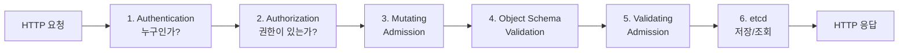
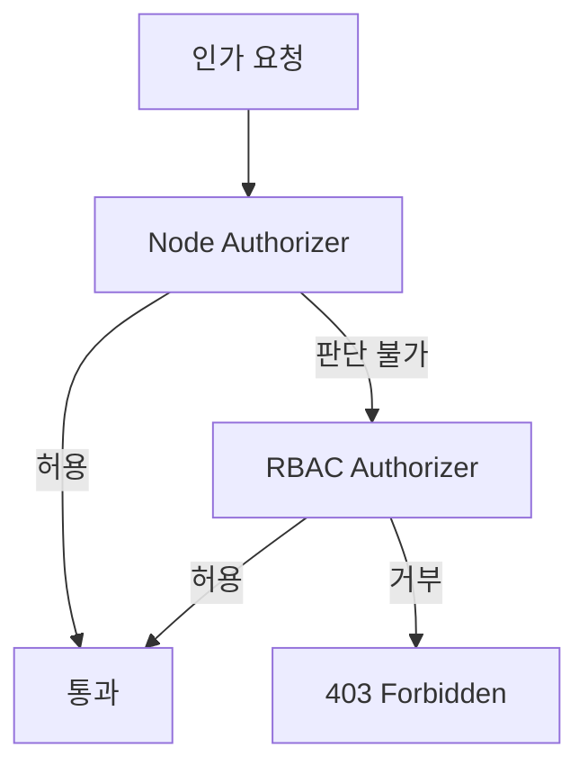
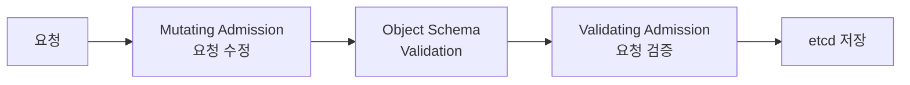
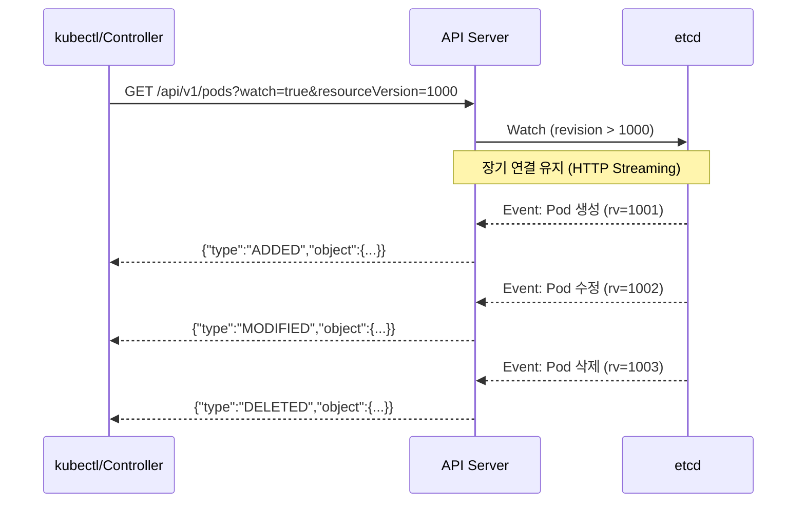
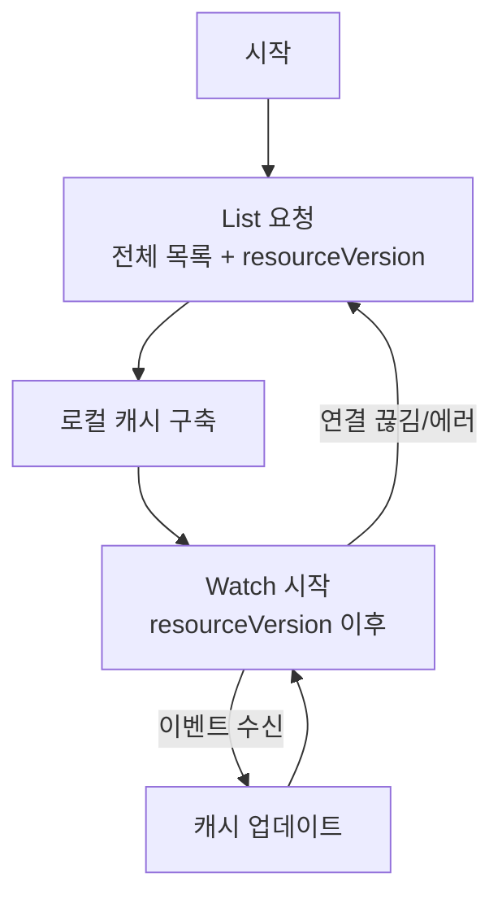
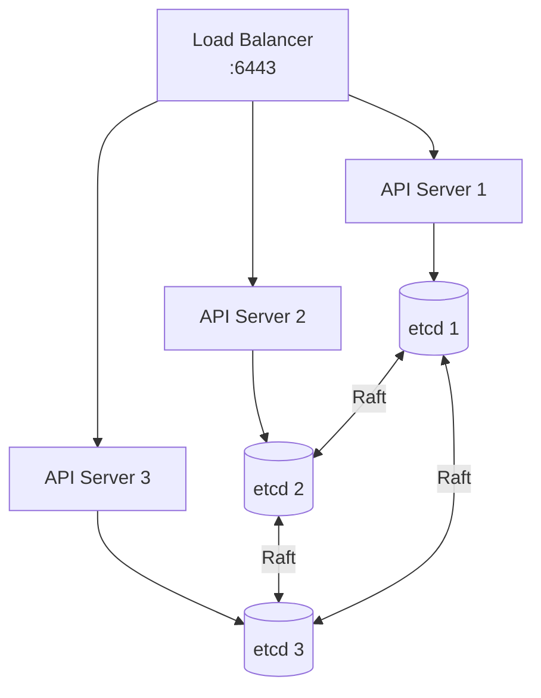

## API Server란?

**kube-apiserver**는 쿠버네티스 클러스터의 중심 허브입니다. 모든 컴포넌트(kubectl, kubelet, controller-manager, scheduler)는 API Server를 통해서만 클러스터 상태를 읽고 쓸 수 있습니다.

### API Server의 역할

- 모든 REST API 요청의 진입점
- 인증(Authentication), 인가(Authorization), 어드미션 제어(Admission Control)
- etcd와의 유일한 통신 채널
- Watch 메커니즘을 통한 이벤트 알림
- API 버전 관리와 변환

## 요청 처리 파이프라인

API Server에 요청이 도착하면 다음 단계를 순차적으로 거칩니다.



어느 단계에서든 실패하면 즉시 에러 응답을 반환하고 이후 단계는 실행되지 않습니다.

---

## 1단계: Authentication (인증)

"이 요청을 보낸 사람이 누구인가?"를 확인합니다. 여러 인증 메커니즘을 체인으로 구성하며, 하나라도 성공하면 인증 통과입니다.

### 인증 메커니즘

| 메커니즘 | 설명 | 사용 사례 |
|----------|------|----------|
| **X.509 클라이언트 인증서** | TLS 인증서의 CN/O 필드로 사용자/그룹 식별 | 클러스터 컴포넌트, 관리자 |
| **Bearer Token** | HTTP Authorization 헤더의 토큰 | ServiceAccount, OIDC |
| **ServiceAccount Token** | Pod에 자동 마운트되는 JWT 토큰 | Pod → API Server 통신 |
| **OIDC (OpenID Connect)** | 외부 IdP(Azure AD, Google)와 연동 | 사용자 인증 |
| **Webhook Token** | 외부 서비스에 토큰 검증 위임 | 커스텀 인증 |
| **Bootstrap Token** | 클러스터 부트스트랩 시 사용 | 노드 조인 |

### X.509 인증서 인증

```bash
# 인증서 생성 (사용자: developer, 그룹: dev-team)
$ openssl genrsa -out developer.key 2048
$ openssl req -new -key developer.key -out developer.csr \
    -subj "/CN=developer/O=dev-team"

# CSR을 쿠버네티스에 제출
$ kubectl certificate approve developer-csr

# kubeconfig에 등록
$ kubectl config set-credentials developer \
    --client-certificate=developer.crt \
    --client-key=developer.key
```

### ServiceAccount Token

```yaml
apiVersion: v1
kind: ServiceAccount
metadata:
  name: monitoring-sa
  namespace: monitoring
---
# K8s 1.24+ : 수동으로 토큰 생성 필요
apiVersion: v1
kind: Secret
metadata:
  name: monitoring-sa-token
  annotations:
    kubernetes.io/service-account.name: monitoring-sa
type: kubernetes.io/service-account-token
```

Pod 내부에서 API Server에 접근:

```bash
# 토큰 경로
$ cat /var/run/secrets/kubernetes.io/serviceaccount/token

# API Server 호출
$ curl -H "Authorization: Bearer $(cat /var/run/secrets/kubernetes.io/serviceaccount/token)" \
    --cacert /var/run/secrets/kubernetes.io/serviceaccount/ca.crt \
    https://kubernetes.default.svc/api/v1/namespaces/default/pods
```

### 익명 요청

인증에 실패한 요청은 `system:anonymous` 사용자로 처리됩니다. 프로덕션에서는 `--anonymous-auth=false`로 비활성화하는 것이 권장됩니다.

---

## 2단계: Authorization (인가)

인증된 사용자가 "요청한 작업을 수행할 권한이 있는가?"를 확인합니다.

### 인가 모드

| 모드 | 설명 |
|------|------|
| **RBAC** | Role/ClusterRole 기반 접근 제어 (가장 일반적) |
| **ABAC** | 속성 기반 접근 제어 (정적 파일) |
| **Webhook** | 외부 서비스에 인가 결정 위임 |
| **Node** | kubelet의 API 접근을 제한 |
| **AlwaysAllow** | 모든 요청 허용 (테스트용) |
| **AlwaysDeny** | 모든 요청 거부 |

일반적으로 `--authorization-mode=Node,RBAC`으로 설정합니다. 여러 모드를 체인으로 구성하면 하나라도 허용하면 통과합니다.

### 인가 결정 과정



### 권한 확인

```bash
# 현재 사용자의 권한 확인
$ kubectl auth can-i create deployments
yes

# 특정 사용자의 권한 확인 (관리자)
$ kubectl auth can-i delete pods --as=developer --namespace=production
no

# 모든 권한 목록
$ kubectl auth can-i --list --namespace=production
```

---

## 3단계: Admission Control (어드미션 제어)

인증과 인가를 통과한 요청을 **수정(Mutating)**하거나 **검증(Validating)**하는 플러그인 체인입니다.

### Admission Controller 종류



#### 주요 내장 Admission Controller

| 컨트롤러 | 타입 | 역할 |
|----------|------|------|
| **NamespaceLifecycle** | Validating | 삭제 중인 네임스페이스에 리소스 생성 방지 |
| **LimitRanger** | Mutating | LimitRange 기본값 적용 |
| **ServiceAccount** | Mutating | 기본 ServiceAccount 자동 할당 |
| **DefaultStorageClass** | Mutating | PVC에 기본 StorageClass 할당 |
| **ResourceQuota** | Validating | ResourceQuota 초과 방지 |
| **PodSecurity** | Validating | Pod 보안 표준 적용 (PSS) |
| **MutatingAdmissionWebhook** | Mutating | 외부 Webhook으로 요청 수정 |
| **ValidatingAdmissionWebhook** | Validating | 외부 Webhook으로 요청 검증 |

### Dynamic Admission Control (Webhook)

외부 서비스를 통해 커스텀 어드미션 로직을 구현할 수 있습니다.

```yaml
apiVersion: admissionregistration.k8s.io/v1
kind: MutatingWebhookConfiguration
metadata:
  name: sidecar-injector
webhooks:
- name: sidecar.example.com
  admissionReviewVersions: ["v1"]
  clientConfig:
    service:
      name: sidecar-injector
      namespace: system
      path: /inject
    caBundle: <base64-encoded-ca>
  rules:
  - operations: ["CREATE"]
    apiGroups: [""]
    apiVersions: ["v1"]
    resources: ["pods"]
  namespaceSelector:
    matchLabels:
      sidecar-injection: enabled
  failurePolicy: Fail        # Webhook 장애 시 요청 거부
  sideEffects: None
  timeoutSeconds: 10
```

### Admission Webhook 활용 사례

| 사례 | 타입 | 설명 |
|------|------|------|
| Sidecar 자동 주입 | Mutating | Istio Envoy 프록시 자동 주입 |
| 이미지 정책 | Validating | 승인된 레지스트리의 이미지만 허용 |
| 리소스 기본값 | Mutating | 누락된 리소스 requests/limits 자동 설정 |
| 레이블 강제 | Validating | 필수 레이블 없는 리소스 거부 |
| OPA/Gatekeeper | Validating | Rego 정책 기반 검증 |

### OPA Gatekeeper 예시

```yaml
# ConstraintTemplate: 정책 템플릿
apiVersion: templates.gatekeeper.sh/v1
kind: ConstraintTemplate
metadata:
  name: k8srequiredlabels
spec:
  crd:
    spec:
      names:
        kind: K8sRequiredLabels
      validation:
        openAPIV3Schema:
          type: object
          properties:
            labels:
              type: array
              items:
                type: string
  targets:
  - target: admission.k8s.gatekeeper.sh
    rego: |
      package k8srequiredlabels
      violation[{"msg": msg}] {
        provided := {label | input.review.object.metadata.labels[label]}
        required := {label | label := input.parameters.labels[_]}
        missing := required - provided
        count(missing) > 0
        msg := sprintf("Missing labels: %v", [missing])
      }
---
# Constraint: 정책 적용
apiVersion: constraints.gatekeeper.sh/v1beta1
kind: K8sRequiredLabels
metadata:
  name: require-team-label
spec:
  match:
    kinds:
    - apiGroups: ["apps"]
      kinds: ["Deployment"]
    namespaces: ["production"]
  parameters:
    labels: ["team", "app", "env"]
```

---

## API Groups와 버전 관리

쿠버네티스 API는 그룹별로 구성되어 독립적으로 버전을 관리합니다.

### API 그룹 구조

| API 그룹 | 경로 | 주요 리소스 |
|----------|------|------------|
| Core (legacy) | `/api/v1` | Pod, Service, ConfigMap, Secret, Namespace |
| apps | `/apis/apps/v1` | Deployment, StatefulSet, DaemonSet, ReplicaSet |
| batch | `/apis/batch/v1` | Job, CronJob |
| networking.k8s.io | `/apis/networking.k8s.io/v1` | Ingress, NetworkPolicy |
| rbac.authorization.k8s.io | `/apis/rbac.authorization.k8s.io/v1` | Role, ClusterRole, RoleBinding |
| storage.k8s.io | `/apis/storage.k8s.io/v1` | StorageClass, CSIDriver |
| autoscaling | `/apis/autoscaling/v2` | HorizontalPodAutoscaler |

### API 버전 성숙도

| 버전 | 안정성 | 설명 |
|------|--------|------|
| `v1alpha1` | Alpha | 실험적, 기본 비활성화, 언제든 변경/삭제 가능 |
| `v1beta1` | Beta | 충분히 테스트됨, 기본 활성화, 마이너 변경 가능 |
| `v1` | Stable | 안정적, 하위 호환성 보장 |

### API 리소스 탐색

```bash
# 모든 API 그룹 조회
$ kubectl api-versions

# 모든 리소스 타입 조회
$ kubectl api-resources

# 특정 리소스의 API 정보
$ kubectl api-resources | grep deployment
deployments    deploy    apps/v1    true    Deployment

# 리소스 스키마 확인
$ kubectl explain deployment.spec.strategy
$ kubectl explain pod.spec.containers.resources --recursive
```

### REST API 직접 호출

```bash
# kubectl proxy로 로컬 프록시 시작
$ kubectl proxy --port=8001

# Pod 목록 조회
$ curl http://localhost:8001/api/v1/namespaces/default/pods

# Deployment 조회
$ curl http://localhost:8001/apis/apps/v1/namespaces/default/deployments/nginx

# 리소스 생성 (POST)
$ curl -X POST http://localhost:8001/api/v1/namespaces/default/pods \
    -H "Content-Type: application/json" \
    -d @pod.json

# 리소스 패치 (PATCH)
$ curl -X PATCH http://localhost:8001/apis/apps/v1/namespaces/default/deployments/nginx \
    -H "Content-Type: application/strategic-merge-patch+json" \
    -d '{"spec":{"replicas":5}}'
```

---

## Watch 메커니즘

Watch는 쿠버네티스의 이벤트 기반 아키텍처의 핵심입니다. 리소스 변경을 실시간으로 감지합니다.

### Watch 동작 원리



### resourceVersion

모든 쿠버네티스 리소스는 `resourceVersion` 필드를 가집니다. etcd의 revision에 매핑되며, Watch의 시작점을 지정합니다.

```bash
# 현재 resourceVersion 확인
$ kubectl get pods -o json | jq '.metadata.resourceVersion'
"12345"

# 특정 버전 이후의 변경만 Watch
$ kubectl get pods --watch --resource-version=12345
```

### Watch 이벤트 타입

| 타입 | 설명 |
|------|------|
| `ADDED` | 새 리소스 생성 |
| `MODIFIED` | 기존 리소스 수정 |
| `DELETED` | 리소스 삭제 |
| `BOOKMARK` | Watch 진행 상황 표시 (resourceVersion 업데이트) |
| `ERROR` | Watch 에러 (재연결 필요) |

### List-Watch 패턴

컨트롤러는 일반적으로 List-Watch 패턴을 사용합니다:

1. **List**: 현재 상태의 전체 목록을 가져옴 (resourceVersion 획득)
2. **Watch**: 해당 resourceVersion 이후의 변경 사항을 스트리밍으로 수신
3. **Re-list**: Watch 연결이 끊기면 다시 List부터 시작



### Informer와 SharedInformer

Go 클라이언트에서 Watch를 효율적으로 사용하기 위한 추상화입니다.

- **Informer**: List-Watch + 로컬 캐시 + 이벤트 핸들러
- **SharedInformer**: 여러 컨트롤러가 같은 리소스를 Watch할 때 연결을 공유
- **Work Queue**: 이벤트를 큐에 넣고 순차적으로 처리 (재시도, 중복 제거)

---

## etcd와의 상호작용

API Server는 etcd와 통신하는 유일한 컴포넌트입니다.

### etcd 데이터 구조

쿠버네티스 리소스는 etcd에 키-값 형태로 저장됩니다:

```
/registry/<resource-type>/<namespace>/<name>

# 예시
/registry/pods/default/nginx-pod
/registry/deployments/production/web-app
/registry/clusterroles/cluster-admin
```

### etcd 성능 고려사항

| 항목 | 권장 사항 |
|------|----------|
| 디스크 | SSD 필수 (fsync 지연시간이 핵심) |
| 네트워크 | 컨트롤 플레인 노드 간 저지연 |
| 크기 제한 | 기본 2GB, 최대 8GB |
| 백업 | 정기적 스냅샷 (`etcdctl snapshot save`) |
| 클러스터 크기 | 3 또는 5 노드 (홀수) |

### Optimistic Concurrency Control

쿠버네티스는 **낙관적 동시성 제어**를 사용합니다. 리소스를 수정할 때 `resourceVersion`을 함께 전송하며, etcd에서 현재 버전과 일치하지 않으면 **409 Conflict**를 반환합니다.

```
1. Client A: GET pod (resourceVersion: 100)
2. Client B: GET pod (resourceVersion: 100)
3. Client A: PUT pod (resourceVersion: 100) → 성공 (rv: 101)
4. Client B: PUT pod (resourceVersion: 100) → 409 Conflict (현재 rv: 101)
5. Client B: GET pod (resourceVersion: 101) → 재시도
```

---

## API Server 고가용성

프로덕션 환경에서는 여러 API Server 인스턴스를 실행합니다.

### HA 구성



### API Server 주요 플래그

| 플래그 | 설명 |
|--------|------|
| `--etcd-servers` | etcd 엔드포인트 목록 |
| `--authorization-mode` | 인가 모드 (Node,RBAC) |
| `--enable-admission-plugins` | 활성화할 Admission Controller |
| `--service-cluster-ip-range` | Service ClusterIP 범위 |
| `--service-node-port-range` | NodePort 범위 (기본 30000-32767) |
| `--anonymous-auth` | 익명 인증 허용 여부 |
| `--audit-log-path` | 감사 로그 파일 경로 |
| `--encryption-provider-config` | etcd 암호화 설정 |

### API 감사 로그 (Audit Log)

누가, 언제, 무엇을 했는지 기록합니다.

```yaml
apiVersion: audit.k8s.io/v1
kind: Policy
rules:
- level: Metadata
  resources:
  - group: ""
    resources: ["secrets", "configmaps"]
- level: RequestResponse
  resources:
  - group: ""
    resources: ["pods"]
  namespaces: ["production"]
- level: None
  resources:
  - group: ""
    resources: ["events"]
```

| 레벨 | 기록 내용 |
|------|----------|
| `None` | 기록하지 않음 |
| `Metadata` | 요청 메타데이터만 (사용자, 시간, 리소스, 동작) |
| `Request` | 메타데이터 + 요청 본문 |
| `RequestResponse` | 메타데이터 + 요청 본문 + 응답 본문 |

---

## 정리

API Server의 요청 처리 파이프라인을 정리하면:

| 단계 | 역할 | 실패 시 |
|------|------|--------|
| **Authentication** | 요청자 신원 확인 | 401 Unauthorized |
| **Authorization** | 요청 권한 확인 | 403 Forbidden |
| **Mutating Admission** | 요청 객체 수정 | 요청 거부 |
| **Schema Validation** | 객체 스키마 검증 | 422 Unprocessable |
| **Validating Admission** | 정책 기반 검증 | 요청 거부 |
| **etcd Persist** | 상태 저장 | 500 Internal Error |

API Server를 깊이 이해하면 클러스터의 보안 강화, 성능 최적화, 문제 해결에 큰 도움이 됩니다. 특히 Admission Webhook을 활용한 정책 적용과 감사 로그를 통한 보안 모니터링은 프로덕션 환경에서 필수적입니다.
