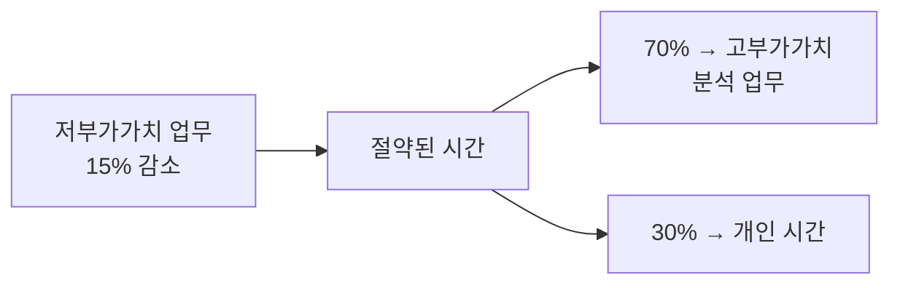
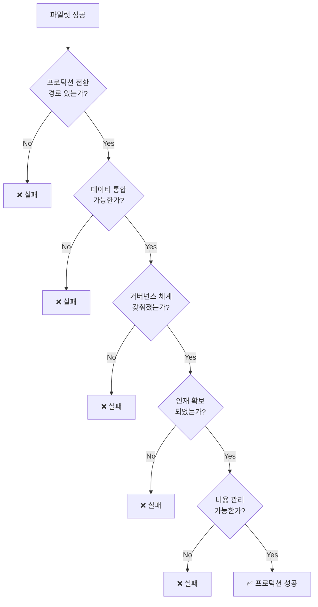
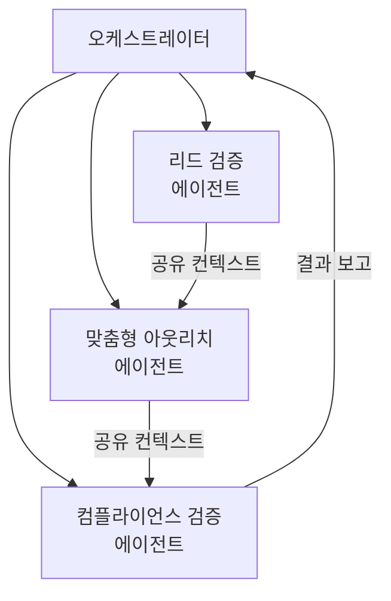
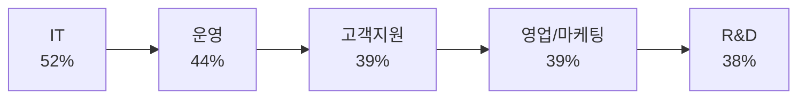
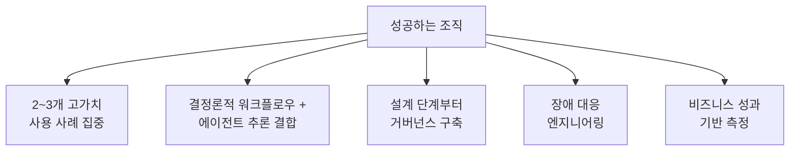
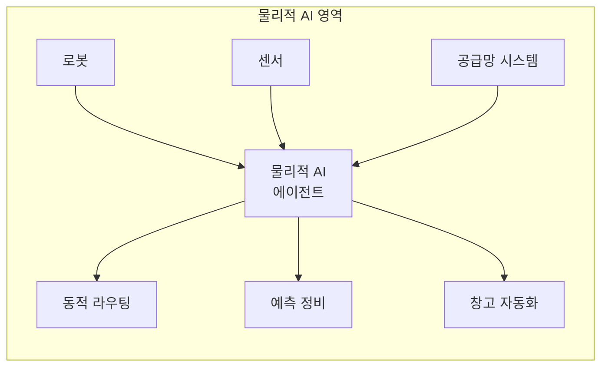

## 개요

2026년, 에이전틱 AI(Agentic AI)는 더 이상 테스트 단계의 데모가 아닙니다. 기업 운영의 핵심 인프라로 빠르게 전환되고 있습니다.

CrewAI의 2026 설문 보고서(500명의 C-레벨 임원 대상)에 따르면, 조사 대상 기업의 **100%가 올해 에이전틱 AI 도입을 확대할 계획**이며, 74%는 이를 전략적 필수 과제로 인식하고 있습니다.

| 지표 | 수치 |
|---|---|
| 이미 AI 에이전트를 사용 중인 기업 | 65% |
| 전사적으로 확대 또는 완전 도입한 기업 | 81% |
| 올해 도입 확대 계획 기업 | 100% |
| 에이전틱 AI로 자동화된 워크플로우 비율 | 평균 31% |
| 2026년 추가 확대 예상치 | +33% |

그러나 동시에 Gartner는 **2027년까지 에이전틱 AI 프로젝트의 40% 이상이 취소될 것**이라고 경고합니다. 기술적 한계가 아니라, 비용 증가·불명확한 비즈니스 가치·미흡한 리스크 관리가 원인입니다.

> 본 포스트는 CrewAI, Gartner, Forrester, McKinsey, IDC 등 주요 리서치 기관의 2025~2026년 보고서를 기반으로 재구성하였습니다.

*Photo by [Andrea De Santis](https://unsplash.com/@santesson89) on [Unsplash](https://unsplash.com) — AI 에이전트가 기업 운영의 핵심 인프라로 부상하고 있습니다.*

---

## 1. 측정 기준의 전환: 배포 수량에서 실질적 가치로

### "몇 개 만들었느냐"는 더 이상 의미 없다

McKinsey, BCG, PwC 등 주요 컨설팅 기업들은 에이전트 배포 수량이 아닌 **실제 사용자 수와 생산성 향상**을 핵심 지표로 전환했습니다.

PwC의 AI 최고 책임자 Dan Priest는 "에이전트를 몇 개 배포했느냐보다, 각 에이전트를 실제로 사용하는 인간 사용자가 몇 명이냐가 중요하다"고 밝혔습니다.

| 기존 지표 | 새로운 지표 |
|---|---|
| 배포된 에이전트 수 | 에이전트당 실제 사용자 수 |
| 파일럿 프로젝트 수 | 프로덕션 전환율 |
| 기술적 성능 | 비즈니스 성과 개선 폭 |
| 자동화 가능 업무 수 | 실제 절약된 시간·비용 |

### BCG의 사례

BCG에 따르면 컨설턴트들이 프레젠테이션 작성 같은 저부가가치 업무에 쓰는 시간이 약 **15% 감소**했고, 절약된 시간의 **70%는 고부가가치 분석 업무에 재투자**, 나머지 30%는 개인 시간으로 전환되고 있습니다.

CrewAI 보고서에서도 75%의 응답자가 시간 절약에 높은 영향을, 69%가 운영 비용 절감을, 62%가 매출 증가를 보고했습니다.

---

## 2. 파일럿에서 프로덕션으로: 5가지 장벽

McKinsey는 AI 에이전트가 연간 **2.6조~4.4조 달러**의 가치를 창출할 수 있다고 추정합니다. 그러나 대부분의 기업이 파일럿 단계를 벗어나지 못하고 있습니다.

### 장벽 1: 프로덕션 전환 경로의 부재

데모 환경은 ID 관리, 권한 구조, 감사 추적, 기존 시스템 통합을 고려하지 않습니다.

> "에이전트는 너무 고도화되어서 실패하는 것이 아니라, 현실에 맞게 엔지니어링되지 않아서 실패한다." — Kore.ai

### 장벽 2: 데이터 단편화

기업 환경은 ERP, CRM, ITSM 등 여러 플랫폼에 걸쳐 있습니다. 에이전트가 의미 있는 가치를 제공하려면 이들 간의 원활한 통합이 필요하지만, 취약한 연결과 데이터 사일로가 실용성을 제한합니다.

### 장벽 3: 거버넌스와 보안

API를 통해 행동을 실행하는 자율 에이전트는 프롬프트 인젝션, 과도한 권한, 추적 불가능성 등의 리스크를 수반합니다. CrewAI 보고서에서 **34%의 기업이 보안과 거버넌스를 최우선 평가 기준**으로 꼽았습니다.

### 장벽 4: 인재 부족

33%의 기업이 인재와 기술 역량 부족을 주요 장벽으로 지목했습니다.

### 장벽 5: 비용 관리

AI 에이전트는 24시간 연속 실행되며 API 호출과 컴퓨팅 리소스를 지속적으로 소비합니다. IDC는 2027년까지 **에이전트 사용량 10배, 추론 수요 1,000배 증가**를 예측합니다.

*Photo by [Igor Omilaev](https://unsplash.com/@omilaev) on [Unsplash](https://unsplash.com) — 파일럿에서 프로덕션으로의 전환이 진짜 경쟁입니다.*

---

## 3. 멀티 에이전트 시스템의 부상

### 단일 에이전트에서 오케스트레이션으로

Forrester와 Gartner 모두 2026년을 **멀티 에이전트 시스템의 돌파구 해**로 지목합니다. 개별 에이전트가 독립적으로 작동하는 것이 아니라, 중앙 오케스트레이션 하에 전문화된 에이전트들이 협업하는 아키텍처입니다.

Gartner는 멀티 에이전트 시스템을 "개별 또는 공유된 복잡한 목표를 달성하기 위해 상호작용하는 AI 에이전트의 집합"으로 정의합니다. 에이전트들은 단일 환경에서 제공되거나, 분산 시스템에 걸쳐 독립적으로 개발·배포될 수 있습니다.

### Kubernetes와의 비유

IBM과 AWS의 리더들은 에이전트 오케스트레이션 플랫폼을 **컨테이너 관리에서 Kubernetes가 했던 것과 비견되는 핵심 인프라**로 봅니다.

| Kubernetes (컨테이너) | 에이전트 오케스트레이션 |
|---|---|
| 컨테이너 스케줄링 | 에이전트 작업 할당 |
| 서비스 디스커버리 | 에이전트 간 컨텍스트 공유 |
| 헬스 체크 | 에이전트 성능 모니터링 |
| 롤링 업데이트 | 에이전트 버전 관리 |
| RBAC | 에이전트 권한 관리 |

단일 목적 에이전트는 이미 기본 수준이 되었고, **멀티 에이전트 오케스트레이션 역량이 경쟁 우위**를 결정합니다.

---

## 4. 검증된 사용 사례와 ROI

거버넌스 과제에도 불구하고, 특정 영역에서는 명확한 ROI가 입증되고 있습니다.

### 영역별 성과

| 영역 | 성과 | 세부 내용 |
|---|---|---|
| 고객 서비스 | 월 40시간+ 절약 | 자율적 티켓 해결, 환불, 에스컬레이션 |
| 재무 운영 | 30~50% 가속 | 송장 매칭, 비용 감사, 예측 |
| 보안/컴플라이언스 | 사전 예방 전환 | 이상 탐지, 정책 집행 |
| 영업/마케팅 | 파이프라인 2~3배 | 리드 생성, 맞춤형 아웃리치 |
| IT 운영 | 높은 ROI | 인프라 모니터링, 인시던트 라우팅 |
| 은행 KYC/AML | 200~2,000% 향상 | 워크플로우 자동화 |

### CrewAI 보고서의 부서별 영향도

CrewAI 보고서에서 **단 한 명의 응답자도 에이전틱 AI의 혜택이 전혀 없다고 답하지 않았습니다.** 이는 이 기술이 얼마나 광범위하게 적용 가능한지를 보여줍니다.

*Photo by [Stephen Dawson](https://unsplash.com/@dawson2406) on [Unsplash](https://unsplash.com) — 검증된 사용 사례에서 명확한 ROI가 입증되고 있습니다.*

---

## 5. 노코드 민주화

### 비즈니스 사용자가 더 나은 에이전트를 만든다

2026년의 중요한 변화 중 하나는 **노코드 플랫폼을 통한 에이전트 생성의 민주화**입니다. 운영 문제를 이해하는 비즈니스 사용자가 기술 팀보다 더 효과적인 에이전트를 설계하는 경우가 늘고 있습니다.

| 역할 | 구축하는 에이전트 |
|---|---|
| 고객 서비스 관리자 | 티켓 분류 및 에스컬레이션 |
| 재무 담당자 | 송장 매칭 및 승인 라우팅 |
| IT 디렉터 | 인프라 모니터링 및 표준 절차 실행 |

IDC에 따르면 이러한 도구에 대한 숙련도가 **스프레드시트 기술만큼 기본적인 역량**이 되고 있습니다. 진입 장벽은 시각적 인터페이스를 통해 크게 낮아지고 있습니다.

CrewAI 보고서에서도 57%의 기업이 처음부터 구축하기보다 **기존 오픈소스 도구 위에 구축하는 것을 선호**한다고 답했습니다. 특히 건설(73%), 금융(71%), 제조(63%), 리테일(60%) 업종에서 이 경향이 강합니다.

---

## 6. 성공과 실패를 가르는 핵심 요인

### 성공하는 조직의 공통점

성공하는 조직들은 다음을 실천합니다:

- **집중**: 수십 개의 파일럿 대신 2~3개의 고가치 프로덕션 사용 사례에 집중
- **결합**: 결정론적 워크플로우와 에이전트 추론을 결합하여, 예외 처리·의사결정·종합 분석 등 AI가 진정한 가치를 더하는 곳에만 적용
- **거버넌스**: ID 관리, 최소 권한 접근, 감사 로그, 인간 개입 제어를 사후가 아닌 **설계 단계부터** 구축
- **복원력**: 재시도, 부분 실패, 시스템 오브 레코드 대비 검증, 우아한 성능 저하를 처리하도록 엔지니어링
- **측정**: "에이전트가 얼마나 똑똑한가?"가 아니라 **"어떤 프로세스 결과를 얼마나 개선했는가?"**

### 비용 관리 전략

선도 기업들은 **계층화 전략**을 사용합니다:

| 작업 유형 | 모델 선택 | 이유 |
|---|---|---|
| 일상적 작업 | 저비용 모델 | 비용 효율성 |
| 고위험 의사결정 | 프리미엄 모델 | 정확성 우선 |

에이전트별 ROI를 추적하고, 성과가 낮은 에이전트는 빠르게 종료합니다. 비용 경제학을 무시하면 생산성 도구가 예산 블랙홀로 변합니다.

### 플랫폼 평가 기준

CrewAI 보고서에서 기업들이 에이전틱 AI 플랫폼을 평가할 때의 우선순위:

| 순위 | 기준 | 비율 |
|---|---|---|
| 1 | 보안 및 거버넌스 | 34% |
| 2 | 기존 시스템 통합 용이성 | 30% |
| 3 | 안정성 및 성능 | 24% |
| ... | ... | ... |
| 최하위 | 투자 대비 수익(ROI) | 2% |

ROI가 최하위인 이유는 ROI가 중요하지 않아서가 아니라, **보안·통합·안정성이라는 기반 없이는 지속 가능한 ROI 자체가 불가능**하다는 인식 때문입니다.

---

## 7. 물리적 AI: 다음 프론티어

### 디지털에서 물리적 세계로

Forrester의 2026년 예측은 **"물리적 AI(Physical AI)"**를 새로운 카테고리로 강조합니다. 로봇, 센서, 공급망 시스템을 실시간으로 조율하는 에이전트입니다.

Deloitte 조사에 따르면:
- 응답 기업의 **58%가 이미 물리적 AI를 사용** 중
- **2년 내 80%까지 확대** 전망

제조업과 물류 분야에서 디지털 에이전트와 엣지 하드웨어의 결합은 기업 AI에서 **가장 높은 임팩트를 가진 기회**로 평가됩니다.

Daniel Burrus는 2026년의 기술 전환을 이렇게 요약합니다: "기술이 사람이 사용하는 도구에서 **스스로 행동하는 자율 시스템**으로 이동하고 있다. 이 구분은 엄청난 전략적 무게를 갖는다."

*Photo by [Lenny Kuhne](https://unsplash.com/@lennykuhne) on [Unsplash](https://unsplash.com) — 물리적 AI가 디지털 세계를 넘어 실제 운영 환경으로 확장되고 있습니다.*

---

## 8. 실무 시사점

### 에이전틱 AI 도입을 고려하는 조직을 위한 체크리스트

| 영역 | 점검 항목 |
|---|---|
| 사용 사례 | 2~3개의 고가치 프로덕션 사용 사례를 선정했는가? |
| 거버넌스 | ID 관리, 최소 권한, 감사 로그가 설계 단계부터 포함되는가? |
| 데이터 통합 | ERP/CRM/ITSM 간 에이전트 접근이 원활한가? |
| 비용 관리 | 에이전트별 ROI를 추적하고 계층화 전략을 사용하는가? |
| 측정 기준 | 모델 성능이 아닌 비즈니스 성과를 측정하는가? |
| 인재 | 에이전트 구축·운영 역량을 갖춘 팀이 있는가? |
| 복원력 | 부분 실패, 재시도, 우아한 성능 저하를 처리하는가? |

### 하네스 엔지니어링과의 연결

이전 포스트에서 다룬 [하네스 엔지니어링](/2026/03/19/harness-engineering-agent-first-development/)의 관점과 연결하면, 에이전틱 AI의 성공은 결국 **에이전트가 안정적으로 일할 수 있는 환경을 얼마나 잘 설계하느냐**에 달려 있습니다. OpenAI가 강조한 리포지터리 구조, 문서화, 검증 루프, 아키텍처 제약은 기업 환경에서의 거버넌스, 통합, 비용 관리와 같은 맥락입니다.

---

## 정리

에이전틱 AI의 현재 상황은 한 문장으로 압축됩니다:

> 2026년 에이전틱 AI의 경쟁력은 "얼마나 많은 에이전트를 배포하느냐"가 아니라, **"거버넌스·통합·비용 관리를 갖춘 프로덕션 수준의 운영 체계를 얼마나 잘 구축하느냐"**에 달려 있습니다.

Kore.ai의 분석이 이를 가장 잘 요약합니다: "에이전트는 모델이 더 똑똑해질 때가 아니라, 조직이 '에이전트로 뭔 멋진 걸 할 수 있지?'라는 질문을 멈추고 **'어떤 프로세스를 안전하고, 측정 가능하고, 반복 가능하게 개선할 수 있지?'**라고 묻기 시작할 때 주류가 될 것이다."

40%의 실패 예측은 경고이자 기회입니다. 규율 있는 실행, 명확한 거버넌스, 입증 가능한 가치를 갖춘 조직이 나머지 60%에 속하게 될 것입니다.

*Photo by [Growtika](https://unsplash.com/@growtika) on [Unsplash](https://unsplash.com) — 실험의 시대는 끝났습니다. 이제는 규율 있는 실행의 시대입니다.*

---

## 참고 자료

- [CrewAI - 2026 State of Agentic AI Survey Report](https://www.crewai.com/blog/the-state-of-agentic-ai-in-2026)
- [Gartner - Predicts Over 40% of Agentic AI Projects Will Be Canceled by End of 2027](https://www.gartner.com/en/newsroom/press-releases/2025-06-25-gartner-predicts-over-40-percent-of-agentic-ai-projects-will-be-canceled-by-end-of-2027)
- [Reinventing.ai - Enterprise AI Agents Move From Pilot to Production](https://insights.reinventing.ai/articles/ai-agents-enterprise-production-2026-02-25)
- [Reinventing.ai - The AI Agent Reckoning: Why 40% of Enterprise Projects Will Fail by 2027](https://insights.reinventing.ai/articles/ai-agents-governance-roi-2026-02-24)
- [Daniel Burrus - 2026 Future Technology Trends and Predictions for Leaders](https://www.burrus.com/articles/future-technology-trends-prediction/)
- [Gartner - 40% of Enterprise Apps Will Run on AI Agents by 2026](https://www.businessworld.in/article/gartner-predicts-40-of-enterprise-apps-will-run-on-ai-agents-by-2026-569223)
