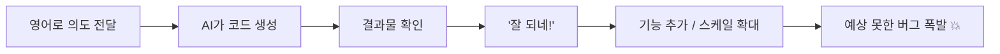
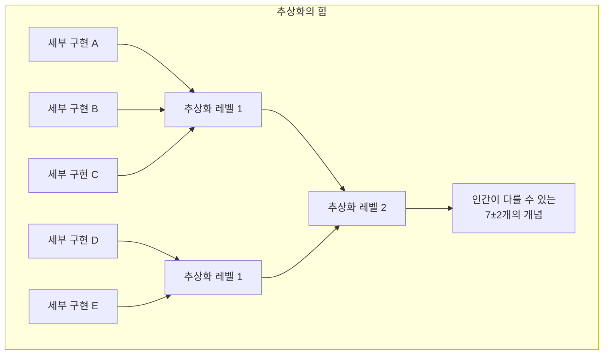
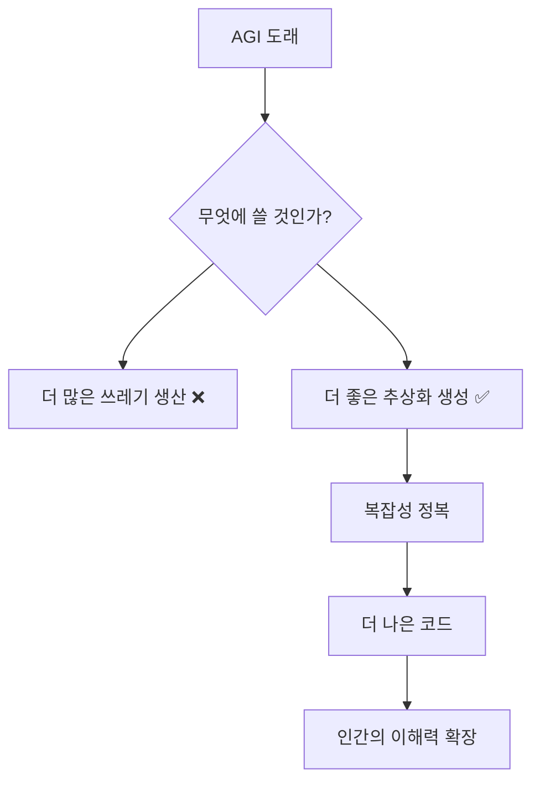
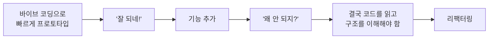

## 개요

2026년 3월, Val Town의 창업자 Steve Krouse가 [Precision](https://stevekrouse.com/precision)이라는 에세이를 발표했습니다. 제목부터 도발적입니다:

> **"Reports of code's death are greatly exaggerated."**
> (코드의 죽음에 대한 보도는 크게 과장되었다.)

사회의 99%가 "코드는 죽었다"고 동의한 것 같은 분위기에서, 그는 정반대의 주장을 펼칩니다. AI가 코딩을 대체하는 것이 아니라, **코딩을 더 강력하게 만들어줄 것**이라는 관점입니다.

이 글은 Krouse의 에세이 핵심 논지를 정리하고, 실무 개발자로서의 생각을 덧붙입니다.

> 본 포스트는 Steve Krouse의 원문을 기반으로 재구성하였으며, 직접 인용이 아닌 분석과 해석을 중심으로 작성되었습니다.

*Photo by [Ilya Pavlov](https://unsplash.com/@ilyapavlov) on [Unsplash](https://unsplash.com) — 코드는 단순한 도구가 아니라, 복잡성을 정복하기 위한 정밀한 언어입니다.*

---

## 1. 바이브 코딩의 매력과 함정

### 영어 수준의 감각은 정밀해 보인다 — 실제로 해보기 전까지는

Krouse는 Bertrand Russell의 말을 인용하며 글을 시작합니다:

> "모든 것은 당신이 그것을 정밀하게 만들려고 시도하기 전까지는, 당신이 인식하지 못하는 수준으로 모호하다."

**바이브 코딩(Vibe Coding)**은 매력적입니다. 영어로 의도를 말하면 AI가 코드를 만들어주고, "버튼을 저기로 옮겨줘", "색을 더 파랗게"라고 반응하면서 점진적으로 원하는 것에 가까워집니다. 영어 수준의 감각(vibes)으로 작업하면서 AI가 만든 결과물에 반응하는 방식입니다.

문제는, 바이브 코딩이 **감각이 정밀한 추상화라는 착각**을 만든다는 점입니다.

### Dan Shipper의 사례

Krouse는 Dan Shipper의 경험을 예로 듭니다. 바이브 코딩으로 만든 텍스트 에디터 앱이 바이럴을 타고 폭발적으로 성장했지만, 곧바로 다운되었습니다. 원인은 "실시간 협업(live collaboration)" 기능이었습니다.

"실시간 협업"은 직관적으로 완벽하게 정의된 스펙처럼 느껴집니다. 우리 모두 Google Docs나 Notion을 써봤으니까요. 하지만 실제로 구현하려고 하면, 그것이 얼마나 불완전한 스펙인지 깨닫게 됩니다.

| 직관적 느낌 | 실제 현실 |
|---|---|
| "실시간 협업" = 명확한 스펙 | 동시 편집 충돌, 네트워크 지연, 상태 동기화 등 수많은 엣지 케이스 |
| "알림 보내기" = 단순한 기능 | Slack의 알림 결정 플로우차트는 악몽 수준의 복잡성 |
| "버튼 하나 추가" = 5분 작업 | 상태 관리, 접근성, 반응형, 에러 처리... |

Krouse 자신도 10년 전에 협업 텍스트 에디터를 제품에 추가하려다 예상치 못한 복잡성의 악몽을 경험했다고 합니다. 그리고 무엇이 어려웠는지 기억조차 나지 않는다고. **복잡성은 지루하고, 생각하기 불쾌하며, 세부 사항과 엣지 케이스를 기억하기 어렵기 때문**입니다.

---

## 2. 추상화: 복잡성을 정복하는 유일한 도구

### 인간 두뇌의 근본적 한계

인간의 뇌는 한 번에 약 **7개(±2)의 것**만 생각할 수 있습니다. 7개 이상을 다루려면 여러 개를 하나로 압축해야 합니다. 이 압축 과정이 바로 **추상화(Abstraction)**입니다.

Edsger Dijkstra의 말:

> "추상화의 목적은 모호해지는 것이 아니라, **새로운 의미 수준을 만들어 그 안에서 절대적으로 정밀해지는 것**이다."

### Slack 알림 플로우차트의 교훈

Krouse는 Slack의 알림 결정 플로우차트를 예로 듭니다. 원래 플로우차트는 악몽 수준으로 복잡하지만, Sophie Alpert가 영리한 추상화를 적용해 훨씬 단순한 다이어그램으로 리팩터링했습니다.

이것이 프로그래밍의 가장 좋은 부분입니다. **복잡성을 정복하기 위해 점점 더 좋은 추상화를 만들어내는 것.** ReactJS가 UI 복잡성을, TailwindCSS가 스타일링 복잡성을 정복한 것처럼.

---

## 3. AGI 시대에도 코드는 살아남는다

### "100명의 카파시급 천재를 고용할 수 있다면?"

Krouse는 AGI 시나리오를 정면으로 다룹니다. 언젠가 기계 지능이 인간 지능과 구별할 수 없는 수준에 도달할 것입니다. 그때 월 $1,000에 100명의 Karpathy급 천재를 고용할 수 있다면, 왜 귀찮은 세부 사항을 신경 쓰겠습니까?

Krouse의 답은 명쾌합니다:

> "그 수준의 지능에 접근할 수 있다면, 더 많은 쓰레기를 만드는 데 쓸 생각은 **전혀 없다**."

### 코드는 소프트웨어만을 위한 것이 아니다

Krouse의 핵심 통찰은 이것입니다: 우리는 코드가 오직 소프트웨어를 만들기 위한 것이라고 잘못 생각합니다. 코드는 부분적으로만 그렇습니다. **코드 자체가 중요한 산출물**입니다. 잘 작성된 코드는 시(poetry)입니다.

이를 글쓰기에 비유하면 더 명확해집니다:

| 코딩 | 글쓰기 |
|---|---|
| "바이브 코딩"이 유행 | "바이브 라이팅"은 아무도 말하지 않음 |
| "AI가 코더를 대체한다" | "ChatGPT가 위대한 소설가를 대체한다"고 아무도 주장하지 않음 |
| 코드 = 단순한 도구? | 글 = 단순한 정보 전달 수단? |

아무도 "바이브 라이팅"을 말하지 않는 이유는, 문법적으로 올바른 문장에는 실행 가능한 코드 같은 신비로움이 없기 때문입니다. 글쓰기에서는 AI가 위대한 작가를 대체한다고 주장하는 것이 말도 안 된다는 걸 모두 알고 있습니다. **코딩도 정확히 같은 상황**입니다.

### AGI가 오면 가장 먼저 할 일

Krouse는 AGI가 도래하면 가장 먼저 사용할 곳이 **가장 어려운 추상화 문제**라고 말합니다. 더 좋은 추상화를 만들어서 복잡성을 더 잘 이해하고 정복하는 데 쓸 것이라고.

> "AI가 똑똑해질수록 좋은 코드의 필요성이 사라진다고 생각할 수 있지만, 그건 ChatGPT로 더 많은 쓰레기를 쓰는 것과 같다."

*Photo by [Kevin Ku](https://unsplash.com/@ikukevk) on [Unsplash](https://unsplash.com) — 코드는 죽어가는 것이 아니라, AI와 함께 더 강력해지고 있습니다.*

---

## 4. Dijkstra가 남긴 메시지

Krouse는 Edsger Dijkstra의 글 "자연어 프로그래밍의 어리석음에 대하여"에서 두 가지 인용을 남깁니다:

> "형식 기호를 사용해야 하는 의무를 부담으로 여기는 대신, 그것을 사용할 수 있는 편의를 **특권**으로 여겨야 한다. 형식 기호 덕분에 학생들이 과거에는 천재만이 달성할 수 있었던 것을 배울 수 있게 되었다."

> "우리가 모국어를 사용하는 '자연스러움'은, 결국 **넌센스가 명백하지 않은 진술을 쉽게 만들 수 있다는 것**으로 귀결된다."

그리고 Tony Hoare의 명언:

> "소프트웨어 설계를 구성하는 두 가지 방법이 있다. 하나는 **명백히 결함이 없을 정도로 단순하게** 만드는 것이고, 다른 하나는 **명백한 결함이 없을 정도로 복잡하게** 만드는 것이다."

---

## 5. 실무 개발자로서의 생각

### 바이브 코딩을 매일 쓰는 사람으로서

솔직히 말하면, 나도 바이브 코딩을 매일 씁니다. 이 블로그 자체도 AI의 도움을 받아 만들었고, 업무에서도 AI 코딩 도구 없이는 이전만큼의 생산성을 내기 어렵습니다. Krouse의 글이 "AI를 쓰지 말라"는 주장이 아니라는 점이 중요합니다. 그의 요점은 **AI가 만든 코드를 이해하지 못한 채 쌓아가는 것의 위험성**입니다.

### 추상화를 이해하지 못하면 결국 무너진다

실무에서 이런 경험을 자주 합니다:

바이브 코딩으로 빠르게 시작하는 건 좋지만, 어느 시점에서 반드시 코드의 구조를 이해해야 하는 순간이 옵니다. 그 순간에 추상화를 이해하는 능력이 없으면, AI에게 "고쳐줘"라고 말해도 AI는 같은 수준의 임시방편만 반복합니다.

이전 포스트에서 다룬 [하네스 엔지니어링](/2026/03/19/harness-engineering-agent-first-development/)의 관점과도 연결됩니다. OpenAI가 강조한 것은 "에이전트가 잘 일하려면 좋은 모델보다 좋은 환경이 먼저"라는 점이었습니다. 그 "좋은 환경"이란 결국 **잘 설계된 추상화와 아키텍처 제약**입니다. 바이브 코딩만으로는 이런 환경을 만들 수 없습니다.

### "코드는 죽었다"가 위험한 이유

Sam Harris 같은 영향력 있는 사람이 "아무도 코딩을 배울 필요가 없다"고 말하는 것은, Krouse의 비유대로 인쇄기가 발명되었을 때 "스토리텔링은 죽었다"고 말하는 것과 같습니다.

코딩을 배우는 것은 단순히 소프트웨어를 만드는 기술을 배우는 것이 아닙니다. **복잡한 문제를 분해하고, 추상화하고, 정밀하게 표현하는 사고방식**을 배우는 것입니다. AI가 아무리 발전해도, 이 사고방식의 가치는 오히려 더 커집니다. 왜냐하면 AI에게 좋은 지시를 내리려면, 문제를 정밀하게 정의할 수 있어야 하기 때문입니다.

### 결국 핵심은 "정밀함을 추구하는 태도"

Krouse의 글에서 가장 공감한 부분은, 코드가 단순한 도구가 아니라 **그 자체로 중요한 산출물**이라는 관점입니다. 잘 작성된 코드는 복잡한 문제에 대한 정밀한 해답이고, 그 정밀함은 영어(또는 한국어)로는 도달할 수 없는 수준입니다.

AI 시대에 개발자의 가치는 "코드를 타이핑하는 속도"가 아니라, **"복잡성을 정복하는 추상화를 설계하는 능력"**에 있습니다. 바이브 코딩은 이 과정을 가속화하는 도구이지, 대체하는 것이 아닙니다.

*Photo by [Fotis Fotopoulos](https://unsplash.com/@ffstop) on [Unsplash](https://unsplash.com) — AI 시대의 개발자 가치는 타이핑 속도가 아니라 추상화 설계 능력에 있습니다.*

---

## 정리

Krouse의 에세이와 내 경험을 종합하면, 핵심은 한 문장으로 압축됩니다:

> AI가 코드를 대신 써주는 시대일수록, **정밀한 추상화를 설계하고 복잡성을 구조적으로 정복하는 능력**이 개발자의 진짜 경쟁력이 됩니다.

바이브 코딩은 시작점으로서 훌륭합니다. 하지만 그것만으로 프로덕션 수준의 소프트웨어를 만들 수 있다는 착각은 위험합니다. 코드는 죽지 않았습니다. 오히려 AI 덕분에, 코드가 할 수 있는 일이 더 많아지고 있습니다.

Dijkstra의 말처럼, 형식 기호를 사용할 수 있는 것은 부담이 아니라 **특권**입니다.

---

## 참고 자료

- [Steve Krouse - Precision](https://stevekrouse.com/precision)
- [Edsger Dijkstra - On the foolishness of "natural language programming"](https://www.cs.utexas.edu/~EWD/transcriptions/EWD06xx/EWD667.html)
- [Simon Willison - AI-enhanced development](https://simonwillison.net/)
- [OpenAI - Harness Engineering](https://openai.com/index/harness-engineering/)
