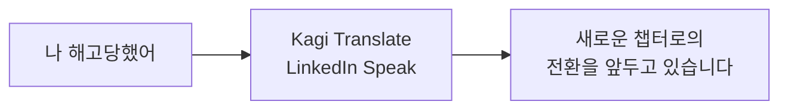
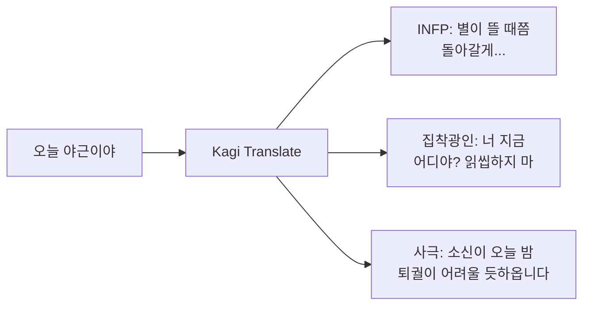
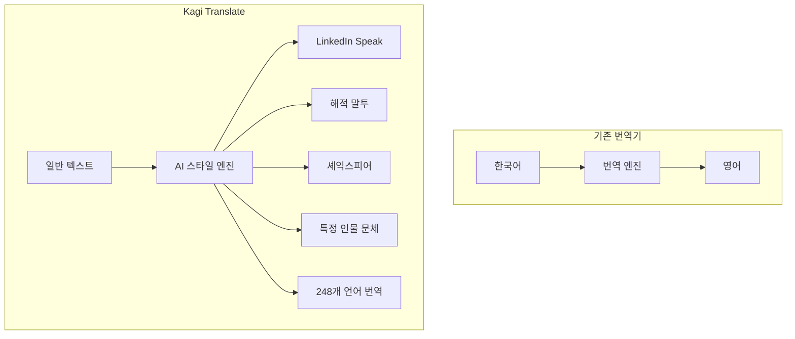
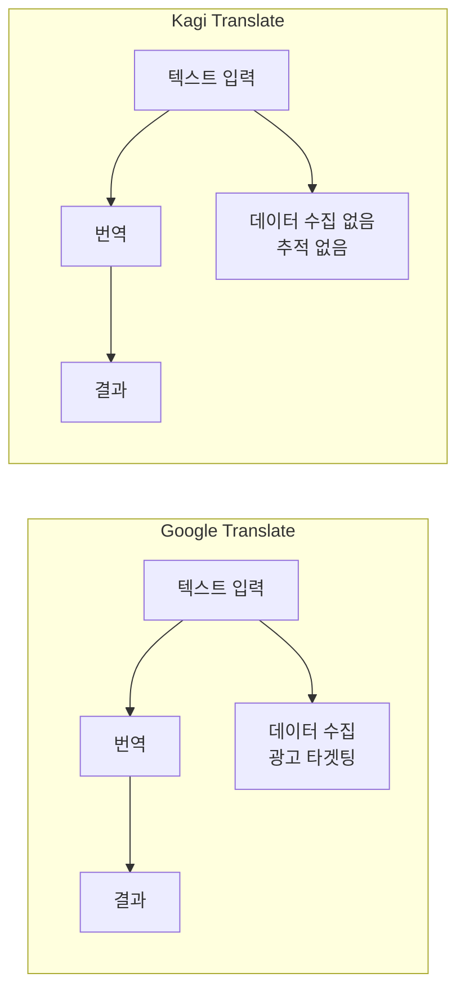
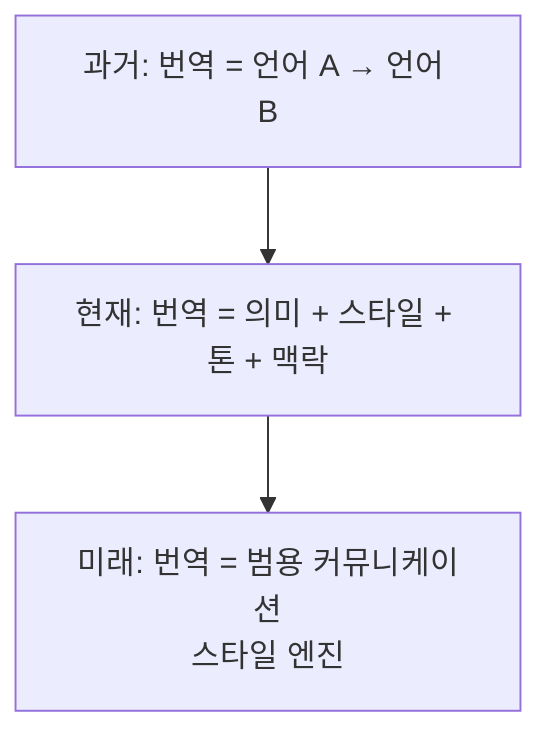

## 개요

번역기에 "I hope you die early"를 입력하면 뭐가 나올까요?

Google Translate라면 정직하게 번역해줄 겁니다. 하지만 **Kagi Translate**의 LinkedIn Speak 모드에서는 이렇게 나옵니다:

> "Wishing you a swift transition to your next chapter."

이 한 줄이 인터넷을 뒤집어 놓았습니다. Hacker News에서 1,180포인트, X(트위터)에서 800만 뷰. 번역기가 밈 생성기가 된 순간입니다.

하지만 웃기기만 한 건 아닙니다. Kagi Translate는 248개 이상의 언어를 지원하는 프라이버시 퍼스트 번역 서비스이고, 이 "LinkedIn Speak" 사건은 AI 번역의 미래에 대한 흥미로운 질문을 던집니다: **번역이란 무엇인가?**

> 본 포스트는 Ars Technica, WinBuzzer, Kagi 공식 블로그 등의 보도를 기반으로 재구성하였습니다.

*Photo by [Mika Baumeister](https://unsplash.com/@kommumikation) on [Unsplash](https://unsplash.com) — 번역기의 정의가 바뀌고 있습니다.*

---

## 1. Kagi Translate가 뭔데?

### Google Translate의 프라이버시 대안

[Kagi](https://kagi.com)는 유료 검색 엔진으로 유명한 회사입니다. 광고 없는 검색을 표방하며, "사용자가 제품이 아니라 고객"이라는 철학을 가지고 있습니다. 2024년 11월에 출시된 [Kagi Translate](https://translate.kagi.com)는 이 철학을 번역 서비스에 적용한 것입니다.

| 항목 | Kagi Translate | Google Translate | DeepL |
|---|---|---|---|
| 지원 언어 | 248+ | 243 | 33 |
| 가격 | 무료 (프리미엄 옵션) | 무료 | 무료/유료 |
| 추적/광고 | 없음 | 있음 | 제한적 |
| 데이터 저장 | 없음 | 있음 | 유료 플랜은 없음 |
| AI 모델 | 복수 LLM 조합 | 자체 모델 | 자체 모델 |
| 스타일 번역 | 지원 | 미지원 | 미지원 |

핵심 차별점은 두 가지입니다:

1. **프라이버시**: 추적 없음, 데이터 저장 없음, 광고 없음. 비회원도 캡차만 풀면 사용 가능
2. **컨텍스트 인식**: 단순 단어 치환이 아니라, 문맥을 이해하는 AI 기반 번역

---

## 2. LinkedIn Speak: 번역기가 밈이 된 날

### "화장실 청소부" → "Google 환경 유지보수 전문 계약자"

2026년 3월, Kagi가 LinkedIn Speak을 공식 출력 언어로 추가하면서 모든 것이 시작되었습니다.

Hacker News의 한 사용자가 평범한 화장실 청소 구인 공고를 입력했더니, Google에 입사하는 "환경 유지보수 전문 계약자(Environmental Maintenance Contractor)"에 대한 거창한 LinkedIn 포스트가 나왔습니다.

### 바이럴의 시작

| 플랫폼 | 반응 |
|---|---|
| Hacker News | 1,180포인트, 271개 댓글 |
| X (트위터) | 원본 트윗 ~800만 뷰 |
| Reddit | 다수의 서브레딧에서 화제 |

사람들이 열광한 이유는 단순합니다: **LinkedIn의 과장된 자기 PR 문화를 완벽하게 풍자**했기 때문입니다. 누구나 한 번쯤 본 적 있는 "I'm thrilled to announce..." 류의 포스트를 AI가 자동으로 생성해주니, 웃기지 않을 수가 없었습니다.

---

## 3. 번역을 넘어선 스타일 트랜스퍼

### "언어"의 정의를 다시 쓰다

LinkedIn Speak은 시작에 불과했습니다. 사용자들은 곧 Kagi Translate의 검색창에 **아무 스타일이나 입력**할 수 있다는 것을 발견했습니다.

| 입력 스타일 | 결과 |
|---|---|
| LinkedIn Speak | 과장된 자기 PR 톤 |
| Reddit Speak | 캐주얼하고 냉소적인 톤 |
| Pirate Speak | 해적 말투 |
| Shakespearean English | 셰익스피어 시대 영어 |
| Gen Z slang | Z세대 슬랭 |
| angry pirate | 화난 해적 |
| McKinsey consultant | 맥킨지 컨설턴트 말투 |

더 놀라운 건, Wharton 교수 Ethan Mollick이 공유한 발견입니다: 특정 인물의 이름을 입력하면, 그 사람의 **문체를 모방한 번역**이 나옵니다. 이는 단순한 번역이 아니라 **범용 스타일 트랜스퍼(Universal Style Transfer)** 엔진입니다.

### 한국에서 이걸 쓴다면?

URL 파라미터에 아무 스타일이나 넣을 수 있다는 건, 한국 문화 특유의 밈과 말투도 가능하다는 뜻입니다. 상상해보면 이런 것들이 됩니다:

| 입력 스타일 | "오늘 야근이야" 번역 결과 (예상) |
|---|---|
| INFP 감성 | "오늘도 세상이 나를 필요로 하나 봐... 별이 뜰 때쯤 돌아갈게, 기다려줄 수 있지?" |
| 집착광인 연인 | "퇴근 못 해. 근데 너 지금 어디야? 읽씹하지 마. 나 지금 위치 공유 켰어." |
| 조선시대 사극 | "전하, 소신이 오늘 밤 퇴궐이 어려울 듯하옵니다." |
| 군대 선임 | "야근이야. 끝나면 연락 넣어. 이상." |
| MZ세대 슬랭 | "ㅋㅋ 오늘 또 갈려나감 ㅠ 퇴근 실화냐 레전드" |
| 부동산 중개인 | "이 야근은 지금 안 하면 다음에 못 합니다. 경쟁률이 치열해요." |

물론 이건 실제 Kagi Translate 출력이 아니라, 이 엔진의 가능성을 한국 맥락에서 상상해본 것입니다. 하지만 LLM 기반 스타일 트랜스퍼의 핵심은 **문화적 맥락을 이해하는 것**이고, 한국어처럼 존댓말·반말·사투리·세대별 말투 차이가 극명한 언어에서 이 기술의 잠재력은 더 큽니다.

### 어떻게 가능한가?

기술적으로 보면, Kagi Translate는 하드코딩된 언어 파서가 아니라 **LLM + 프롬프트 엔지니어링**으로 동작합니다. 각 "언어"에 특화된 프롬프트가 붙어 있고, URL 파라미터로 타겟 언어를 자유롭게 지정할 수 있습니다.

즉, 번역 서비스의 탈을 쓴 **범용 텍스트 스타일 변환 엔진**인 셈입니다. 표준 번역은 이 엔진의 기본 모드일 뿐입니다.

---

## 4. 프라이버시 퍼스트: 진짜 차별점

### 재미만 있는 게 아니다

밈으로 유명해졌지만, Kagi Translate의 본질적인 가치는 **프라이버시**입니다.

Kagi의 공식 입장:

> "프라이버시와 품질은 공존할 수 있고, 강력한 도구가 사용자를 추적할 필요는 없으며, 최고의 기술은 사용자에 대한 타협 없이 작동해야 합니다."

실제 기능도 탄탄합니다:

| 기능 | 설명 |
|---|---|
| 웹페이지 번역 | 북마클릿으로 원클릭 번역 |
| 문서 번역 | PDF, DOCX 등 업로드 번역 |
| 브라우저 확장 | Chrome, Firefox, Safari 지원 |
| 인라인 번역 | Gmail, Mastodon 등 플랫폼 내 직접 번역 |
| 모바일 앱 | iOS, Android 지원 |
| 음성 번역 | 실시간 음성-음성 번역 |
| 교정 모드 | 번역 + 교정 동시 수행 |
| 이미지 번역 | 컨텍스트 인식 이미지 내 텍스트 번역 |

*Photo by [Towfiqu barbhuiya](https://unsplash.com/@towfiqu999999) on [Unsplash](https://unsplash.com) — 프라이버시와 품질은 공존할 수 있습니다.*

---

## 5. 논란: 자유와 책임 사이

### 검열 없는 LLM의 양날의 검

Kagi Translate의 자유로움은 양날의 검이기도 합니다. Hacker News 댓글에서 한 사용자가 지적했습니다:

> "이 도구는 검열되지 않은 LLM을 사용합니다. URL에 아무거나 넣을 수 있어요. 정말로, 아무거나."

이는 Kagi의 "사용자를 신뢰한다"는 철학과 직결됩니다. 하지만 도구가 대중화될수록, 콘텐츠 모더레이션에 대한 압력도 커질 수밖에 없습니다.

| 관점 | 주장 |
|---|---|
| 자유 옹호 | 사용자를 신뢰하는 것이 Kagi의 정체성 |
| 우려 | 악용 가능성, 브랜드 신뢰도 훼손 |
| 현실 | 대중화될수록 모더레이션 압력 증가 불가피 |

이전 포스트에서 다룬 [에이전틱 AI의 기업 도입](/2026/03/23/agentic-ai-enterprise-2026/)에서 34%의 기업이 보안과 거버넌스를 최우선으로 꼽았던 것처럼, AI 도구의 자유도와 안전성 사이의 균형은 2026년의 핵심 과제입니다.

---

## 6. 실무자 관점: 이게 왜 중요한가

### 번역기의 미래는 "스타일 엔진"이다

Kagi Translate가 보여준 것은, AI 번역의 미래가 단순한 언어 변환이 아니라 **스타일 변환**까지 포함한다는 점입니다.

실무에서 이런 시나리오를 생각해볼 수 있습니다:

- 기술 문서를 경영진용 요약으로 "번역"
- 내부 슬랙 메시지를 고객 대응 이메일로 "번역"
- 캐주얼한 회의록을 공식 보고서로 "번역"

이 모든 것이 "언어 간 번역"은 아니지만, **스타일 간 번역**입니다. Kagi Translate는 이 가능성을 장난스럽게 보여준 셈입니다.

### 개발자에게 주는 시사점

이전 포스트에서 다룬 [코드는 죽지 않았다](/2026/03/24/precision-code-is-not-dead/)의 관점과 연결하면, Kagi Translate의 스타일 트랜스퍼는 LLM의 "정밀함"이 어디까지 갈 수 있는지를 보여줍니다. 프롬프트 엔지니어링만으로 번역기를 범용 스타일 엔진으로 변환한 것은, **좋은 추상화가 도구의 가능성을 얼마나 확장하는지**를 보여주는 사례입니다.

*Photo by [Volodymyr Hryshchenko](https://unsplash.com/@lunarts) on [Unsplash](https://unsplash.com) — AI 번역의 미래는 언어를 넘어 커뮤니케이션 스타일 전체를 다루는 방향으로 진화하고 있습니다.*

---

## 정리

Kagi Translate 사건을 한 문장으로 요약하면:

> 번역기에 "LinkedIn Speak"을 넣었더니 밈이 되었고, 그 밈 뒤에는 **AI 번역이 "언어 변환"에서 "범용 스타일 엔진"으로 진화하고 있다**는 진지한 메시지가 숨어 있었습니다.

"I hope you die early"가 "Wishing you a swift transition to your next chapter"로 바뀌는 세상. 웃기지만, 이게 AI가 언어를 다루는 방식의 미래입니다. 그리고 그 미래에서 프라이버시까지 지켜주는 도구가 있다면, 한 번쯤 써볼 가치가 있습니다.

---

## 참고 자료

- [Kagi Translate](https://translate.kagi.com)
- [Ars Technica - Kagi Translate's AI answers the question "What would horny Margaret Thatcher say?"](https://arstechnica.com/ai/2026/03/kagi-translates-ai-answers-the-question-what-would-horny-margaret-thatcher-say/)
- [WinBuzzer - Kagi Translate Goes Viral with "LinkedIn Speak"](https://winbuzzer.com/2026/03/17/kagi-translate-linkedin-speak-satirical-corporate-prose-xcxwbn/)
- [Kagi Blog - Translate Extension](https://blog.kagi.com/tips/translate-extension)
