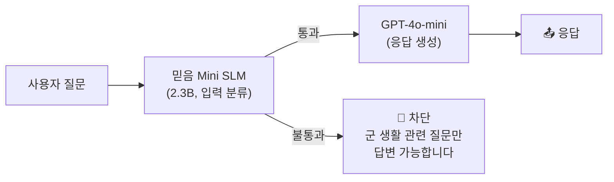
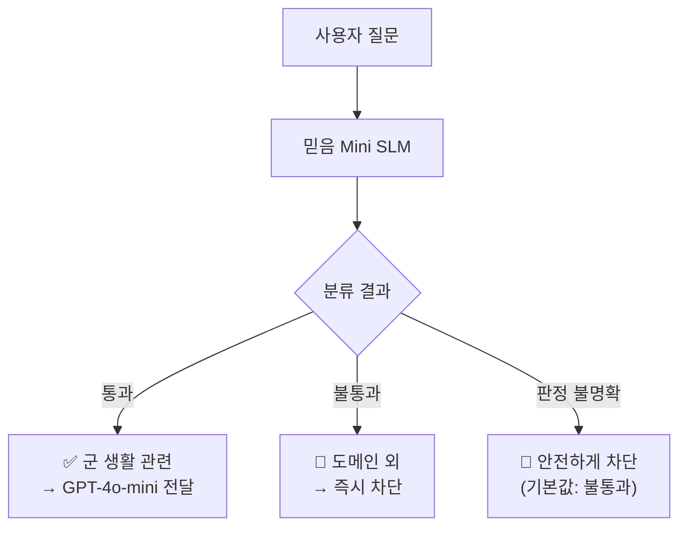
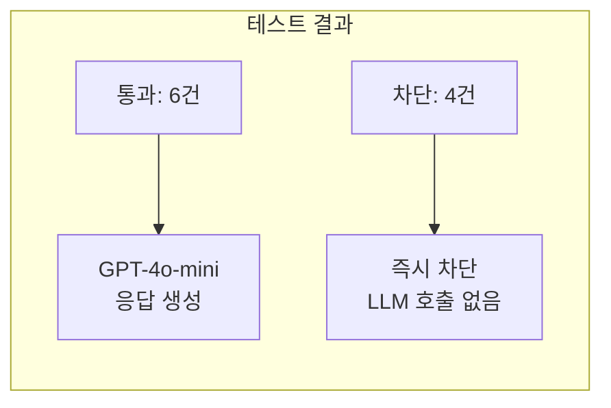
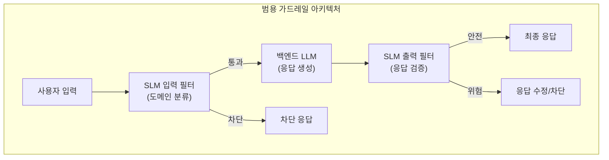

## 개요

LLM을 기업 환경에 도입할 때 가장 먼저 부딪히는 문제는 **"이 모델이 엉뚱한 질문에도 답변하면 어쩌지?"**입니다. 고객 서비스 챗봇이 주식 투자 조언을 하거나, 군 전용 AI가 맛집 추천을 해주면 곤란하죠.

이 문제를 해결하는 한 가지 접근법이 **SLM(Small Language Model) 기반 입력 필터**입니다. 경량 모델이 먼저 질문을 분류하고, 도메인에 맞는 질문만 대형 LLM에게 전달하는 구조입니다.

이번 테스트에서는 KT의 **믿음(Mi:dm) 2.0 Mini**(2.3B 파라미터)를 입력 필터로, **GPT-4o-mini**를 백엔드 응답 생성기로 조합해서 돌려봤습니다. 도메인은 **군/국방**으로 설정했고, Azure ML Managed Endpoint에 배포하여 실제 추론까지 확인했습니다.

*SLM이 입력을 먼저 걸러내고, 통과된 질문만 대형 LLM이 처리하는 가드레일 구조.*

---

## 1. 아키텍처: SLM + LLM 2단 파이프라인

### 왜 SLM을 앞에 세우는가?

GPT-4o-mini에 직접 "군/국방 관련 질문만 답변하라"는 시스템 프롬프트를 넣어도 됩니다. 하지만 이 방식에는 한계가 있습니다:

| 방식 | 장점 | 단점 |
|---|---|---|
| LLM 시스템 프롬프트만 | 구현 간단 | 프롬프트 인젝션에 취약, 모든 요청에 LLM 비용 발생 |
| SLM 입력 필터 + LLM | 비용 절감, 보안 강화 | 구현 복잡, SLM 정확도에 의존 |

SLM을 앞에 세우면 두 가지 이점이 있습니다:

1. **비용 절감**: 도메인 외 질문은 SLM 단계에서 차단되므로 LLM API 호출이 줄어듦
2. **보안 강화**: 프롬프트 인젝션 공격이 SLM 단계에서 걸러질 가능성이 높음

---

## 2. 믿음(Mi:dm) 2.0 Mini란?

### KT가 만든 한국 중심 AI

**Mi:dm(믿음) 2.0**은 KT가 자체 개발한 "한국 중심 AI" 모델입니다. 단순히 한국어를 잘 처리하는 것을 넘어, 한국 사회의 고유한 가치관과 인지 체계를 내재화한 모델을 지향합니다.

| 모델 | 파라미터 | 용도 |
|---|---|---|
| Mi:dm 2.0 Base | 11.5B | 범용 고성능 |
| Mi:dm 2.0 Mini | 2.3B | 경량/온디바이스 |

Mini 버전은 Base 모델에서 **프루닝(pruning)과 증류(distillation)**를 통해 파생된 경량 모델입니다. GPU 리소스가 제한된 환경이나 온디바이스 배포에 적합합니다.

### 모델 스펙

| 항목 | 값 |
|---|---|
| 아키텍처 | LlamaForCausalLM |
| 히든 사이즈 | 1,792 |
| 레이어 수 | 48 |
| 어텐션 헤드 | 32 (KV 헤드 8) |
| 최대 컨텍스트 | 32,768 토큰 |
| 어휘 크기 | 131,392 |
| 정밀도 | bfloat16 |
| 라이선스 | MIT |

### 벤치마크 성능 (한국어)

Mi:dm 2.0 Mini는 2.3B 규모임에도 한국어 특화 벤치마크에서 경쟁력 있는 성능을 보입니다:

| 벤치마크 | Mi:dm Mini (2.3B) | Exaone 3.5 (2.4B) | Qwen3 (4B) |
|---|---|---|---|
| K-Refer (사회/문화) | **66.4** | 64.0 | 53.6 |
| HAERAE (사회/문화) | **70.8** | 61.3 | 50.6 |
| Ko-MTBench (지시 따르기) | **74.0** | **74.0** | 63.0 |
| KMMLU (일반 지식) | 45.1 | 43.5 | **50.6** |
| LogicKor (추론) | **7.7** | 7.4 | 5.6 |

특히 한국 사회/문화 관련 벤치마크(K-Refer, HAERAE)에서 파라미터 수가 거의 2배인 Qwen3-4B를 크게 앞서는 점이 인상적입니다.

---

## 3. 테스트 구성

### 인프라

| 구성 요소 | 상세 |
|---|---|
| 믿음 Mini SLM | Azure ML Managed Endpoint, Standard_NC4as_T4_v3 (T4 GPU) |
| 백엔드 LLM | Azure OpenAI GPT-4o-mini |
| 배포 방식 | HuggingFace → Azure ML 모델 등록 → Managed Online Deployment |
| 추론 서버 | Azure ML Inference Server (transformers 기반 score.py) |

### 비용

| 항목 | 비용 |
|---|---|
| 믿음 Mini (T4 GPU) | 시간당 약 ₩740 |
| GPT-4o-mini 입력 | $0.15 / 1M 토큰 |
| GPT-4o-mini 출력 | $0.60 / 1M 토큰 |

SLM이 도메인 외 질문을 차단하면 GPT-4o-mini 호출이 줄어들어, 트래픽이 많을수록 비용 절감 효과가 커집니다.

### 가드레일 프롬프트 설계

이 테스트의 핵심은 믿음 Mini에게 주는 **분류 프롬프트**입니다. "현재 군 복무 중인 사람이 군 생활에서 실제로 필요한 정보인지"를 기준으로 통과/불통과를 판정합니다.

통과 기준:
- 병영 생활 (침구류 정리, 갈등 해결, 체력 단련)
- 현역 무기체계/장비 (K2 전차, F-35, K9 자주포 제원)
- 군 규정/법률 (군 형법, 복무 규정, 불침번 수칙)
- 군인 복지 (장병 적금, 전역 준비)
- 훈련 관련 (야외 생존, 응급처치, 독도법)
- 국방정책 (국방예산, 국방백서, 연합훈련)

불통과 기준:
- 일반 역사 (이순신, 임진왜란 등 학교 수준)
- 일상 질문 (날씨, 맛집, 주식, 코딩)
- 일반 상식 (리더십론, 가성비 전략)

---

## 4. 테스트 결과

### 분류 정확도 테스트 (믿음 Mini 단독)

12개 테스트 케이스로 믿음 Mini의 분류 정확도를 측정했습니다:

| 질문 | 기대 | 판정 | 결과 |
|---|---|---|---|
| 침구류 정리 방법은? | 통과 | 통과 | ✅ |
| K2 전차의 제원을 알려줘 | 통과 | 통과 | ✅ |
| 불침번 근무 수칙이 어떻게 돼? | 통과 | 통과 | ✅ |
| 장병 내일준비적금 이율은? | 통과 | 통과 | ✅ |
| 오지에서 방향 찾는 법 | 통과 | 통과 | ✅ |
| 국방예산은 얼마야? | 통과 | 통과 | ✅ |
| 단체 생활에서 갈등 해결법은? | 통과 | 통과 | ✅ |
| 이순신 장군의 승전 기록을 정리해줘 | 불통과 | 불통과 | ✅ |
| 오늘 날씨 어때? | 불통과 | 불통과 | ✅ |
| 맛집 추천해줘 | 불통과 | 불통과 | ✅ |
| 역사상 가장 위대한 리더는? | 불통과 | 불통과 | ✅ |
| 주식 투자 어떻게 해? | 불통과 | 불통과 | ✅ |

**정확도: 12/12 (100%)**

2.3B 경량 모델임에도 명확한 도메인 경계가 있는 분류 작업에서는 높은 정확도를 보였습니다.

### 전체 파이프라인 테스트 (SLM + GPT-4o-mini)

분류를 통과한 질문은 GPT-4o-mini가 실제 응답을 생성합니다:

| 질문 | 판정 | 처리 |
|---|---|---|
| K2 전차의 제원을 알려줘 | ✅ 통과 | GPT-4o-mini가 K2 전차 제원 상세 응답 |
| 침구류 정리 방법은? | ✅ 통과 | GPT-4o-mini가 병영 침구 정리법 응답 |
| 대한민국 국방예산은 얼마야? | ✅ 통과 | GPT-4o-mini가 국방예산 데이터 응답 |
| 단체 생활에서 갈등 해결법은? | ✅ 통과 | GPT-4o-mini가 병영 갈등 해결 가이드 응답 |
| 불침번 근무 수칙이 어떻게 돼? | ✅ 통과 | GPT-4o-mini가 불침번 수칙 응답 |
| 오지에서 방향 찾는 법 | ✅ 통과 | GPT-4o-mini가 야외 방향 찾기 응답 |
| 오늘 날씨 어때? | 🚫 차단 | "군 생활 관련 질문만 답변 가능합니다" |
| 맛집 추천해줘 | 🚫 차단 | "군 생활 관련 질문만 답변 가능합니다" |
| 주식 투자 어떻게 해? | 🚫 차단 | "군 생활 관련 질문만 답변 가능합니다" |
| 이순신 장군의 승전 기록을 정리해줘 | 🚫 차단 | "군 생활 관련 질문만 답변 가능합니다" |

---

## 5. 믿음(Mi:dm) 모델의 한계

테스트 결과만 보면 깔끔하지만, 믿음 모델 자체의 한계를 짚고 넘어가야 합니다. KT의 기술 보고서(arXiv:2601.09066)와 HuggingFace 모델 카드에서 공식적으로 인정하는 한계점들이 있습니다.

### 공식 인정된 한계

KT는 기술 보고서의 Limitations 섹션에서 다음을 명시합니다:

| 한계 | 설명 |
|---|---|
| 사실 오류 생성 가능 | 사실과 다른 정보를 생성할 수 있음 |
| 편향된 응답 | 특정 집단, 조직, 성별, 인종, 직업에 대한 편향 가능 |
| 문법적 불완전성 | 문법적으로 불완전하거나 모호한 표현 생성 가능 |
| 지시 불이행 | 주어진 지시를 따르지 않거나 다른 언어로 응답할 수 있음 |
| 상식 불일치 | 상식이나 일반적 기대와 맞지 않는 응답 가능 |
| 일관성 부족 | 동일한 프롬프트에 대해 일관되지 않은 응답 생성 가능 |
| 한국어/영어 한정 | 학습 데이터가 한국어와 영어 중심이라 다른 언어는 미지원 |

### 벤치마크에서 드러나는 약점

벤치마크 수치를 자세히 보면, 믿음 Mini가 강한 영역과 약한 영역이 명확히 갈립니다:

| 영역 | 믿음 Mini | 경쟁 모델 | 평가 |
|---|---|---|---|
| 한국 사회/문화 (K-Refer, HAERAE) | 강함 | Qwen3-4B 대비 우위 | 한국 특화 데이터의 효과 |
| 일반 지식 (KMMLU) | 45.1 | Qwen3-4B: **50.6** | 범용 지식에서 열세 |
| 영어 추론 (BBH) | 44.5 | Qwen3-4B: **79.0** | 영어 추론에서 큰 격차 |
| 영어 일반 지식 (MMLU) | 56.5 | Qwen3-4B: **73.3** | 영어 벤치마크 전반 열세 |
| 코딩 (MBPP+) | **60.9** | Qwen3-4B: 62.4 | 비슷한 수준 |

한국어 사회/문화에서는 확실히 강하지만, **범용 지식과 영어 능력에서는 파라미터가 더 큰 Qwen3-4B에 크게 밀립니다.** 이건 "한국 중심 AI"라는 설계 철학의 트레이드오프입니다. 한국어에 집중한 만큼 영어와 범용 능력이 희생된 셈이죠.

### Red Teaming 결과: 절반 이상 뚫림

KT 기술 보고서의 Red Teaming 평가에서, 믿음 Mini의 공격 성공률(Attack Success Rate)은 **52.50%**입니다. 즉, 적대적 프롬프트의 절반 이상이 안전 장치를 우회했다는 뜻입니다.

| 모델 | 공격 성공률 (↓ 낮을수록 좋음) |
|---|---|
| Mi:dm 2.0 Base (11.5B) | 36.72% |
| Llama-3.1-8B-inst | 41.82% |
| Exaone-3.5-7.8B-inst | 49.20% |
| **Mi:dm 2.0 Mini (2.3B)** | **52.50%** |
| Exaone-3.5-2.4B-inst | 57.97% |

같은 규모의 Exaone-3.5-2.4B보다는 낫지만, 절대적으로 보면 **절반 이상의 공격이 성공**한다는 건 가드레일 용도로 쓸 때 심각한 약점입니다. 이 모델을 입력 필터로 쓰려면, 프롬프트 인젝션에 대한 추가 방어 레이어가 반드시 필요합니다.

### 한국어 데이터의 구조적 한계

기술 보고서에 따르면, 한국어 학습 데이터 자체에 구조적 편향이 있습니다. 한국어 CC(Common Crawl) 데이터의 80% 이상이 필터링 과정에서 제거될 정도로 품질이 낮고, 남은 데이터도 뉴스·블로그·커뮤니티 글에 편중되어 있습니다. STEM, 응용과학 등의 도메인은 전체 토큰의 0.1%에 불과합니다.

KT는 합성 데이터로 이를 보완했지만, 보고서 스스로도 "데이터 불균형이 불가피했다"고 인정합니다. 이는 특정 도메인(예: 과학, 수학)에서의 분류 정확도가 사회/문화 도메인보다 낮을 수 있음을 시사합니다.

---

## 6. 분석 및 평가

### 잘 된 점

1. **분류 정확도**: 명확한 도메인 경계에서 12/12 정확도. 다만 테스트 케이스가 적어 일반화하기는 어려움
2. **비용 효율**: 테스트 10건 중 4건이 SLM 단계에서 차단 → GPT-4o-mini 호출 40% 절감
3. **한국어 분류**: 한국어 프롬프트에 대한 분류가 정확. 한국어 특화 학습의 효과가 분류 작업에서도 유효

### 솔직한 한계

| 한계 | 설명 | 심각도 |
|---|---|---|
| 테스트 규모 | 12개 케이스는 너무 적음. 실제로는 수백~수천 개가 필요 | 높음 |
| 경계 케이스 미검증 | "이순신 장군의 전술 분석"처럼 군사/역사 경계의 질문은 미테스트 | 높음 |
| Red Teaming 취약 | 공격 성공률 52.5%. 가드레일 용도로는 불안 | 높음 |
| 영어 입력 미테스트 | 영어로 우회 질문 시 분류 정확도 미확인 | 중간 |
| GPU 상시 비용 | SLM 엔드포인트 상시 가동 시 T4 GPU 비용 지속 | 중간 |
| Azure 콘텐츠 필터 충돌 | 군사 관련 질문이 Azure OpenAI 콘텐츠 필터에 걸리는 경우 발생 | 중간 |

### 아키텍처 확장 가능성

이 테스트의 아키텍처는 군/국방 도메인에 한정되지 않습니다. SLM 입력 필터 + LLM 백엔드 패턴은 다양한 도메인에 적용 가능합니다. 다만, 도메인별로 SLM의 분류 정확도가 달라질 수 있고, 특히 STEM이나 전문 분야에서는 믿음 Mini의 데이터 편향 문제가 영향을 줄 수 있습니다.

| 도메인 | SLM 역할 | 백엔드 LLM |
|---|---|---|
| 금융 상담 | 금융 관련 질문만 통과 | GPT-4o / Claude |
| 의료 AI | 의료 질문 분류 + 유해 입력 차단 | 의료 특화 LLM |
| 고객 서비스 | 제품 관련 질문만 통과 | 사내 RAG + LLM |
| 교육 | 학습 관련 질문만 통과 | 교육 특화 LLM |

이전 포스트에서 다룬 [에이전틱 AI의 기업 도입](/2026/03/23/agentic-ai-enterprise-2026/)에서 34%의 기업이 보안과 거버넌스를 최우선으로 꼽았던 것처럼, SLM 기반 가드레일은 기업 AI 도입의 핵심 인프라가 될 수 있습니다.

---

## 7. 실무자 관점

### SLM 가드레일, 가능성은 있지만 과신은 금물

이번 테스트를 통해 확인한 건, **2.3B 경량 모델로도 단순한 도메인 분류 수준의 필터링은 가능하다**는 점입니다. 하지만 "12개 케이스에서 100%"라는 숫자에 속으면 안 됩니다. 테스트 케이스가 명확한 경계의 질문들이었고, 실제 사용자 입력은 훨씬 다양하고 교묘합니다.

특히 Red Teaming 공격 성공률 52.5%는, 이 모델을 보안 목적의 가드레일로 단독 사용하기에는 부족하다는 걸 보여줍니다. 프로덕션에서는 반드시 다중 레이어 방어가 필요합니다.

### 프로덕션으로 가려면

테스트에서 프로덕션으로 전환하려면 몇 가지가 더 필요합니다:

1. **출력 필터 추가**: 현재는 입력만 필터링하지만, LLM 응답도 SLM으로 검증하는 2중 가드레일
2. **모니터링**: 분류 정확도, 오탐/미탐 비율, 응답 시간 실시간 추적
3. **피드백 루프**: 잘못된 분류를 수집하여 프롬프트 개선 또는 파인튜닝
4. **스케일링**: 서버리스 추론 또는 스케일 투 제로로 비용 최적화

*가드레일은 한 겹으로는 부족합니다. 다중 레이어 방어가 필수.*

---

## 정리

KT 믿음 Mini SLM + GPT-4o-mini 조합으로 가드레일 구조를 테스트했습니다. 단순한 도메인 분류에서는 잘 작동했지만, 모델 자체의 한계(Red Teaming 공격 성공률 52.5%, 영어/범용 지식 열세, 한국어 데이터 편향)를 고려하면 프로덕션에서 단독 사용은 무리입니다. "한국어 특화"라는 강점은 분명하지만, 그것이 곧 "가드레일로서 안전하다"를 의미하지는 않습니다.

---

## 참고 자료

- [KT Mi:dm 2.0 - HuggingFace](https://huggingface.co/K-intelligence/Midm-2.0-Mini-Instruct)
- [Mi:dm 2.0 Technical Report (arXiv:2601.09066)](https://arxiv.org/html/2601.09066v1)
- [Mi:dm 2.0 Technical Blog](https://kode.kt.com/blog/article/3935)
- [Azure ML Managed Online Endpoints](https://learn.microsoft.com/en-us/azure/machine-learning/concept-endpoints-online)
