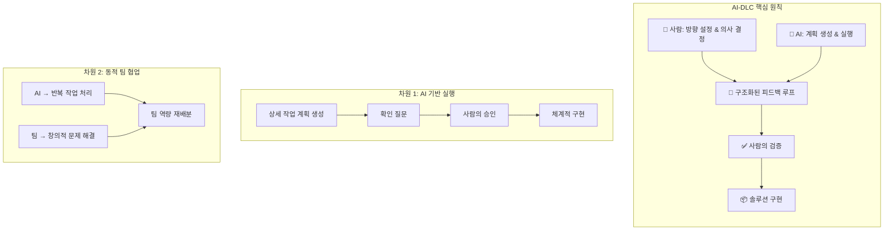
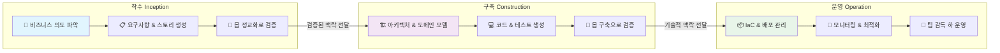
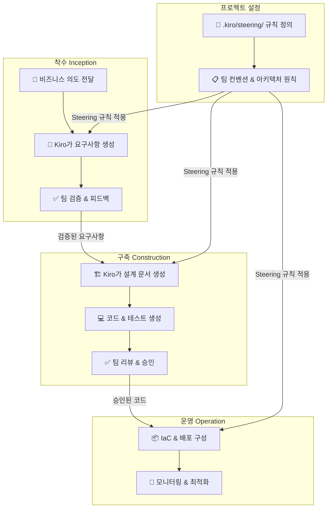
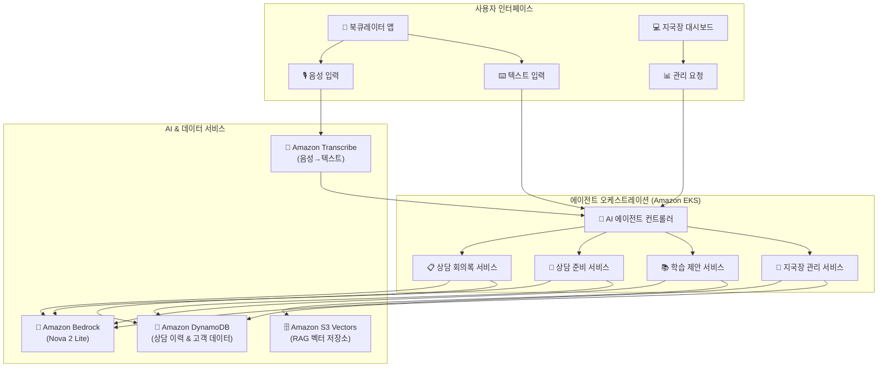
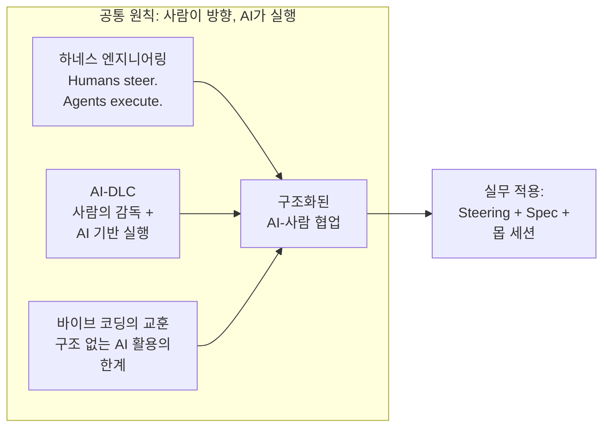

## 개요

AI 코딩 어시스턴트가 자동완성을 넘어 PR을 생성하고, 에이전트가 리포지터리 전체를 탐색하며 코드를 작성하는 시대가 됐습니다. 하지만 대부분의 조직은 여전히 기존 SDLC(Software Development Life Cycle) 위에 AI 도구를 얹는 방식으로 접근합니다. 프롬프트 한 줄로 코드를 뽑아내는 바이브 코딩(Vibe Coding)이 화제가 되기도 했지만, 프로토타입을 넘어 프로덕션 수준의 소프트웨어를 만들려면 구조가 필요합니다. AI를 기존 프로세스에 끼워 맞추는 것이 아니라, AI의 능력을 소프트웨어 개발의 구조 자체에 통합하는 접근이 필요한 시점입니다.

AWS가 제안하는 **AI-DLC(AI-Driven Development Life Cycle)**는 바로 이 문제의식에서 출발합니다. AI를 보조 도구가 아닌 개발 프로세스의 중심 협력자로 위치시키고, 사람의 감독(Human Oversight) 아래 AI가 실행하는 구조를 체계화한 방법론입니다. 이전 포스트에서 다뤘던 [하네스 엔지니어링의 "Humans steer. Agents execute."](/2026/03/19/harness-engineering-agent-first-development/) 원칙과 맥을 같이하면서도, AI-DLC는 개발 생명주기 전체를 재설계한다는 점에서 한 단계 더 나아갑니다.

이 글에서는 AI-DLC의 핵심 개념과 세 단계(착수, 구축, 운영)를 정리하고, 웅진씽크빅이 이 방법론을 적용해 북큐레이터 AI 에이전트를 2일 만에 MVP로 구축한 실제 사례를 분석합니다. 바이브 코딩과의 차이, Kiro Steering을 활용한 실전 워크플로우, 그리고 실무자 관점에서의 시사점까지 함께 다룹니다.

> 본 포스트는 AWS 기술 블로그에 게시된 [AI-DLC(AI-Driven Development Life Cycle) 소개](https://aws.amazon.com/ko/blogs/tech/ai-driven-development-life-cycle/)와 [웅진씽크빅 북큐레이터 AI 에이전트 구축 사례](https://aws.amazon.com/ko/blogs/tech/aws-aidlc-woongjinthinkbig-tech-blog/) 두 편의 내용을 참고하여, 독자적인 분석과 해석을 중심으로 재구성하였습니다.


*Photo by [Igor Omilaev](https://unsplash.com/@omilaev) on [Unsplash](https://unsplash.com) — AI가 개발 프로세스의 중심 협력자로 자리잡는 시대, 구조화된 접근이 필요합니다.*

---

## 1. AI-DLC란 무엇인가

### 개념 정의

**AI-DLC(AI-Driven Development Life Cycle)**는 AI를 보조 도구가 아닌 개발 프로세스의 중심 협력자로 위치시키는 소프트웨어 개발 방법론입니다. 기존 SDLC가 사람이 계획하고 사람이 실행하는 구조였다면, AI-DLC는 사람이 방향을 설정하고 AI가 체계적으로 실행하는 구조를 제안합니다.

여기서 중요한 건 "AI가 알아서 다 해준다"는 이야기가 아니라는 점입니다. AI-DLC의 핵심은 AI의 실행력과 사람의 판단력을 구조적으로 결합하는 데 있습니다. AI가 계획을 생성하고, 맥락을 이해하기 위해 확인 질문(Clarifying Questions)을 던지며, 사람의 검증을 받은 후에야 솔루션을 구현합니다. 이전 포스트에서 다뤘던 [하네스 엔지니어링의 "Humans steer. Agents execute."](/2026/03/19/harness-engineering-agent-first-development/) 원칙이 개별 에이전트 수준의 이야기였다면, AI-DLC는 이 원칙을 개발 생명주기 전체로 확장한 프레임워크라고 볼 수 있습니다.

### 두 가지 핵심 차원

AI-DLC는 두 가지 강력한 차원을 강조합니다.

**첫째, 사람의 감독을 통한 AI 기반 실행(AI-Driven Execution with Human Oversight)**입니다. AI가 체계적으로 상세한 작업 계획을 생성하고, 불분명한 사항에 대해 적극적으로 명확한 설명을 구하며, 중요한 결정은 사람에게 위임합니다. 이는 단순히 "AI가 코드를 짜고 사람이 리뷰한다"는 수준을 넘어서, 계획 수립 단계부터 AI와 사람이 구조화된 피드백 루프(Feedback Loop)를 형성한다는 의미입니다. AI는 실행의 속도를, 사람은 판단의 정확성을 담당하는 분업 구조가 만들어집니다.

**둘째, 동적 팀 협업(Dynamic Team Collaboration)**입니다. AI가 일상적인 작업을 처리하는 동안, 팀은 협업 공간(Collaboration Space)에서 실시간으로 문제 해결, 창의적 사고 및 신속한 의사 결정에 집중합니다. 기존 개발 프로세스에서 엔지니어가 반복적인 구현 작업에 시간을 쏟았다면, AI-DLC에서는 그 시간이 설계 토론, 아키텍처 결정, 사용자 경험 개선 같은 고차원적 활동으로 재배분됩니다.



### 새로운 용어 체계

AI-DLC는 기존 소프트웨어 개발의 익숙한 용어들을 새롭게 재정의합니다. 이는 단순한 이름 변경이 아니라, AI 중심 개발에서 작업의 단위와 속도가 근본적으로 달라졌음을 반영합니다.

| 기존 용어 | AI-DLC 용어 | 변화의 의미 |
|---|---|---|
| 스프린트(Sprint) | 볼트(Bolts) | 주 단위에서 시간/일 단위로 개발 주기가 압축됩니다. AI의 실행 속도에 맞춰 반복 주기가 극적으로 짧아집니다. |
| 에픽(Epic) | 작업 단위(Unit) | 대규모 기능 묶음 대신, AI가 한 번에 처리할 수 있는 명확한 작업 범위로 재정의됩니다. |
| 스크럼 마스터(Scrum Master) | 플로우 가디언(Flow Guardian) | 프로세스 관리자에서 AI-사람 간 워크플로우의 흐름을 최적화하는 역할로 전환됩니다. |
| 회고(Retrospective) | 시그널 리뷰(Signal Review) | 정성적 회고에서 AI가 수집한 데이터 기반의 정량적 개선 분석으로 진화합니다. |

스프린트가 볼트(Bolts)로 바뀐다는 건, 2주짜리 계획을 세우고 그 안에서 작업을 배분하는 방식이 더 이상 유효하지 않다는 뜻입니다. AI가 계획을 생성하고 실행하는 속도에 맞춰, 개발 주기 자체가 시간 단위로 압축됩니다. 에픽이 작업 단위(Unit)로 바뀌는 것도 같은 맥락입니다. AI에게 "이 에픽을 처리해"라고 던지는 것이 아니라, AI가 이해하고 실행할 수 있는 명확한 범위의 작업으로 분해하는 것이 핵심입니다.


---

## 2. AI-DLC의 세 단계

AI-DLC는 소프트웨어 개발을 세 단계로 구분합니다: **착수(Inception)**, **구축(Construction)**, **운영(Operation)**. 기존 SDLC의 요구사항 분석 → 설계 → 구현 → 테스트 → 배포 → 유지보수라는 선형적 흐름과 비교하면, AI-DLC의 세 단계는 각 단계가 다음 단계를 위한 맥락(Context)을 축적하는 누적적 구조라는 점에서 근본적으로 다릅니다.

핵심은 **맥락의 연속성**입니다. 착수 단계에서 팀이 검증한 요구사항과 비즈니스 의도는 구축 단계에서 AI가 아키텍처와 코드를 제안하는 근거가 되고, 구축 단계에서 축적된 기술적 맥락은 운영 단계에서 AI가 인프라와 배포를 관리하는 기반이 됩니다. AI는 이 모든 산출물을 프로젝트 저장소에 저장하여 지속적인 맥락을 유지합니다. 단계가 진행될수록 AI의 제안은 점점 더 정보에 기반한(Informed) 것이 됩니다.



### 착수(Inception) — 몹 정교화(Mob Elaboration)

착수 단계는 "무엇을 만들 것인가"를 정의하는 과정입니다. 기존 SDLC에서 프로덕트 오너가 요구사항을 작성하고 개발팀에 전달하는 일방향 흐름이었다면, AI-DLC의 착수 단계는 AI가 비즈니스 의도를 상세한 요구사항, 사용자 스토리(User Story), 작업 단위(Unit)로 변환하는 과정을 **전체 팀이 실시간으로 검증**하는 구조입니다.

이 과정을 AI-DLC에서는 **몹 정교화(Mob Elaboration)**라고 부릅니다. 몹 프로그래밍(Mob Programming)에서 영감을 받은 이 방식은, AI가 생성한 요구사항과 스토리에 대해 팀 전체가 동시에 질문하고, 수정하고, 승인하는 협업 세션입니다. AI가 "이 기능의 사용자는 누구인가요?", "예외 상황은 어떻게 처리할까요?" 같은 확인 질문(Clarifying Questions)을 던지면, 팀은 즉시 답변하고 AI의 이해를 교정합니다.

이 단계의 핵심 가치는 **암묵지의 명시화**입니다. 기존 프로세스에서는 프로덕트 오너의 머릿속에만 있던 비즈니스 규칙, 엣지 케이스(Edge Case), 우선순위 판단 기준이 AI와의 대화를 통해 문서화됩니다. AI가 질문을 던지는 과정 자체가 요구사항의 빈틈을 드러내는 효과를 만들어냅니다.

### 구축(Construction) — 몹 구축(Mob Construction)

구축 단계는 착수 단계에서 검증된 맥락을 기반으로 AI가 실제 솔루션을 제안하는 과정입니다. AI는 논리적 아키텍처(Logical Architecture), 도메인 모델(Domain Model), 코드 솔루션, 테스트를 생성하고, 팀은 **몹 구축(Mob Construction)**을 통해 기술적 결정과 아키텍처 선택에 대한 설명을 실시간으로 제공합니다.

기존 SDLC에서 시니어 개발자가 아키텍처를 설계하고 주니어 개발자가 구현하는 위계적 구조였다면, AI-DLC의 구축 단계에서는 AI가 초안을 빠르게 생성하고 팀 전체가 그 품질을 평가하는 수평적 구조로 전환됩니다. AI가 "이 서비스는 마이크로서비스로 분리하는 것이 적합합니다"라고 제안하면, 팀은 "현재 트래픽 규모에서는 모놀리스가 더 효율적이다"라고 방향을 수정할 수 있습니다.

구축 단계에서 특히 주목할 점은 **테스트의 위상 변화**입니다. 기존에는 구현 후 테스트를 작성하는 경우가 많았지만, AI-DLC에서는 AI가 코드와 테스트를 동시에 생성합니다. 팀은 테스트 케이스의 적절성을 검토함으로써, 코드의 정확성뿐 아니라 요구사항의 완전성까지 검증하는 이중 안전망을 구축합니다.

### 운영(Operation) — 팀 감독 하의 AI 관리

운영 단계는 착수와 구축에서 축적된 모든 맥락을 AI가 활용하여 코드형 인프라(Infrastructure as Code, IaC)와 배포를 관리하는 과정입니다. AI는 프로젝트의 아키텍처 결정, 기술 스택 선택, 성능 요구사항을 이미 이해하고 있기 때문에, 인프라 구성과 배포 파이프라인을 맥락에 맞게 제안할 수 있습니다.

기존 SDLC에서 DevOps 엔지니어가 별도로 인프라를 구성하고 배포 스크립트를 작성했다면, AI-DLC에서는 개발 과정에서 축적된 맥락이 운영까지 자연스럽게 이어집니다. "이 서비스는 DynamoDB를 사용하고, 피크 시간대 초당 1,000건의 요청을 처리해야 한다"는 정보가 이미 프로젝트 저장소에 있으므로, AI는 이에 맞는 오토스케일링(Auto Scaling) 설정과 모니터링 대시보드를 제안합니다.

운영 단계에서 사람의 역할은 **감독과 예외 처리**에 집중됩니다. AI가 일상적인 배포와 모니터링을 처리하는 동안, 팀은 장애 대응, 보안 이슈, 비용 최적화 같은 판단이 필요한 영역에 집중합니다.

### 단계별 주요 활동과 산출물

| 단계 | 주요 활동 | 산출물 | 팀의 역할 |
|---|---|---|---|
| 착수(Inception) | 비즈니스 의도 파악, 요구사항 생성, 확인 질문 | 요구사항 문서, 사용자 스토리, 작업 단위(Unit) | 몹 정교화(Mob Elaboration)를 통한 실시간 검증 |
| 구축(Construction) | 아키텍처 설계, 코드 생성, 테스트 작성 | 논리적 아키텍처, 도메인 모델, 코드, 테스트 | 몹 구축(Mob Construction)을 통한 기술적 의사결정 |
| 운영(Operation) | IaC 구성, 배포 관리, 모니터링 | 인프라 코드, 배포 파이프라인, 모니터링 설정 | 감독, 예외 처리, 보안 및 비용 최적화 |

### 기존 SDLC와의 비교

AI-DLC의 세 단계를 기존 SDLC와 비교하면, 단순히 "AI가 도와준다"는 수준이 아니라 개발 프로세스의 구조 자체가 달라진다는 것을 알 수 있습니다.

| 비교 항목 | 기존 SDLC | AI-DLC |
|---|---|---|
| 요구사항 정의 | 프로덕트 오너가 작성 → 개발팀에 전달 | AI가 생성 → 전체 팀이 몹 정교화로 검증 |
| 설계 & 구현 | 시니어가 설계 → 주니어가 구현 → 리뷰 | AI가 설계+코드+테스트 동시 생성 → 팀이 몹 구축으로 검증 |
| 배포 & 운영 | DevOps가 별도 인프라 구성 | AI가 개발 맥락 기반으로 IaC 제안 → 팀 감독 |
| 맥락 전달 | 문서 기반, 단계 간 정보 손실 빈번 | AI가 저장소에 맥락 축적, 단계 간 연속성 유지 |
| 팀 협업 방식 | 역할별 분업, 비동기 커뮤니케이션 중심 | 몹 세션 기반 실시간 협업, 역할 경계 유연화 |
| 반복 주기 | 스프린트(Sprint) 1~4주 | 볼트(Bolts) 시간~일 단위 |
| 테스트 시점 | 구현 후 별도 테스트 단계 | AI가 코드와 테스트를 동시 생성 |

기존 SDLC에서 가장 큰 병목은 **단계 간 맥락 손실**이었습니다. 요구사항 분석가가 파악한 비즈니스 의도가 설계 문서로 옮겨지면서 뉘앙스가 사라지고, 설계 의도가 구현 과정에서 왜곡되며, 운영팀은 "왜 이렇게 만들었는지" 모른 채 시스템을 관리하는 상황이 반복됐습니다. AI-DLC는 AI가 모든 단계의 산출물을 프로젝트 저장소에 저장하고, 다음 단계에서 이를 참조함으로써 이 문제를 구조적으로 해결합니다.


---

## 3. AI-DLC vs 바이브 코딩

AI-DLC를 이해하는 가장 빠른 방법은, 최근 개발자 커뮤니티에서 화제가 된 **바이브 코딩(Vibe Coding)**과 비교하는 것입니다. 둘 다 AI를 활용한 소프트웨어 개발이라는 공통점이 있지만, 접근 방식과 지향점은 근본적으로 다릅니다.

### 바이브 코딩: 감각에 의존하는 개발

바이브 코딩은 개발자의 직관과 간단한 프롬프트(Prompt)에 의존하는 AI 활용 방식입니다. "대충 이런 거 만들어줘"라고 요청하면 AI가 코드를 생성하고, 결과물을 보면서 "여기 좀 고쳐줘", "색을 바꿔줘"라고 반복하며 점진적으로 원하는 것에 가까워지는 방식입니다.

이전 포스트 [코드는 죽지 않았다](/2026/03/24/precision-code-is-not-dead/)에서 다뤘듯이, Steve Krouse는 바이브 코딩이 **"감각이 정밀한 추상화라는 착각"**을 만든다고 지적했습니다. 프로토타입 수준에서는 놀라울 정도로 잘 작동하지만, 기능이 복잡해지고 규모가 커지면 한계가 드러납니다.

바이브 코딩의 핵심 한계는 다음과 같습니다:

- **맥락의 부재**: 프롬프트 한 줄에는 비즈니스 규칙, 엣지 케이스(Edge Case), 아키텍처 제약 같은 맥락이 담기지 않습니다. AI는 매번 새로운 대화에서 맥락을 처음부터 추론해야 합니다.
- **구조적 일관성 부족**: 여러 번의 프롬프트로 누적된 코드는 전체적인 설계 의도 없이 쌓이기 때문에, 시간이 지날수록 유지보수가 어려워집니다.
- **검증의 어려움**: "잘 되는 것 같다"는 감각에 의존하기 때문에, 요구사항 대비 완성도를 체계적으로 검증하기 어렵습니다.
- **프로덕션 전환의 벽**: 프로토타입에서 프로덕션으로 넘어가는 순간, 보안, 성능, 확장성 같은 비기능 요구사항(Non-Functional Requirements)이 벽이 됩니다.

### AI-DLC: 구조화된 명세 기반의 협업

AI-DLC는 바이브 코딩과 정반대의 접근을 취합니다. "대충 이런 거 만들어줘"가 아니라, **"이런 요구사항이 있고, 이렇게 설계했으니, 이 부분을 구현해줘"**라고 요청하는 방식입니다.

AI-DLC에서 AI는 단순한 코드 생성기가 아니라, 요구사항을 이해하고 확인 질문(Clarifying Questions)을 던지며, 팀의 검증을 받은 후에야 구현에 들어가는 **구조화된 협업 파트너**입니다. 이 과정에서 생성되는 모든 산출물 — 요구사항 문서, 설계 문서, 작업 단위(Unit), 코드, 테스트 — 은 프로젝트 저장소에 축적되어 맥락의 연속성을 보장합니다.

Kiro의 **스펙 드리븐 개발(Spec-Driven Development)**이 바로 이 구조적 접근의 실제 구현입니다. Kiro는 요구사항(Requirements) → 설계(Design) → 구현 태스크(Tasks)라는 워크플로우를 통해, AI가 명확한 맥락 위에서 작업하도록 구조를 제공합니다. 세션을 오래 유지하는 것보다 스펙과 스티어링을 잘 정리하는 것이 일관된 결과를 만드는 핵심입니다.

### 비교: 바이브 코딩 vs AI-DLC

| 비교 항목 | 바이브 코딩(Vibe Coding) | AI-DLC |
|---|---|---|
| 접근 방식 | 직관과 프롬프트 기반 | 구조화된 명세(Spec) 기반 |
| AI의 역할 | 코드 생성기 | 구조화된 협업 파트너 |
| 맥락 관리 | 대화 단위, 휘발성 | 저장소 기반, 누적적 |
| 요구사항 정의 | 암묵적 (프롬프트에 내포) | 명시적 (문서화 & 검증) |
| 검증 방식 | "잘 되는 것 같다" (감각) | 요구사항 대비 체계적 검증 |
| 팀 협업 | 개인 작업 중심 | 몹 정교화/몹 구축 기반 실시간 협업 |
| 적합한 규모 | 프로토타입, 소규모 프로젝트 | 프로덕션 수준, 팀 단위 프로젝트 |
| 반복 주기 | 프롬프트 → 결과 확인 → 수정 (비구조적) | 볼트(Bolts) 단위의 구조화된 반복 |
| 산출물 | 코드 (+ 대화 기록) | 요구사항, 설계, 코드, 테스트, IaC |
| 맥락 손실 위험 | 높음 (세션 전환 시 유실) | 낮음 (저장소에 맥락 축적) |

### 실무자 관점: 둘 다 쓰되, 구분해서 쓰자

바이브 코딩이 나쁜 것은 아닙니다. 아이디어를 빠르게 검증하거나, 일회성 스크립트를 작성하거나, 학습 목적으로 코드를 탐색할 때는 바이브 코딩이 훨씬 효율적입니다. 문제는 바이브 코딩의 성공 경험이 **"프로덕션에서도 이렇게 하면 되겠지"**라는 착각으로 이어질 때 발생합니다.

웅진씽크빅이 2일 만에 MVP를 완성할 수 있었던 것은 바이브 코딩 덕분이 아니라, AI-DLC의 구조화된 프로세스 — 몹 정교화로 요구사항을 검증하고, 몹 구축으로 아키텍처를 합의하고, Kiro Steering으로 AI의 실행을 가이드한 — 덕분입니다. 속도와 구조는 상충하는 것이 아니라, **구조가 속도를 만들어내는 것**입니다.

스펙 드리븐 개발의 핵심도 같은 맥락입니다. 바이브 코딩 방식으로 "이거 만들어줘" → 결과 확인 → 수정을 반복하면 복잡해질수록 제어가 불가능해지지만, 스펙이 맥락을 유지해주면 복잡해질수록 오히려 구조가 빛을 발합니다. AI-DLC는 이 원칙을 개발 생명주기 전체로 확장한 프레임워크입니다.


---

## 4. Kiro Steering으로 AI-DLC 적용하기

앞서 AI-DLC의 개념과 단계, 바이브 코딩과의 차이를 살펴봤습니다. 그렇다면 실제로 AI-DLC를 프로젝트에 적용하려면 어떻게 해야 할까요? 여기서 핵심 역할을 하는 것이 바로 **Kiro의 Steering 기능**입니다.

AI IDE의 일관된 결과는 모델의 똑똑함이 아니라 **잘 정리된 스펙과 스티어링**에서 나옵니다. Steering은 Kiro가 프로젝트의 맥락을 이해하고, 팀이 정의한 규칙과 컨벤션에 따라 일관된 방식으로 개발을 안내하도록 하는 기능입니다. `.kiro/steering` 폴더에 규칙 파일을 넣어두면, Kiro가 해당 규칙을 자동으로 인식하여 코드 생성, 설계 문서 작성, 리뷰 등 모든 작업에 반영합니다.

### `.kiro/steering` 폴더 구조

Steering 파일은 프로젝트 루트의 `.kiro/steering/` 디렉토리에 위치합니다. 이 폴더에 마크다운(Markdown) 형식의 규칙 파일을 배치하면, Kiro가 세션 시작 시 자동으로 이를 읽어들여 모든 작업의 기준으로 삼습니다.

```
프로젝트 루트/
├── .kiro/
│   ├── steering/                    # Steering 규칙 폴더
│   │   ├── coding-standards.md      # 코딩 표준 규칙
│   │   ├── architecture-rules.md    # 아키텍처 규칙
│   │   ├── testing-conventions.md   # 테스트 컨벤션
│   │   └── api-guidelines.md        # API 설계 가이드라인
│   └── specs/                       # 스펙 드리븐 개발 폴더
│       └── feature-name/
│           ├── requirements.md
│           ├── design.md
│           └── tasks.md
└── src/
```

AWS에서는 AI-DLC 워크플로우를 빠르게 적용할 수 있도록 **aidlc-workflows 저장소**에 사전 정의된 규칙과 프롬프트를 제공합니다. 다음 명령어로 프로젝트에 바로 적용할 수 있습니다:

```bash
mkdir -p .kiro/steering && cp -R aidlc-workflows/aidlc-rules/aws-aidlc-rules .kiro/steering/
```

이렇게 설정하면, Kiro에게 "Using AI-DLC, 북큐레이터를 위한 AI 상담 어시스턴트를 만들고 싶습니다"라고 요청하는 것만으로 AI-DLC 워크플로우가 자동으로 시작됩니다. Steering 규칙이 AI의 행동 범위와 방식을 사전에 정의해두었기 때문에, 매번 프롬프트에서 컨텍스트를 반복할 필요가 없습니다.

### Steering 파일의 역할과 작성 방법

Steering 파일은 팀의 개발 컨벤션, 아키텍처 원칙, 품질 기준을 Kiro가 이해할 수 있는 형태로 문서화한 것입니다. 단순한 주석이나 README가 아니라, **AI가 매 작업마다 참조하는 실행 가능한 규칙**입니다.

Steering 파일에 담을 수 있는 규칙의 예시는 다음과 같습니다:

| 규칙 유형 | 예시 | 효과 |
|---|---|---|
| 코딩 표준 | "모든 API는 RESTful 규칙을 따른다" | API 엔드포인트 생성 시 REST 원칙 자동 적용 |
| 테스트 컨벤션 | "테스트 코드는 Given-When-Then 패턴으로 작성한다" | 테스트 생성 시 일관된 구조 유지 |
| 아키텍처 원칙 | "서비스 간 통신은 이벤트 기반으로 한다" | 설계 제안 시 이벤트 드리븐 아키텍처(Event-Driven Architecture) 우선 |
| 네이밍 규칙 | "변수명은 camelCase, 클래스명은 PascalCase를 사용한다" | 코드 생성 시 네이밍 컨벤션 자동 준수 |
| 보안 정책 | "모든 사용자 입력은 서버 사이드에서 검증한다" | 입력 처리 코드 생성 시 검증 로직 자동 포함 |

Steering 파일 작성의 핵심은 **구체적이고 실행 가능한 규칙**을 정의하는 것입니다. "좋은 코드를 작성한다"는 추상적인 지침이 아니라, "함수는 단일 책임 원칙(Single Responsibility Principle)을 따르며, 한 함수의 길이는 30줄을 넘지 않는다"처럼 AI가 판단할 수 있는 명확한 기준을 제시해야 합니다.

### Kiro Steering 워크플로우

Steering과 스펙 드리븐 개발(Spec-Driven Development)이 결합되면, AI-DLC의 세 단계가 Kiro 안에서 자연스럽게 구현됩니다. 아래 다이어그램은 Steering이 AI-DLC 워크플로우 전체에 어떻게 작용하는지를 보여줍니다.



이 워크플로우에서 Steering은 **모든 단계를 관통하는 일관성의 축**입니다. 착수 단계에서 Kiro가 요구사항을 생성할 때도, 구축 단계에서 코드를 작성할 때도, 운영 단계에서 인프라를 구성할 때도 동일한 Steering 규칙이 적용됩니다. 세션이 바뀌거나 다른 팀원이 작업을 이어받아도, Steering 파일이 프로젝트 저장소에 있는 한 맥락은 유지됩니다.

### 스펙 드리븐 개발과의 시너지

Kiro의 스펙 드리븐 개발은 **요구사항(Requirements) → 설계(Design) → 구현 태스크(Tasks)**라는 구조화된 워크플로우를 제공합니다. Steering은 이 워크플로우의 각 단계에서 AI가 따라야 할 규칙을 정의하는 역할을 합니다.

| 스펙 드리븐 단계 | Steering의 역할 | AI-DLC 단계 매핑 |
|---|---|---|
| 요구사항 정의 | 요구사항 작성 형식, 수용 기준(Acceptance Criteria) 패턴 정의 | 착수(Inception) |
| 설계 문서 작성 | 아키텍처 원칙, 기술 스택 제약, 다이어그램 형식 정의 | 착수 → 구축 전환 |
| 구현 태스크 실행 | 코딩 표준, 테스트 컨벤션, 네이밍 규칙 적용 | 구축(Construction) |

스펙이 "무엇을 만들 것인가"를 정의한다면, Steering은 "어떻게 만들 것인가"의 기준을 정의합니다. 이 둘이 결합되면, AI는 **무엇을(스펙)** **어떤 방식으로(Steering)** 만들어야 하는지를 명확히 이해한 상태에서 작업을 수행합니다. 바이브 코딩에서 매번 프롬프트로 맥락을 전달해야 했던 비효율이 구조적으로 해소되는 것입니다.

웅진씽크빅이 AI-DLC 워크숍에서 2일 만에 MVP를 완성할 수 있었던 배경에도 이 구조가 있습니다. Steering 규칙으로 팀의 기술적 컨벤션을 사전에 정의하고, 스펙으로 비즈니스 요구사항을 구조화한 뒤, Kiro가 이 맥락 위에서 코드를 생성하는 방식으로 개발 속도를 극대화한 것입니다. 다음 섹션에서는 이 사례를 구체적으로 살펴보겠습니다.


---

## 5. 웅진씽크빅 사례: 문제 정의

지금까지 AI-DLC의 개념, 단계, 도구를 살펴봤습니다. 이론은 충분합니다. 이제 이 방법론이 실제 비즈니스 현장에서 어떻게 작동하는지 확인할 차례입니다. 웅진씽크빅의 북큐레이터 AI 에이전트 구축 사례는 AI-DLC가 단순한 프레임워크가 아니라, 실무에서 측정 가능한 성과를 만들어내는 방법론임을 보여주는 좋은 예입니다.


*Photo by [Jason Goodman](https://unsplash.com/@jasongoodman_youxventures) on [Unsplash](https://unsplash.com) — 현장의 문제를 정의하는 것에서 모든 혁신이 시작됩니다.*

### 웅진씽크빅과 북큐레이터

웅진씽크빅은 교육 산업 분야의 디지털 교육 솔루션 기업으로, 2019년 AWS 클라우드 기반 맞춤형 학습 서비스를 출시하며 에듀테크(EdTech) 전환을 본격화했습니다. 이 회사의 핵심 서비스 중 하나인 **북클럽(BookClub)**은 회원제 독서·학습 맞춤 큐레이션 서비스인데, 이 서비스의 최전선에서 고객과 직접 만나는 사람들이 바로 **북큐레이터(Book Curator)**입니다.

북큐레이터는 단순한 영업 사원이 아닙니다. 고객의 학습 성향, 독서 이력, 가정 환경을 종합적으로 파악하여 맞춤형 학습 큐레이션을 제공하는 전문 컨설턴트입니다. 그리고 이 북큐레이터들을 관리하고 코칭하는 역할이 **지국장**입니다. 지국장은 각 지역의 북큐레이터 팀을 이끌며, 상담 품질 향상과 성과 관리를 담당합니다.

문제는 이 현장 조직이 디지털 도구의 지원 없이 운영되고 있었다는 점입니다.

### 현장에서 드러난 세 가지 문제

북큐레이터와 지국장이 매일 마주하는 문제는 크게 세 가지로 압축됩니다. 이 문제들은 개별적으로 존재하는 것이 아니라, 서로 연쇄적으로 영향을 미치는 구조적 병목이었습니다.

| 역할 | 문제 | 현장의 목소리 |
|---|---|---|
| 북큐레이터 | 고객 데이터 분산 | "고객 정보가 여기저기 흩어져 있어서 상담 전에 정리하는 데만 시간이 많이 걸려요." |
| 북큐레이터 | 상담 기록 부재 | "상담하고 나면 내용을 정리해야 하는데, 다음 고객 만나러 이동하느라 바빠서 제대로 못 해요." |
| 지국장 | 코칭 근거 부족 | "북큐레이터들 개별 코칭을 해주고 싶은데, 상담 이력이 없으니 뭘 어떻게 도와줘야 할지 모르겠어요." |

**첫째, 고객 데이터 분산 문제**입니다. 가망고객(Prospect) 데이터가 지인 소개, 박람회, 온라인 행사 등 다양한 경로로 유입되지만, 이 데이터가 체계적으로 통합 관리되지 않았습니다. 북큐레이터는 상담 전에 여러 시스템과 메모를 뒤져가며 고객 정보를 수동으로 정리해야 했고, 이 준비 과정 자체가 상당한 시간을 잡아먹었습니다. 데이터가 흩어져 있으니 고객의 전체 맥락을 파악하기 어렵고, 결과적으로 상담의 질이 떨어지는 악순환이 반복됐습니다.

**둘째, 상담 기록 부재 문제**입니다. 북큐레이터의 업무 특성상 차량으로 이동하면서 전화 상담을 하는 경우가 많습니다. 한 고객과의 상담이 끝나면 바로 다음 고객을 만나러 이동해야 하기 때문에, 상담 내용을 체계적으로 기록하는 것이 현실적으로 어려웠습니다. 상담 내용이 기록되지 않으니, 다음 상담 때 이전 대화 맥락을 기억에 의존해야 하고, 고객은 "지난번에 말씀드렸는데요"라는 말을 반복하게 됩니다.

**셋째, 지국장의 코칭 근거 부족 문제**입니다. 앞의 두 문제가 해결되지 않으니, 지국장 입장에서는 북큐레이터의 상담 이력 자체가 존재하지 않았습니다. 개별 북큐레이터가 어떤 고객과 어떤 대화를 나눴는지, 어떤 부분에서 어려움을 겪고 있는지 파악할 데이터가 없으니, 코칭이 감(感)에 의존할 수밖에 없었습니다. 체계적인 성과 관리와 역량 개발이 구조적으로 불가능한 상황이었습니다.

이 세 가지 문제의 공통 근인(Root Cause)은 명확합니다. **현장 데이터의 디지털화 부재**입니다. 고객 데이터가 통합되지 않고, 상담 내용이 기록되지 않고, 따라서 분석과 코칭의 근거가 만들어지지 않는 것. 이것은 단순한 IT 시스템 문제가 아니라, 현장 조직의 업무 효율성과 서비스 품질에 직결되는 비즈니스 과제였습니다.

### AI-DLC 워크숍: Unicorn Gym

웅진씽크빅은 이 문제를 해결하기 위해 2025년 12월 AWS의 **AI-DLC 워크숍(Unicorn Gym)**에 참여합니다. Unicorn Gym은 AWS가 고객사와 함께 AI-DLC 방법론을 실전에 적용하며 MVP(Minimum Viable Product)를 구축하는 집중 워크숍 프로그램입니다.

워크숍에는 웅진씽크빅의 사업 기획, IT 기획, 개발자 총 8명이 참여했습니다. 여기서 주목할 점은 참여 인원의 구성입니다. 개발자만 모인 것이 아니라, 비즈니스 도메인을 이해하는 사업 기획자와 기술 요구사항을 정리하는 IT 기획자가 함께했습니다. 이는 앞서 설명한 AI-DLC의 **몹 정교화(Mob Elaboration)** 원칙 — 전체 팀이 실시간으로 요구사항을 검증하는 구조 — 과 정확히 일치합니다.

### 2일 MVP에서 1개월 베타 서비스까지

워크숍의 결과는 놀라웠습니다. **2일 만에 MVP가 완성**됐습니다. 북큐레이터의 상담 내용을 자동으로 기록하고, 고객 데이터를 통합 관리하며, 지국장에게 코칭 근거를 제공하는 AI 에이전트의 핵심 기능이 이틀 안에 동작하는 형태로 만들어진 것입니다.

물론 2일 만에 프로덕션 수준의 서비스가 완성된 것은 아닙니다. MVP 이후 약 한 달간의 고도화 과정을 거쳐, **2026년 1월 베타 서비스가 오픈**됐습니다. 이 타임라인을 정리하면 다음과 같습니다:

| 시점 | 마일스톤 | 내용 |
|---|---|---|
| 2025년 12월 | AI-DLC 워크숍(Unicorn Gym) | 사업 기획/IT 기획/개발자 8명 참여, 2일간 집중 개발 |
| 워크숍 2일차 | MVP 완성 | 핵심 기능(상담 기록, 데이터 통합, 코칭 대시보드) 동작 확인 |
| 2025년 12월~2026년 1월 | 고도화 | 약 1개월간 기능 보완, 안정성 확보, UX 개선 |
| 2026년 1월 | 베타 서비스 오픈 | 실제 북큐레이터 대상 베타 테스트 시작 |

2일 만에 MVP를 만들 수 있었던 것은 단순히 "AI가 코드를 빨리 짜줘서"가 아닙니다. AI-DLC의 구조 — 몹 정교화로 요구사항을 빠르게 합의하고, Steering으로 기술적 컨벤션을 사전에 정의하고, 스펙 드리븐 개발로 AI에게 명확한 맥락을 제공한 — 가 속도를 만들어낸 것입니다. 바이브 코딩 방식으로 "대충 이런 거 만들어줘"를 반복했다면, 2일 안에 팀 전체가 합의한 MVP가 나오기는 어려웠을 것입니다.

다음 섹션에서는 이 MVP가 기술적으로 어떻게 구현됐는지, 어떤 AWS 서비스를 활용했는지를 구체적으로 살펴보겠습니다.


---

## 6. 북큐레이터 AI 에이전트 구축

앞 섹션에서 정의한 세 가지 문제 — 고객 데이터 분산, 상담 기록 부재, 코칭 근거 부족 — 를 해결하기 위해 웅진씽크빅이 구축한 것이 **북큐레이터 AI 에이전트**입니다. 이 에이전트는 단일 기능의 챗봇이 아니라, 북큐레이터의 상담 업무 전 과정을 지원하는 복합 AI 시스템입니다. AI-DLC의 구축(Construction) 단계에서 몹 구축(Mob Construction)을 통해 팀 전체가 아키텍처를 합의하고, Kiro Steering으로 기술적 컨벤션을 사전에 정의한 뒤 구현에 들어갔습니다.

### 주요 기능 4가지

북큐레이터 AI 에이전트는 현장의 업무 흐름에 맞춰 네 가지 핵심 기능을 제공합니다. 각 기능은 독립적으로 동작하면서도, 데이터 파이프라인을 통해 서로 연결되어 하나의 통합된 상담 지원 체계를 형성합니다.

**첫째, 상담 회의록 자동 저장 및 분석**입니다. 북큐레이터가 상담을 마친 뒤 내용을 입력하면, AI가 이를 구조화된 회의록으로 자동 변환합니다. 단순한 텍스트 저장이 아니라, 상담 주제, 고객 반응, 후속 조치 사항 등을 자동으로 분류하고 태깅합니다. 차량 이동 중 음성으로 상담 내용을 기록하면 Amazon Transcribe가 음성을 텍스트로 변환하고, Amazon Bedrock의 Nova 2 Lite 모델이 이를 구조화된 회의록으로 정리합니다. OCR 기능을 통해 설문지 같은 정형 데이터도 디지털화할 수 있습니다. 앞서 지적한 "상담 기록 부재" 문제를 기술적으로 해결하는 핵심 기능입니다.

**둘째, 가망고객 기반 상담 준비**입니다. 상담 전에 AI가 해당 고객의 과거 상담 이력, 구매 패턴, 자녀의 연령과 학습 성향을 종합 분석하여 맞춤형 상담 포인트를 제안합니다. 북큐레이터가 "오늘 오후 김OO 고객 상담 준비해줘"라고 요청하면, AI가 DynamoDB에 저장된 고객 데이터를 조회하고, 이전 상담 회의록과 구매 이력을 분석하여 "지난 상담에서 독서 습관 형성에 관심을 보였고, 자녀가 초등 3학년이므로 독해력 강화 프로그램을 제안하세요"와 같은 구체적인 상담 가이드를 생성합니다. "고객 데이터 분산" 문제를 AI가 데이터를 통합 조회하고 분석하는 방식으로 해결한 것입니다.

**셋째, RAG 기반 맞춤형 학습 제안**입니다. 웅진씽크빅의 교육 콘텐츠와 학습 방법론을 벡터 데이터베이스(Amazon S3 Vectors)에 저장하고, 고객의 성격유형 검사 결과와 학습 패턴 분석 데이터를 결합하여 맞춤형 학습 방법을 제안합니다. RAG(Retrieval-Augmented Generation) 아키텍처를 통해 AI가 최신 교육 콘텐츠를 참조하면서도 환각(Hallucination) 없이 정확한 추천을 제공합니다. 북큐레이터가 교육 전문가 수준의 학습 컨설팅을 제공할 수 있도록 AI가 지식 기반을 보강하는 역할을 합니다.

**넷째, 지국장 관리 기능**입니다. 지국장이 소속 북큐레이터들의 상담 현황을 한눈에 파악할 수 있는 대시보드를 제공합니다. 각 북큐레이터의 상담 건수, 전환율, 고객 만족도 등의 지표를 AI가 자동으로 집계하고, 개별 북큐레이터에 대한 코칭 포인트를 제안합니다. "A 큐레이터는 초기 상담 전환율이 높지만 재상담 비율이 낮으니, 후속 관리 강화를 코칭하세요"와 같은 데이터 기반의 구체적인 코칭 가이드를 생성합니다. "코칭 근거 부족" 문제를 AI 분석 기반의 정량적 코칭 시스템으로 전환한 것입니다.

### AWS 서비스 아키텍처

북큐레이터 AI 에이전트는 다섯 가지 핵심 AWS 서비스를 조합하여 구축됐습니다. 각 서비스의 선택에는 명확한 기술적 근거가 있습니다.

| AWS 서비스 | 역할 | 선택 근거 |
|---|---|---|
| Amazon Bedrock (Nova 2 Lite) | 자연어 처리 핵심 엔진 | 단계별 사고(Extended Thinking)와 작업 분해(Task Decomposition) 기능으로 복잡한 상담 분석 처리. 관리형 서비스로 인프라 운영 부담 최소화 |
| Amazon S3 Vectors | RAG 벡터 저장소 | OpenSearch 대비 벡터 저장 비용 최대 90% 절감. 서버리스(Serverless) 아키텍처로 별도 클러스터 관리 불필요 |
| Amazon Transcribe | 음성→텍스트 변환 | 북큐레이터의 이동 중 음성 기록을 텍스트로 변환. 모의 상담(Role-play) 기능 지원으로 교육 활용 가능 |
| Amazon EKS | 컨테이너 기반 에이전트 실행 환경 | 마이크로서비스 아키텍처로 기능별 독립 배포 및 스케일링. 기존 웅진씽크빅 인프라와의 통합 용이 |
| Amazon DynamoDB | 상담 이력 및 고객 데이터 저장 | 10ms 미만의 응답 시간으로 실시간 데이터 조회. 상담 이력, 가망고객 정보, 북큐레이터 활동 데이터를 유연한 스키마로 관리 |

이 아키텍처에서 특히 주목할 점은 **Amazon S3 Vectors**의 활용입니다. 기존에 RAG 시스템을 구축하려면 Amazon OpenSearch Service 같은 벡터 검색 엔진을 별도로 운영해야 했는데, S3 Vectors는 서버리스 방식으로 벡터 저장과 검색을 제공하면서 비용을 최대 90%까지 절감합니다. MVP 단계에서 인프라 복잡성을 최소화하면서도 RAG 기능을 구현할 수 있었던 핵심 요인입니다.

또한 **Amazon Bedrock의 Nova 2 Lite** 모델은 단순한 텍스트 생성을 넘어, 단계별 사고(Extended Thinking) 기능을 통해 복잡한 상담 시나리오를 분석합니다. "이 고객은 지난 3회 상담에서 가격에 민감한 반응을 보였고, 자녀의 학습 성취도가 향상되고 있으므로, 성취도 데이터를 근거로 프리미엄 프로그램의 가치를 설명하는 접근이 효과적입니다"와 같은 다단계 추론이 가능합니다.

### 시스템 아키텍처

다음 다이어그램은 북큐레이터 AI 에이전트의 전체 시스템 아키텍처를 보여줍니다. 사용자 인터페이스에서 시작된 요청이 EKS 기반의 에이전트 오케스트레이션 레이어를 거쳐, 각 AWS 서비스로 분기되는 흐름입니다.



이 아키텍처의 핵심은 **에이전트 오케스트레이션 레이어**입니다. Amazon EKS 위에서 실행되는 AI 에이전트 컨트롤러가 사용자의 요청을 분석하고, 적절한 서비스(상담 회의록, 상담 준비, 학습 제안, 지국장 관리)로 라우팅합니다. 각 서비스는 독립적인 마이크로서비스로 구현되어 있어, 기능별로 독립적인 배포와 스케일링이 가능합니다.

데이터 흐름을 보면, 상담 회의록 서비스가 생성한 구조화된 데이터는 DynamoDB에 저장되고, 이 데이터는 상담 준비 서비스와 지국장 관리 서비스가 참조합니다. 학습 제안 서비스는 S3 Vectors의 교육 콘텐츠 벡터와 DynamoDB의 고객 데이터를 결합하여 RAG 기반 추천을 생성합니다. 모든 자연어 처리는 Amazon Bedrock의 Nova 2 Lite 모델이 담당하며, 서비스 간 데이터 흐름이 자연스럽게 연결되는 구조입니다.

### Kiro Steering 적용: 워크숍에서의 실전 활용

웅진씽크빅 팀이 2일 만에 이 아키텍처를 MVP로 구현할 수 있었던 데에는 **Kiro Steering**의 역할이 컸습니다. 워크숍에서는 AWS가 제공하는 **aidlc-workflows 저장소**의 사전 정의된 규칙을 `.kiro/steering` 폴더에 배치하고, AI-DLC 워크플로우를 즉시 시작했습니다.

구체적인 적용 과정은 다음과 같습니다:

**1단계: Steering 규칙 배치**

```bash
mkdir -p .kiro/steering && cp -R aidlc-workflows/aidlc-rules/aws-aidlc-rules .kiro/steering/
```

이 명령어 하나로 AI-DLC 방법론에 맞는 코딩 표준, 아키텍처 원칙, 테스트 컨벤션이 프로젝트에 적용됩니다. Steering 규칙에는 AWS 서비스 활용 패턴, 에이전트 설계 원칙, 보안 가이드라인 등이 포함되어 있어, Kiro가 코드를 생성할 때 이 규칙들을 자동으로 참조합니다.

**2단계: AI-DLC 워크플로우 시작**

Steering 규칙이 배치된 상태에서 Kiro에게 다음과 같이 요청합니다:

> "Using AI-DLC, 북큐레이터를 위한 AI 상담 어시스턴트를 만들고 싶습니다"

이 한 문장이 AI-DLC의 착수(Inception) 단계를 트리거합니다. Kiro는 Steering 규칙을 참조하여 요구사항을 생성하고, 확인 질문(Clarifying Questions)을 던지며, 팀의 검증을 받은 후 설계와 구현으로 진행합니다. 매번 프롬프트에서 "AWS 서비스를 사용해줘", "마이크로서비스로 설계해줘" 같은 맥락을 반복할 필요가 없습니다. Steering이 이미 그 맥락을 담고 있기 때문입니다.

**3단계: 스펙 드리븐 개발과의 결합**

Kiro는 Steering 규칙을 기반으로 `.kiro/specs/` 폴더에 요구사항(requirements.md), 설계(design.md), 구현 태스크(tasks.md)를 자동 생성합니다. 워크숍 참여자들은 이 산출물을 몹 정교화(Mob Elaboration)와 몹 구축(Mob Construction)을 통해 실시간으로 검증하고 수정했습니다.

```
프로젝트 루트/
├── .kiro/
│   ├── steering/
│   │   └── aws-aidlc-rules/          # AI-DLC 워크플로우 규칙
│   │       ├── coding-standards.md    # AWS 서비스 활용 패턴
│   │       ├── agent-design.md        # 에이전트 설계 원칙
│   │       └── testing-rules.md       # 테스트 컨벤션
│   └── specs/
│       └── book-curator-agent/        # 북큐레이터 에이전트 스펙
│           ├── requirements.md        # 검증된 요구사항
│           ├── design.md              # 합의된 아키텍처
│           └── tasks.md               # 구현 태스크 목록
└── src/
    ├── agent-controller/              # 에이전트 오케스트레이션
    ├── consultation-service/          # 상담 회의록 서비스
    ├── preparation-service/           # 상담 준비 서비스
    ├── recommendation-service/        # 학습 제안 서비스
    └── management-service/            # 지국장 관리 서비스
```

워크숍에서 주목할 만한 점은, 참여자들이 AI-DLC 방법론을 처음 접하더라도 Steering 규칙이 워크플로우를 자연스럽게 안내했다는 것입니다. Steering이 "다음에 무엇을 해야 하는지"를 구조적으로 정의해두었기 때문에, 방법론에 대한 사전 학습 없이도 AI-DLC의 착수 → 구축 → 운영 흐름을 따라갈 수 있었습니다. 이는 Steering이 단순한 코딩 규칙을 넘어, **개발 프로세스 자체를 가이드하는 메타 규칙**으로 기능할 수 있음을 보여주는 사례입니다.

다음 섹션에서는 이 구축 과정의 결과 — 정량적 성과와 비즈니스 시사점 — 을 구체적으로 분석합니다.


---

## 7. 성과와 시사점

웅진씽크빅의 북큐레이터 AI 에이전트 프로젝트는 AI-DLC 방법론의 효과를 정량적으로 보여주는 사례입니다. 성과는 크게 두 가지 관점 — 개발 생산성과 현장 업무 효율화 — 에서 측정됩니다.

### AI-DLC 적용 효과: 개발 생산성

| 지표 | 성과 | 설명 |
|---|---|---|
| 개발 속도 | 4배 이상 향상 | 요구사항 정의부터 MVP 화면 구성까지 2일 완료. 기존 방식 대비 3~4주 단축 |
| 개발 비용 | 70% 이상 절감 | AI가 설계 문서와 코드를 생성하고, 개발자가 검토하는 협업 방식으로 투입 인력 최소화 |
| 품질 관리 | 체계적 검증 | 단계별 리뷰 프로세스와 테스트 코드 자동 생성으로 설계-구현 품질 확보 |

개발 속도 4배 향상이라는 수치는 단순히 "AI가 코드를 빨리 짜줘서"가 아닙니다. AI-DLC의 구조적 효과가 복합적으로 작용한 결과입니다. 몹 정교화(Mob Elaboration)로 요구사항 합의 시간이 단축됐고, Steering으로 기술적 의사결정이 사전에 정의됐으며, 스펙 드리븐 개발로 AI에게 명확한 맥락이 제공됐습니다. 이 세 가지가 결합되면서 "계획 → 합의 → 구현" 사이클이 극적으로 압축된 것입니다.

비용 70% 절감도 주목할 만합니다. 기존 방식에서는 요구사항 분석가, 아키텍트, 프론트엔드/백엔드 개발자, QA 엔지니어가 각각 필요했지만, AI-DLC에서는 AI가 초안을 생성하고 팀이 검증하는 구조이므로 투입 인력이 크게 줄어듭니다. 8명이 2일 만에 MVP를 완성한 것은, 기존 방식이라면 수십 명이 수 주간 작업해야 할 규모의 결과물입니다.

### 현장 업무 효율화

베타 서비스 오픈 후 현장에서 체감하는 변화도 명확합니다.

북큐레이터의 가장 큰 변화는 **상담 준비 시간의 단축**입니다. 여러 시스템에 흩어진 고객 정보를 찾고 정리하는 데 30분 가까이 걸리던 작업이, AI에게 고객 이름만 말하면 과거 상담 이력, 자녀 학습 현황, 성격유형 검사 결과까지 정리된 형태로 바로 확인할 수 있게 됐습니다. 상담 기록도 음성 입력으로 자동 생성되어, 이동 중에도 상담 내용이 누락되지 않습니다.

지국장의 변화도 의미 있습니다. 20명이 넘는 북큐레이터를 관리하면서 개별 상담 현황을 파악하기 어려웠던 문제가, AI가 분석한 상담 패턴과 성과 데이터를 바탕으로 각 북큐레이터에게 맞는 코칭 포인트를 잡을 수 있게 됐습니다. 감(感)에 의존하던 코칭이 데이터 기반의 체계적 코칭으로 전환된 것입니다.

이전 포스트 [에이전틱 AI의 기업 도입](/2026/03/23/agentic-ai-enterprise-2026/)에서 다뤘듯이, 기업들이 AI 에이전트를 도입할 때 가장 큰 과제는 파일럿에서 프로덕션으로의 전환입니다. 웅진씽크빅 사례는 AI-DLC가 이 전환을 가속화하는 구조적 프레임워크로 기능할 수 있음을 보여줍니다. 2일 MVP → 1개월 베타라는 타임라인은, AI-DLC가 "빠른 검증 → 점진적 고도화"라는 애자일한 접근을 구조적으로 지원한다는 증거입니다.


*Photo by [Luke Chesser](https://unsplash.com/@lukechesser) on [Unsplash](https://unsplash.com) — 정량적 성과는 방법론의 효과를 증명하는 가장 강력한 근거입니다.*

---

## 8. 실무자 관점

### AI-DLC와 에이전트 우선 개발의 공통점

이 블로그에서 지금까지 다뤘던 여러 포스트들 — [하네스 엔지니어링](/2026/03/19/harness-engineering-agent-first-development/), [에이전틱 AI의 기업 도입](/2026/03/23/agentic-ai-enterprise-2026/), [코드는 죽지 않았다](/2026/03/24/precision-code-is-not-dead/) — 을 관통하는 하나의 흐름이 있습니다. AI가 소프트웨어 개발에서 차지하는 비중이 커질수록, **구조와 감독의 중요성이 오히려 높아진다**는 것입니다.

하네스 엔지니어링의 "Humans steer. Agents execute." 원칙, AI-DLC의 "사람의 감독을 통한 AI 기반 실행", 그리고 바이브 코딩의 한계에서 드러난 "구조 없는 AI 활용의 위험성"은 모두 같은 메시지를 전달합니다. AI의 실행력이 강해질수록, 그 실행의 방향을 설정하고 품질을 검증하는 사람의 역할이 더 중요해진다는 것.



### 기존 SDLC 대비 실질적 변화

AI-DLC가 기존 SDLC와 가장 크게 다른 점은 **역할의 재정의**입니다. 기존에는 "누가 무엇을 하는가"가 역할별로 고정되어 있었습니다. 프로덕트 오너는 요구사항을, 아키텍트는 설계를, 개발자는 구현을, QA는 테스트를 담당했습니다. AI-DLC에서는 AI가 이 모든 산출물의 초안을 생성하고, 팀 전체가 검증하는 구조로 전환됩니다.

이 변화가 의미하는 건, 개발자의 핵심 역량이 "코드를 잘 짜는 것"에서 **"AI가 생성한 산출물의 품질을 판단하고 방향을 교정하는 것"**으로 이동한다는 점입니다. 코드 작성 속도보다 아키텍처 판단력, 요구사항 분석력, 테스트 설계 능력이 더 중요해집니다. AI가 코드를 짜주는 시대에, 개발자의 가치는 "무엇을 짜야 하는지"와 "이게 맞는지"를 판단하는 데서 나옵니다.

### AI-DLC 도입 시 고려사항

AI-DLC가 만능은 아닙니다. 실무에 도입할 때 고려해야 할 현실적인 제약들이 있습니다.

| 고려사항 | 설명 | 대응 방안 |
|---|---|---|
| 팀 문화 전환 | 몹 세션 기반 실시간 협업은 기존의 비동기 분업 문화와 충돌할 수 있음 | 소규모 파일럿부터 시작하여 점진적으로 확대 |
| Steering 규칙 품질 | 추상적이거나 모호한 규칙은 AI의 일관성을 오히려 해칠 수 있음 | 구체적이고 실행 가능한 규칙 작성, 정기적 리뷰 |
| AI 산출물 검증 역량 | AI가 생성한 코드/설계의 품질을 판단할 수 있는 시니어 인력 필요 | 코드 리뷰 문화 강화, AI 산출물 평가 기준 수립 |
| 도구 의존성 | Kiro, Amazon Q Developer 등 특정 도구에 대한 의존도 증가 | 방법론(AI-DLC)과 도구를 분리하여 이해, 도구 전환 가능성 확보 |
| 보안 및 거버넌스 | AI가 생성한 코드의 보안 취약점, 라이선스 이슈 | 자동화된 보안 스캔, 라이선스 검증 파이프라인 구축 |

특히 **Steering 규칙의 품질**은 AI-DLC 성공의 핵심 변수입니다. "좋은 코드를 작성한다"는 추상적인 규칙은 AI에게 아무런 가이드가 되지 않습니다. "함수는 단일 책임 원칙을 따르며, 한 함수의 길이는 30줄을 넘지 않는다"처럼 AI가 판단할 수 있는 명확한 기준이 필요합니다. Steering 규칙을 잘 작성하는 것 자체가 팀의 기술적 성숙도를 반영하는 지표가 됩니다.

---

## 정리

AI-DLC는 AI를 기존 SDLC에 끼워 맞추는 것이 아니라, AI의 능력을 소프트웨어 개발의 구조 자체에 통합하는 방법론입니다. 착수(Inception) → 구축(Construction) → 운영(Operation)의 세 단계를 통해 맥락의 연속성을 유지하고, 몹 정교화와 몹 구축으로 팀 전체가 실시간으로 AI의 산출물을 검증합니다.

웅진씽크빅의 북큐레이터 AI 에이전트 사례는 이 방법론이 실무에서 작동한다는 것을 보여줍니다. 2일 만에 MVP를 완성하고, 개발 속도 4배 향상과 비용 70% 절감을 달성한 것은 AI의 코드 생성 속도가 아니라, AI-DLC의 구조 — Steering으로 컨벤션을 정의하고, 스펙으로 맥락을 제공하고, 몹 세션으로 품질을 검증하는 — 가 만들어낸 결과입니다.

> AI의 실행력이 강해질수록, 그 실행의 방향을 설정하고 품질을 검증하는 사람의 역할이 더 중요해집니다. 구조가 속도를 만들어냅니다.


*Photo by [Possessed Photography](https://unsplash.com/@possessedphotography) on [Unsplash](https://unsplash.com) — AI와 사람의 협업, 구조가 그 핵심입니다.*

---

## 참고 자료

- [AI-DLC(AI-Driven Development Life Cycle) 소개 - AWS 기술 블로그](https://aws.amazon.com/ko/blogs/tech/ai-driven-development-life-cycle/)
- [AI-DLC 기반 웅진씽크빅 북큐레이터 AI 에이전트 구축 사례 - AWS 기술 블로그](https://aws.amazon.com/ko/blogs/tech/aws-aidlc-woongjinthinkbig-tech-blog/)
- [AI-DLC Workflows GitHub Repository](https://github.com/aws-samples/aidlc-workflows)
- [Kiro - AWS AI IDE](https://kiro.dev)
- [Amazon Bedrock - Managed Foundation Models](https://aws.amazon.com/bedrock/)
- [Amazon S3 Vectors](https://aws.amazon.com/s3/vectors/)
