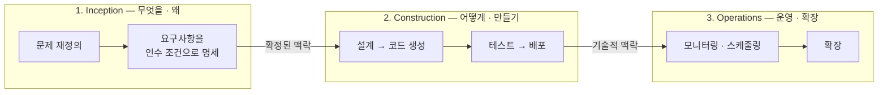
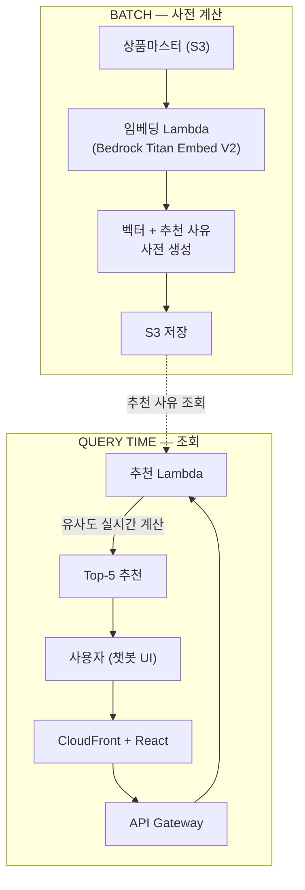
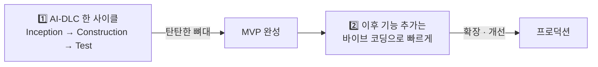

## 개요

이전 포스트 [AI-DLC 실전 적용기](/tech%20insights/ai%20engineering/2026/04/01/aidlc-ai-driven-development-lifecycle.html)에서 AWS가 제안하는 **AI-DLC(AI-Driven Development Life Cycle)** 방법론의 개념과 공개된 적용 사례를 분석했습니다. 이번 포스트는 그 후속편입니다. 방법론을 문서로 읽는 것과 실제 고객 프로젝트에 적용하는 것은 전혀 다른 이야기였습니다.

국내 리테일 기업 A사의 **결품 대체상품 추천 서비스** PoC에 AI-DLC를 적용해, 요구사항 정의부터 배포까지 **총 3일** 만에 동작하는 MVP를 완성했습니다. 이 글에서는 프로젝트 진행 과정과 함께, 직접 써보니 보이는 AI-DLC의 강점과 한계, 그린필드(Greenfield)와 브라운필드(Brownfield)에서의 극명한 차이, 그리고 알고 시작하면 훨씬 빠른 6가지 실전 팁을 정리합니다.

> 본 포스트는 사내 공유 세션에서 발표한 내용을 재구성한 것입니다. 고객사명과 식별 가능한 수치·일정 등 민감 정보는 비식별 처리했습니다.

*Photo by [John Schnobrich](https://unsplash.com/@johnishappysometimes) on [Unsplash](https://unsplash.com) — AI-DLC의 핵심은 사람과 AI 에이전트가 짝을 이뤄 짧은 반복으로 완주하는 것입니다.*

---

## 1. AI-DLC 3단계, 빠른 복습

AI-DLC는 AI가 개발 전 과정을 주도하되, 사람이 방향을 설정하고 검증하는 개발 생명주기입니다. 요구사항 정의부터 설계·구현·운영까지 사람과 AI 에이전트가 짝을 이뤄 짧은 반복(Iteration)으로 완주하는 것을 목표로 합니다. 세 단계로 구성됩니다.

| 단계 | 핵심 질문 | 이번 PoC에서의 비중 |
|---|---|---|
| Inception | 무엇을, 왜 만드는가 | **가장 많은 시간 투자** — 여기서 완성도가 전체 결과를 결정 |
| Construction | 어떻게 만드는가 | AI가 만들고 사람이 검증. Build는 빠르지만 Test는 명시적 지시 필요 |
| Operations | 어떻게 운영·확장하는가 | 이번 PoC에서는 후속 과제로 분리 |

개발 도구는 AI 코딩 에이전트 **Kiro**와 **Amazon Bedrock**(Titan Embed V2 임베딩 + Claude Haiku)을 사용했습니다. 방법론 자체에 대한 자세한 설명은 [이전 포스트](/tech%20insights/ai%20engineering/2026/04/01/aidlc-ai-driven-development-lifecycle.html)를 참고하세요.

---

## 2. 고객 사례 — 결품 대체상품 추천 PoC

### 프로젝트 개요

| 항목 | 내용 |
|---|---|
| 고객사 | 국내 리테일 기업 A사 (생활용품 유통) |
| 과제 | 결품 발생 시 대체상품 자동 추천 서비스 |
| 기간 | 총 3일 (1 Day Workshop + Unicorn Gym 2회) |
| 우리 팀 역할 | 요구사항 정의 · 아키텍처 설계 · PoC 개발/배포 · QA |
| 기술 스택 | AWS Bedrock, S3, DynamoDB, Lambda, API Gateway, CloudFront, React, WebSocket |

한 줄로 요약하면, **"AI로 대체상품을 추천해주면 좋겠다"는 막연한 바람을 동작하는 MVP로** 만든 프로젝트입니다.

- 운영 상품 규모: **수만 개 SKU** — 전수 수작업 탐색은 현실적으로 불가능
- PoC 검증 데이터: **약 1만 개 SKU**
- 산출물: 유사상품 **Top-5 추천** + 추천 사유 자동 생성 챗봇

### AS-IS — 결품 대체상품 선정이 사람 손에 달려 있었다

| Pain Point | 상세 |
|---|---|
| 경험·수작업 의존 | 결품 발생 시 담당자의 감과 경험으로 대체상품을 선정 → 판매 기회 손실 발생 |
| 규모의 벽 | 수만 개 상품을 모두 수동으로 대체 탐색하는 것은 현실적으로 불가능 |
| 막연한 AI 기대 | AI 활용 관심은 있었으나 구체적 적용 방식·구현 방안이 정리되지 않은 상태 |

흥미로운 점은, 사내에 "결품-대체상품 AI 활용안 제안" 문서는 이미 있었다는 것입니다. 아이디어가 없어서가 아니라, **아이디어를 실제 시스템으로 구체화할 방법**이 없어서 멈춰 있던 상태였습니다. AI-DLC의 Inception 단계가 정확히 이 간극을 메웠습니다.

### 요구사항 — 막연한 요구를 구체적 기술 과제로

Inception 단계를 거치며 막연한 요구가 네 가지 구체적 기술 과제로 확정됐습니다.

| # | 요구사항 | 구체화 결과 |
|---|---|---|
| 1 | 유사도 분석 엔진 | 속성 기반(분류·크기·품명·재질·입수·색상) **가중합 알고리즘**으로 담당자의 주관 판단을 정량화. 동일 소분류 필터 + Top-5 자동 도출 |
| 2 | 추천 사유 설명 | "왜 이 상품인가"를 항목별 기여도로 설명 — 신뢰할 수 있는 투명한 AI가 필수 요건 |
| 3 | 챗봇 UI · 재고 연동 | 현업이 즉시 쓸 수 있는 검색형 챗봇 + 물류센터별 재고 연동 |
| 4 | 정확도 목표 수치화 | **hit_rate@5 ≥ 80%**, precision@5 ≥ 60%, 응답 5초 이내로 성공 기준을 정량화 |

---

## 3. 아키텍처 — OpenSearch 대신 S3 + 사전 계산

PoC에서 주목할 만한 설계 결정이 하나 있었습니다. 벡터 검색을 위해 OpenSearch를 도입하는 대신, **배치에서 벡터화와 추천 사유를 미리 생성해 S3에 저장**하는 방식을 택했습니다. OpenSearch의 고정 비용을 피하면서, 쿼리 시에는 유사도만 실시간 계산하고 추천 사유는 S3에서 조회합니다.

PoC 규모(약 1만 SKU)에서는 이 구조로 응답 5초 이내 기준을 무리 없이 충족했습니다. 전체 SKU 확장과 실시간 재고 연동은 프로덕션 단계의 후속 과제로 분리했습니다.

---

## 4. Inception 단계 — MD 파일의 힘

이번 PoC에서 가장 인상 깊었던 것은 Inception 단계의 **요구사항 MD 파일 기반 질의응답**이었습니다. 바이브 코딩(Vibe Coding)과의 차이가 극명하게 드러나는 지점입니다.

### 바이브 코딩 vs AI-DLC Inception

| 구분 | 바이브 코딩 (직접 요청) | AI-DLC Inception (MD 파일) |
|---|---|---|
| 시작 | "결품 상품에 유사 상품 추천 기능을 만들어줘" | AI가 먼저 질문: "묶음 결품 감지가 필요한가요?", "Fallback 추천은?", "hit_rate 목표치는?" |
| 요구사항 | 개발자가 하나하나 떠올려 직접 입력 | 사람이 놓친 헛점을 AI가 사전에 질의하여 발굴 |
| 엣지케이스 | 개발 중 발견 → 뒤늦은 수정 | 질문·답변이 WHEN/THEN 인수 조건으로 자동 구조화 |
| 완료 판정 | 인수 조건 없이 "되는 것 같음" | 요구사항 MD = 개발 완료 체크리스트로 직결 |

### 실제 Inception 산출물

Inception에서 AI는 **10개 질문을 선택지 형태로 먼저 질의**했습니다. 그중 인상적이었던 두 가지:

- **리전 불일치 포착**: 문서 간 us-east-1과 서울 리전이 충돌하는 것을 AI가 스스로 발견해 질의
- **이미지 검색 우선순위 미명시**: 사람이 놓친 스코프 빈틈을 AI가 발굴해 확정

핵심 산출물은 세 가지 MD 파일입니다.

1. **requirements.md** — AI와의 Q&A를 거쳐 WHEN/THEN/IF 형식의 인수 조건으로 명세. "완료 기준"이 곧 테스트 체크리스트가 됩니다.
2. **requirement-verification-questions.md** — AI가 선택지 형태로 질의해 사람이 놓친 엣지케이스(묶음 결품, Fallback, 리전 불일치 등)를 사전에 포착합니다.
3. **technical-environment.md** — AWS 리전, 런타임 버전, DB 스키마, 인증 방식, TDD 여부까지 명시해 Construction 중 환경 불일치를 원천 차단합니다.

> 💡 Inception에서 AI가 질문을 주도하기 때문에, 사람은 장문의 프롬프트를 쓸 필요 없이 답변만 하면 됩니다. 완성된 MD 파일은 요구사항 정의서이자 테스트 체크리스트로 그대로 활용됩니다.

---

## 5. 한계 — 컨셉과 현실 사이

AI-DLC의 컨셉은 "비개발자도 AI-DLC로 본인만의 서비스를 구축할 수 있다"입니다. 하지만 현실은, **아직 도움 없이 혼자 구축하기에는 어려움이 있다**는 것이 솔직한 결론입니다. 직접 경험한 간극 세 가지입니다.

### 간극 1: API 활용의 한계

고객 담당자가 바이브 코딩으로 이미지 불러오기 기능을 "추가했다"고 했지만 이미지가 계속 뜨지 않았습니다. 원인은 상품 이미지가 지정된 API로만 호출 가능한 구조인데, URL 직접 참조 방식으로 계속 시도하고 있었던 것. API 형식과 요구사항 기준으로 직접 바로잡아야 했습니다.

### 간극 2: 배포 개념의 벽

소스를 고쳐 "반영했다"는데 UI는 그대로였습니다. 원인은 **로컬에서만 수정하고 CloudFront에는 배포하지 않은 것**. 로컬과 클라우드의 개념, 배포 과정을 설명하고 직접 적용하도록 유도해야 했습니다. AI가 코드를 대신 써주는 시대에도, 배포 파이프라인에 대한 기본 이해는 여전히 사람의 몫입니다.

### 간극 3: 개념 진입장벽

기본 개념과 실습 세션을 듣지 못하고 중간에 합류한 참가자는 일정이 밀려 첫날 산출물 목표를 달성하지 못했습니다. Inception·Construction·Operations 각 단계에 대한 이해가 선행되어야 하고, 반복 숙달이 필요하다는 시사점을 남겼습니다.

> ⚠️ 정리하면: AI-DLC는 개발 지식의 필요량을 줄여주지만, **0으로 만들지는 못합니다**. API·배포·아키텍처의 기본 개념은 여전히 진입 조건입니다.

---

## 6. 그린필드 vs 브라운필드 — AI-DLC는 어디에서 빛나는가

같은 AI-DLC라도 **어떤 땅 위에서 시작하느냐**에 따라 결과가 크게 달라졌습니다.

| 구분 | 그린필드 (새 프로젝트) | 브라운필드 (기존 코드베이스) |
|---|---|---|
| Inception | 백지 상태에서 요구사항을 완전히 정의한 채 시작 | 기존 코드 전체를 AI가 충분히 파악하기 어려워 정의가 불완전 |
| Construction | 기존 맥락이 없으니 설계 의도대로 일관성 있게 구현 | 사이클을 반복할수록 예상치 못한 충돌·회귀 누적 |
| 결과 | Test → 배포까지 흐름이 막힘 없이 진행 | 투입 시간 대비 산출물 품질이 현저히 낮음 |

이번 PoC가 3일 만에 끝난 것도 **그린필드였기 때문**입니다. 백지에서 시작해 Inception으로 요구사항을 완전히 확정하니, Construction이 막힘 없이 진행됐습니다. 반면 기존 코드 수천 줄을 Inception 맥락에 넣었을 때는 AI가 의존 관계를 완전히 파악하지 못해 Construction에서 충돌과 회귀가 반복됐습니다.

### 현시점 최적 조합

1. **AI-DLC 한 사이클로 탄탄한 뼈대 구축** — Inception → Construction → Test를 한 번만 제대로 돌려 요구사항·아키텍처·MVP를 완성합니다. 여러 사이클을 반복하지 않습니다.
2. **이후 기능 추가는 바이브 코딩으로** — 확장·개선·특정 기능은 맥락을 아는 개발자가 바이브 코딩으로 빠르게 추가합니다. AI-DLC를 처음부터 다시 돌리는 것보다 훨씬 효율적입니다.

> 💡 AI-DLC와 바이브 코딩은 **대체재가 아니라 보완재**입니다. AI-DLC로 단단한 첫 사이클을 완성하고, 그 위에서 바이브 코딩으로 빠르게 확장하는 것이 현시점 최적 조합입니다.

---

## 7. 실전 팁 6가지 — 알고 시작하면 훨씬 빠른 것들

### Tip 1. Inception에 가장 많은 시간을 투자하세요

요구사항이 불명확하면 Construction 내내 수정이 반복됩니다. AI와의 Q&A로 인수 조건을 최대한 구체화해 두는 것이 전체 속도를 결정합니다. **Inception 완성도 = 전체 프로젝트 속도.** 여기에 쓰는 시간은 Construction에서 수십 배로 돌아옵니다.

### Tip 2. UI 목업을 먼저 만들고 참조시키세요

UI 디자인이 중요하다면 Claude나 Figma로 목업을 미리 만든 뒤, 해당 파일을 참조해 "이 디자인을 따르라"고 요구사항에 명시하세요.

- ✅ **목업 있을 때**: AI가 디자인 파일을 참조해 정확한 색상·레이아웃·컴포넌트를 구현
- ⚠️ **목업 없을 때**: AI가 임의로 UI를 결정 — 전혀 다른 디자인이 나오거나 기능에만 집중한 투박한 화면

### Tip 3. Build는 잘 되지만 Test는 약합니다

AI-DLC는 Build까지는 가장 강하지만, Test부터는 제 기능을 잘 못 합니다. "테스트하라"고만 하면 부족합니다. 실제로 겪은 사례 두 가지:

- **흰 화면 에러**: 메인 페이지 코드 위치를 제대로 인지하지 못하고 엉뚱한 곳으로 라우팅 → 첫 빌드 후 접속 시 흰 페이지만 뜨는 에러 반복
- **버튼 무반응**: 채팅 내역 삭제 버튼이 무반응 — API Gateway가 요청을 엉뚱한 곳으로 전달하고 있었음

"Inception이 가장 중요하다"는 말은 맞지만, **Construction의 Test 단계도 그만큼 중요**합니다.

### Tip 4. 테스트는 5단계 전부를 명시해서 지시하세요

단계 지정 없이 "테스트해"라고만 하면 AI는 일부만 수행합니다. 아래 5단계를 명시적으로 요청하세요.

| 단계 | 테스트 | 검증 대상 |
|---|---|---|
| 1 | Unit | 함수·모듈 단위 개별 검증 |
| 2 | Integration | 모듈 간 연결·API 검증 |
| 3 | E2E | 사용자 흐름 전체 검증 |
| 4 | System | 전체 요건 기준 검증 |
| 5 | Acceptance | 현업 인수 조건 확인 |

### Tip 5. MCP로 AI가 직접 QA하게 하세요

**Playwright MCP**를 연결하면 AI 에이전트가 실제 사용자처럼 페이지를 열고 클릭·입력·이동하며 결과를 스크린샷으로 확인합니다.

- 로그인 → 검색 → 결과까지 흐름 재현
- 콘솔 에러·깨진 화면을 캡처로 즉시 포착
- 스크린샷을 AI가 분석해 UI 깨짐 자동 판별

QA 범위를 넓혀주는 MCP 조합도 유용합니다: **GitHub MCP**(발견한 버그를 즉시 이슈로 등록, CI 회귀 추적), **Fetch/HTTP MCP**(엔드포인트 직접 호출로 상태코드·스키마 검증), **Filesystem MCP**(테스트 로그·리포트를 직접 읽어 실패 원인 분석). 세 층을 겹쳐 QA하면 브라우저가 잡지 못하는 결함까지 잡힙니다.

### Tip 6. AWS 배포에는 AWS Knowledge MCP가 꽤 유용합니다

Terraform으로 인프라를 구성할 때 IAM 정책, 서비스 제한, API 파라미터를 일일이 찾아볼 필요 없이 — AI가 **AWS 공식 문서를 직접 참조**하면서 작성해 줬습니다.

| MCP 없이 배포 | AWS Knowledge MCP 연결 후 |
|---|---|
| IAM 정책 오류 → 직접 검색 → 수정 반복 | 공식 문서 기반으로 정책·파라미터 자동 작성 |
| 서비스 제한·리전 지원 여부 확인 번거로움 | 리전별 가용 서비스 즉시 확인 |
| Terraform 리소스 파라미터 오탈자 빈번 | 배포 전 설정 검증까지 한 번에 |

필수는 아닙니다. 하지만 AWS 리소스를 처음 다루는 상황이라면, 옆에 두고 쓰는 것만으로도 체감상 디버깅 시간이 절반 가까이 줄었습니다.

---

## 정리

3일간의 AI-DLC 실전 경험은 한 문장으로 압축됩니다:

> AI-DLC의 성패는 "AI가 얼마나 코드를 잘 짜느냐"가 아니라, **"Inception에서 요구사항을 얼마나 완전하게 확정하느냐"**에 달려 있습니다.

막연한 AI 기대를 가진 고객과 함께, 백지 상태에서 시작해 3일 만에 정량화된 성공 기준(hit_rate@5 ≥ 80%)을 갖춘 MVP를 완성할 수 있었던 것은 Inception 단계의 힘이었습니다. AI가 먼저 질문을 던져 사람이 놓친 헛점을 발굴하고, 그 답변이 인수 조건이자 테스트 체크리스트가 되는 구조는 문서로 읽을 때보다 실전에서 훨씬 강력했습니다.

동시에 한계도 분명했습니다. Test 단계는 명시적으로 지시해야 하고, 배포·API 같은 기본 개념의 진입장벽은 여전히 존재하며, 브라운필드에서는 오히려 바이브 코딩이 더 현실적인 선택이었습니다. AI-DLC로 단단한 첫 사이클을 완성하고 바이브 코딩으로 확장하는 조합 — 이것이 현시점에서 제가 찾은 최적의 답입니다.

*Photo by [Kaleidico](https://unsplash.com/@kaleidico) on [Unsplash](https://unsplash.com) — Inception에 쓰는 시간은 Construction에서 수십 배로 돌아옵니다.*

---

## 참고 자료

- [AWS 기술 블로그 - AI-DLC(AI-Driven Development Life Cycle) 소개](https://aws.amazon.com/ko/blogs/tech/ai-driven-development-life-cycle/)
- [이전 포스트 - AI-DLC 실전 적용기: AI 중심 개발 생명주기와 적용 사례 분석](/tech%20insights/ai%20engineering/2026/04/01/aidlc-ai-driven-development-lifecycle.html)
- [Kiro - AI 코딩 에이전트](https://kiro.dev/)
- [Playwright MCP - Microsoft](https://github.com/microsoft/playwright-mcp)
- [AWS MCP Servers (AWS Knowledge MCP 포함)](https://awslabs.github.io/mcp/)
