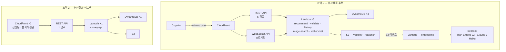
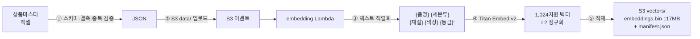

> **2026-08 전면 개정.** 이 글은 원래 2026년 6월, 3일짜리 PoC를 마치고 쓴 *AI-DLC 실전 후기* 였습니다.
> 이후 프로젝트가 계속 이어지면서 시스템이 PoC 때와 완전히 달라졌고, 사내 세미나에서 전체 구조를 공유할
> 기회가 있어 그 내용을 기준으로 글을 다시 썼습니다. 방법론 회고는 마지막 장으로 옮기고,
> 이번에는 **서비스 안에서 실제로 무슨 일이 일어나는지**를 중심으로 정리합니다.

## 개요

국내 리테일 기업 A사(생활용품 유통)의 **결품 대체상품 추천 서비스** 이야기입니다.
매장에서 상품이 품절됐을 때 "이걸 대신 팔 수 있다"고 말해 주는 서비스이고, 지금은 고객사 계정의
프로덕션 환경에서 돌아가고 있습니다.

시작은 **3일짜리 PoC 지원**이었습니다. 워크숍 한 번과 실습 두 번으로 동작하는 MVP를 만들고
거기서 끝날 예정이었는데, 결과와 진행 방식에 대한 반응이 좋아 **추가 지원 요청이 이어졌고**,
그 뒤로 범위가 계속 넓어져 **정식 프로젝트로 연결**됐습니다. 2026년 4월에 시작해 8월 현재까지,
5개월째 진행 중입니다. PoC 때 1만 SKU였던 검증 데이터는 **30,006건 전량**이 됐고,
서비스도 추천 하나에서 **추천 + 추천결과 피드백 두 개**로 늘었습니다.

이 글에서는 그 사이에 내린 설계 결정들을 순서대로 풀어봅니다. 화면에서 시작해 아키텍처로,
아키텍처에서 벡터까지 — 안에서 무슨 일이 일어나는지 전부 열어보는 순서입니다.

> 고객사명, 서비스 URL, 내부 리소스 식별자 등 식별 가능한 정보는 비식별 처리했습니다.


*Photo by [John Schnobrich](https://unsplash.com/@johnishappysometimes) on [Unsplash](https://unsplash.com)*

---

## 1. 무엇을 만들었나 — 두 개의 서비스

| 서비스 | 하는 일 | 쓰는 사람 |
|---|---|---|
| **유사상품 추천** | 결품 상품을 검색하면 대체 가능한 유사상품 Top 5를 **추천 사유와 함께** 반환 | 상품 담당자(MD), 관리자 |
| **추천결과 피드백** | 추천 결과에 적합/부적합 판정과 정답 상품을 기록 — 다음 로직 개편의 정답셋 원천 | 매장 점장, 본사 직원 |

두 서비스는 짝입니다. 추천이 결과를 내면 피드백이 그 결과를 평가하고, 평가 결과가 다시 추천 로직으로
돌아옵니다. **추천 → 현장 피드백 → 로직 반영**의 루프를 닫는 것이 목표였습니다.

관리자 화면에서는 블렌딩 비율, 모양·향 비중, 추천 개수를 **실시간으로 조정**할 수 있습니다.
이 부분은 뒤에서 다시 이야기하겠지만, 개인적으로는 이번 프로젝트에서 가장 잘한 결정 중 하나였습니다.

---

## 2. 아키텍처 — 한 계정 안에 따로 배포되는 두 스택

두 서비스는 같은 AWS 계정·리전(us-east-1)에 있지만 **Terraform 스택이 분리**되어 있습니다.
서로의 리소스를 공유하지 않고 따로 배포·롤백됩니다.


```mermaid
graph TB
    subgraph REC["스택 1 — 유사상품 추천"]
        CF1["CloudFront"] --> API1["REST API<br>5 경로"]
        CF1 --> WS["WebSocket API<br>스트리밍"]
        API1 --> L1["Lambda ×5<br>recommend · validate · history<br>image-search · websocket"]
        WS --> L1
        L1 --> DDB1["DynamoDB ×4"]
        L1 --> S3A["S3 — vectors/ · reasons/"]
        COG["Cognito"] -.->|"admin / user"| CF1
        S3A -->|"S3 이벤트"| EMB["Lambda — embedding"]
        EMB -.-> BR["Bedrock<br>Titan Embed v2 · Claude 3 Haiku"]
    end

    subgraph SUR["스택 2 — 추천결과 피드백"]
        CF2["CloudFront ×2<br>점장용 · 본사직원용"] --> API2["REST API<br>1 경로"]
        API2 --> L2["Lambda ×1<br>survey-api"]
        L2 --> DDB2["DynamoDB ×1"]
        L2 --> S3B["S3"]
    end
```

두 영역 사이에 **연결선이 없다는 점**이 핵심입니다. 서로를 호출하지 않고 각자 배포됩니다.

### 왜 스택을 나눴나

피드백 서비스는 설문 기간에만 쓰이고, 참여자가 **계정 없이** 들어옵니다.
추천 서비스와 배포 주기·인증 방식·장애 영향 범위가 전부 달랐습니다.
한쪽 배포가 다른 쪽을 건드리지 않도록 스택을 분리한 것이 그 이유입니다.

### 배포된 리소스 합계

| 구분 | 내역 |
|---|---|
| 컴퓨트 | Lambda ×7 (추천 6 + 피드백 1, 전부 Node.js 22) |
| API | REST ×2 · WebSocket ×1 |
| 데이터 | DynamoDB ×5 · S3 ×2 |
| 프론트 | CloudFront ×3 (추천 1 · 피드백 2, 전부 OAC) |
| 인증 | Cognito ×1 (추천 전용) · 피드백은 명단 대조 |
| AI | Bedrock ×2 (Titan Embed v2 · Claude 3 Haiku) |
| 운영 | Terraform 모듈 9종 / 환경 3개 · IAM 역할 4종 · 로그그룹 7종 |

Lambda 메모리는 역할별로 따로 산정했습니다. `recommendation`은 117MB짜리 벡터 인덱스를
메모리에 올려야 해서 2048MB, `image-search`는 3008MB, 반면 `validation`과 `chat-history`는
512MB면 충분합니다. **모든 함수에 같은 메모리를 주는 것은 그냥 돈을 버리는 일**입니다.

한 줄로 요약하면 — 사용자는 CloudFront에서 화면을 받고, API Gateway를 거쳐 Lambda가 계산하며,
데이터가 갱신될 때만 S3 이벤트가 임베딩 파이프라인을 깨웁니다. **상시 켜 두는 서버가 한 대도 없습니다.**

---

## 3. 리소스 선택 — 두 개의 질문이 아키텍처를 결정했다

이 아키텍처는 취향으로 나온 게 아니라, 두 질문에 답하다 보니 나온 결과입니다.

### 질문 ㄱ. 운영 수준의 응답 속도를 어떻게 확보하나

**답: 추천 사유를 미리 만들어 S3에 넣어 둔다.**

LLM이 추천 사유를 실시간으로 생성하면 추천 1회에 수 초가 걸립니다. 사내 도구라도 이건 못 씁니다.
그래서 사유를 **배치에서 전부 미리 생성**해 S3에 저장하고, 요청이 오면 꺼내 붙이기만 합니다.

- 실시간 경로의 **Bedrock 호출 = 0건**
- 요청 시점에는 벡터 내적·가중합 같은 산수만 수행 → **응답 속도가 일정**

LLM을 쓰는 서비스에서 응답 속도가 안 나올 때, 대부분의 답은 "모델을 더 빠른 걸로 바꾸자"가 아니라
**"이 호출이 정말 요청 시점에 일어나야 하나?"** 입니다. 이번 경우엔 아니었습니다.

### 질문 ㄴ. 비용을 어떻게 잡나

**답: OpenSearch를 안 쓴다.**

벡터 검색 엔진은 "자주 바뀌는 대량 벡터의 실시간 검색"을 위한 물건입니다.
그런데 우리 데이터는 정반대였습니다.

| | 벡터 검색 엔진이 필요한 상황 | 우리 상황 |
|---|---|---|
| 데이터 변경 빈도 | 실시간·수시 | **월 단위** |
| 규모 | 수백만~수억 벡터 | **3만 SKU** |
| 쿼리 패턴 | 임의 벡터로 ANN 탐색 | **상품 → 유사 상품** (조합이 유한) |

조합이 유한하고 데이터가 월 단위로만 바뀐다면, **미리 다 계산해 두면 검색할 일이 없습니다.**

- OpenSearch 최소 구성: **월 $25~100+** (상시 과금)
- S3에 벡터·사유 적재: **월 $0.02**

> **"검색을 조회로 바꾸면 검색 엔진은 필요 없다."**

### 공통 원칙

간헐적으로 쓰이는 사내 도구에서 **비용의 지배 요인은 트래픽이 아니라 유휴 시간의 상시 과금**입니다.
하루에 몇 번 쓰는 도구인데 EC2와 RDS가 24시간 켜져 있으면, 비용의 99%는 아무도 안 쓸 때 나갑니다.

그래서 상시 실행 리소스(EC2·RDS·OpenSearch·ALB)를 **전면 배제**하고,
비싼 연산(임베딩·LLM)은 **전부 배치로** 밀었습니다.

**결과: 유휴 시 월 인프라 비용 $1 미만.**

---

## 4. 엑셀 한 장이 벡터가 되기까지

상품 데이터를 올리는 순간부터 추천에 쓸 벡터가 만들어지기까지의 과정입니다.


```mermaid
graph LR
    X["상품마스터<br>엑셀"] -->|"① 스키마·결측·중복 검증"| J["JSON"]
    J -->|"② S3 data/ 업로드"| EV["S3 이벤트"]
    EV --> LMB["embedding Lambda"]
    LMB -->|"③ 텍스트 직렬화"| T["'{품명} {세분류}<br>{재질} {색상} {등급}'"]
    T -->|"④ Titan Embed v2"| V["1,024차원 벡터<br>L2 정규화"]
    V -->|"⑤ 적재"| S3["S3 vectors/<br>embeddings.bin 117MB<br>+ manifest.json"]
```

### ① 엑셀 검증·변환

상품 마스터 엑셀을 스키마·결측·중복 기준으로 검증한 뒤 JSON으로 변환합니다.
검증에 실패한 건은 버리지 않고 **리포트로 분리**합니다 — 고객이 원본 데이터의 문제를 알아야 고칩니다.

### ② S3 업로드가 파이프라인을 깨운다

`data/` 프리픽스에 업로드되면 S3 이벤트가 embedding Lambda를 호출합니다.

다만 여기엔 **실전에서 배운 제약**이 하나 있습니다. 3만 건 전량 재임베딩은 Lambda 최대 실행시간을
넘깁니다(설정 15분, 실측 22분 소요). 그래서 이벤트 트리거의 **동시성을 0으로 막아 두고**,
전량 재임베딩은 오프라인 배치로 처리합니다. 증분 갱신만 이벤트 경로를 씁니다.

> 타임아웃으로 실패하는 Lambda를 그대로 두면, 재시도가 겹치면서 Bedrock 호출 비용만 나갑니다.
> **"안 되는 경로는 막아 두는 것"** 도 설계입니다.

### ③ 상품 정보의 텍스트 직렬화

임베딩 입력은 상품 속성을 이어붙인 한 줄 텍스트입니다.

```
"{품명} {세분류} {재질} {색상} {등급}"
```

원래는 부피(CBM)도 들어 있었는데, 상품마스터 v4.0에서 CBM 항목이 폐지되면서 입력에서 빠졌습니다.
**임베딩 입력 스키마는 원본 데이터 스키마에 묶여 있습니다** — 고객사 데이터 정책이 바뀌면 같이 바뀝니다.

### ④ Titan Embed v2 → 1,024차원

상품 하나가 숫자 1,024개의 좌표가 됩니다. 여기서 한 가지 — **L2 정규화까지 걸어 둡니다.**
정규화된 벡터끼리는 내적이 곧 코사인 유사도라서, 이후 추천 계산에서 나눗셈을 할 필요가 없습니다.
3만 건 × 3만 건 규모에서 이 차이는 작지 않습니다.

### ⑤ S3 적재

벡터를 `embeddings.bin`(Float32, **117MB**)과 `embedding_manifest.json`으로 나눠 저장합니다.
**30,006건 전량**이며, 추천 Lambda가 **콜드스타트에 1회 로드해 재사용**합니다.

바이너리와 매니페스트를 나눈 이유는 단순합니다 — 벡터는 순수 숫자 배열이라 JSON으로 감싸면
파일이 3배로 불고 파싱이 훨씬 느려집니다.

---

## 5. 추천 사유는 어떻게 미리 만드나 — Matrix

"사유를 미리 다 만든다"는 말은 쉽지만, 3만 SKU의 **전체 쌍은 약 4.5억 개**입니다.
여기에 전부 LLM을 돌리면 프로젝트가 끝납니다(비용으로).

두 단계로 줄였습니다.

### 1단계 — 동일 소분류 안에서만 계산

애초에 다른 소분류 상품은 대체품이 아닙니다. 소분류가 **594종**이라, 동일 소분류 내 쌍만 계산하면
**계산량이 수백분의 1**로 줄어듭니다.

### 2단계 — 상품당 상위 10쌍만 LLM 호출

소분류 내 모든 쌍의 유사도 점수를 계산해 행렬(Matrix)을 만듭니다.

| 기준 ↓ / 대상 → | 수건 B | 수건 C | 수건 D | 수건 E |
|---|---|---|---|---|
| **수건 A (결품)** | 0.87 ★ | 0.79 ★ | 0.41 | 0.22 |

★ 표시된 상위 쌍만 LLM 사유 생성 대상입니다. **Matrix 전체는 저장하되, 비싼 LLM 호출은
사유가 실제로 화면에 쓰일 상위 쌍으로 제한** — 이게 비용 통제의 핵심입니다.
Top 5를 보여주는 서비스에서 11등짜리 조합의 사유는 영원히 안 읽힙니다.

### 배치 실행 — 중단돼도 되는 구조로

- **Claude 3 Haiku** 사용. 사유 생성은 전 상품 조합 배치 호출이라 **단가가 지배 요인**입니다.
  품질 차이보다 호출량이 압도적이라 최저가 티어가 맞는 선택이었습니다
- 프롬프트는 역할을 명시: *"상품 MD로서 결품 상품의 대체 사유를 2~3문장으로"*
- **15건 동시 호출 · 300건마다 체크포인트 · 4개 샤드 병렬 실행**

체크포인트가 핵심입니다. 수 시간짜리 배치는 **반드시 중간에 끊깁니다.**
끊겼을 때 처음부터 다시 도는 배치는 실전에서 못 씁니다.

결과는 S3의 `reasons.json`에 적재되고, 추천 화면은 여기서 꺼내 붙입니다.
아직 캐시에 없는 조합은 규칙 기반 문구로 폴백합니다 — 사유가 없다고 추천 자체가 실패하면 안 되니까요.

---

## 6. 하드룰 — MD의 판단 기준을 숫자로 옮기기

추천 점수의 뼈대는 **8요소 가중합**입니다.
"어떤 상품이 대체품인가"에 대한 MD의 실무 감각 — 같은 세분류인가, 크기가 비슷한가, 이름이 겹치는가 —
을 그대로 수식으로 옮긴 것입니다.

| 요소 | 가중치 | 판정 방식 |
|---|---|---|
| 세분류 일치 | **1.698** | 같은 세분류면 1, 아니면 0 |
| 색상 | 1.366 | 품명에서 색상 키워드 추출 후 비교 |
| 재질 | 1.166 | 동일 재질 여부 |
| 특징 | 1.048 | 특징 항목의 일치도 |
| 단가 | 0.934 | 가격 비율 유사도 |
| 입수 | 0.737 | 중포장 입수량 비율 |
| 크기 | 0.655 | 가로·세로·높이 비율 평균 |
| 품명 | 0.397 | 품명 토큰 겹침 비율 (Jaccard) |

가중치 합은 8.001이고, 점수는 이 합으로 나눠 0~1로 정규화합니다.

### 설계 원칙 — 결측은 0점

크기 정보가 없는 상품에 **크기 만점을 주지 않습니다.** 데이터가 없으면 그 항목의 기여는 0입니다.

사소해 보이지만 결과를 크게 바꿉니다. 결측을 만점으로 처리하면 **데이터가 부실한 상품이 상위로 올라옵니다.**
"모르면 유리하게"가 아니라 **"모르면 보수적으로"** 가 원칙입니다.

### 판매·재고를 걷어낸 이야기

이전 로직은 6요소 유사도에 판매량과 재고를 다시 섞었습니다.

```
이전:  최종점수 = 0.7 × 유사도 + 0.2 × 판매 + 0.1 × 재고
       + 재고 1,200 미만 상품은 후보에서 탈락
       + 부족분은 판매량 순으로 충당
```

그러다 판매·재고 데이터 수령이 중단되면서 세 가지를 전부 걷어냈습니다.
당시엔 기능이 줄어드는 것 같았는데, 지나고 보니 **오히려 좋았습니다.**

지금 순위는 **순수 유사도**입니다. 그래서 "왜 이 상품이 2등인가"를 유사도 하나로 설명할 수 있습니다.
판매·재고가 섞여 있을 때는 순위가 왜 그렇게 나왔는지 아무도 설명하지 못했습니다.
**설명 가능성은 정확도만큼 중요한 요구사항이었습니다.**

### 가중치를 화면으로 꺼낸 것

이 8개 숫자는 오랫동안 **코드 상수**로 박혀 있었습니다. 조정하려면 배포를 해야 했다는 뜻입니다.
이번에 **관리자 화면에 노출**했습니다. 값을 바꾸면 정규화 분모(가중치 합)도 함께 재계산되고,
저장하지 않으면 기존 상수와 동일하게 동작합니다.

이게 왜 중요하냐면 — **로직을 이해시키는 것과 조정 권한을 넘기는 것은 다른 일**이기 때문입니다.
아무리 잘 설명해도 조정하려면 개발자를 불러야 하는 시스템은 결국 고객의 것이 되지 못합니다.
지금은 고객사 담당 팀이 직접 가중치를 만지며 로직 개편을 주도하고 있습니다.

---

## 7. 블렌딩 — 규칙의 정확함에 벡터의 유연함을 더하기

하드룰은 명확하지만 **규칙에 없는 유사함**을 놓칩니다. 용도가 같은 다른 카테고리 상품이라든가,
표기가 다른 사실상 같은 상품이라든가. 그래서 임베딩 벡터 간 거리를 **두 번째 눈**으로 씁니다.

```
최종 점수 = 0.7 × 하드룰(정규화) + 0.3 × 임베딩 코사인
```

- 임베딩은 L2 정규화된 1,024차원 벡터라 **내적이 곧 코사인 유사도**
- 음수는 0으로 클램프
- 임베딩을 못 읽으면 **하드룰 단독으로 자동 폴백** — 벡터 파일 문제로 서비스가 죽지 않도록

| | 잘하는 것 |
|---|---|
| **하드룰** | MD 기준의 정확한 반영 · 설명 가능성("세분류 일치 + 크기 유사") · 항목별 기여도 분해 |
| **임베딩** | 규칙으로 못 잡는 의미적 유사성 · 품명 표기가 달라도 매칭 · 피처를 추가하지 않고도 개선 여지 |

0.7 : 0.3이라는 비율은 감이 아니라 **정답셋 기반 오프라인 평가로 탐색해서 정했습니다.**
그리고 앞서 말했듯 이 값도 관리자 화면에서 조정 가능합니다.

### 여기에 규칙 3종이 더 붙습니다

| 규칙 | 가중 | 동작 |
|---|---|---|
| **모양 유사도** | 0.2 | 두 상품 **모두** 모양이 확정된 경우에만 가점. 하나라도 미확정이면 점수를 건드리지 않음 |
| **향 유사도** | 0.35 | 향 카테고리(소분류 20종)에서만 작동. 이때 모양 비중은 0.1로 줄여 향을 우선 |
| **일본 카테고리 제외** | — | 소싱 경로가 달라 대체 추천이 성립하지 않으므로 후보에서 제외 |

모양 규칙의 "**둘 다 확정된 경우에만**" 조건은 결측 0점 원칙의 연장선입니다.
현재 모양이 확정된 상품은 5,132건(17%), 향은 262건 — 아직 커버리지가 낮습니다.
커버리지가 낮은 피처를 무리하게 적용하면 **데이터가 채워진 소수 상품만 계속 추천되는 편향**이 생깁니다.

---

## 8. 그래서 얼마나 좋아졌나

로직 개편의 효과는 **MD가 직접 레이블링한 정답셋 13,417쌍 전량**을 기준으로 측정했습니다.

| 항목 | 결과 |
|---|---|
| Hit@5 | **2.9% → 9.3%** (3.2배) |
| 최대 기여 요인 | **상품 마스터 확장 (+5.4p)** |
| 회귀 테스트 | 57건(속성·단위·게이트 통합) 전량 통과 |

여기서 개인적으로 가장 의미 있었던 건 **기여 요인 분해**입니다.

여러 가지를 한꺼번에 바꾸면 뭐가 효과였는지 알 수 없습니다. 이번에 확인된 건,
정교한 알고리즘 튜닝보다 **후보군 자체를 늘린 것(상품 마스터 확장)이 압도적으로 큰 기여**를 했다는 사실입니다.
추천 품질이 안 나올 때 사람들은 보통 알고리즘부터 만지는데, **데이터 커버리지를 먼저 보는 게 맞을 때가 많습니다.**

그리고 하나 더 — 매 테스트 실행마다 **배포 아티팩트와 테스트 대상 코드를 md5로 대조**합니다.

굳이 이렇게까지 하는 이유가 있습니다. 이전에 "현행 로직"에 대한 정보가 서로 어긋난 적이 있었습니다.
소스에는 하이브리드 로직이 있는데 문서에는 사전 계산 방식이라고 되어 있었고요.
소스·커밋 이력·배포 아티팩트·실데이터를 전부 대조해 보니, **그 코드는 커밋도 배포도 안 된 상태**였습니다.

> **코드에 있다 ≠ 돌아간다.**
> 그 이후로 "테스트한 코드 = 배포된 코드"를 매번 기계적으로 확인합니다.

---

## 9. 피드백 서비스 — 정답셋을 만드는 쪽

추천이 아무리 좋아져도 **"좋아졌다"는 걸 무엇으로 판정하느냐**가 남습니다. 그게 피드백 서비스입니다.

### 계정 없이 들어오게 하기

현장 점장님들에게 계정을 발급하고 비밀번호를 관리하게 하는 건 현실적으로 불가능합니다.
그래서 **로그인리스 2단 검증**으로 갔습니다 — 매장코드 + 담당자 사번을 등록 명단과 대조합니다.
등록 매장은 약 **1,341개**입니다.

Cognito를 안 쓴 게 아니라, **못 쓴 게 아니라 안 맞았습니다.** 참여자가 설문 기간에 한 번 들어와서
응답하고 끝나는 워크로드에 계정 체계를 얹는 건 순수한 마찰입니다.

프론트는 점장용·본사직원용 **2벌**을 각각 다른 CloudFront로 배포하고,
같은 버킷의 다른 prefix를 오리진으로 씁니다.

### 설문 설계

- 후보 상품에 **1~3순위 부여 + 선정 사유(고정 6종) 다중 선택**
- 임시저장 / 제출 / 마감기한 제어
- **결정론적 분산배정** — 재현 가능한 시드 기반 셔플로 참여자별 문항을 배정하되,
  문항 커버리지가 고르게 분산되도록 설계
- 관리자 화면: 진행현황 · 미제출 명단 · 응답 CSV 내보내기

분산배정에서 "결정론적"이 중요한 이유는, 같은 참여자가 재접속했을 때 **다른 문항이 나오면 안 되기 때문**입니다.
난수를 그대로 쓰면 새로고침마다 설문이 바뀝니다. 시드를 참여자 식별자에서 유도하면
서버가 상태를 저장하지 않고도 항상 같은 배정이 나옵니다.

전체를 **Lambda 한 개(512MB)** 가 처리합니다 — 문항 배정, 응답 저장, 관리자 조회 전부.
설문 기간에만 쓰이는 서비스에 마이크로서비스를 나눌 이유가 없었습니다.

---

## 10. 방법론 회고 — AI-DLC로 시작해서 여기까지

이 글의 원본은 AI-DLC(AI-Driven Development Life Cycle) 실전 후기였습니다.
그 내용도 여전히 유효하다고 생각해서, 핵심만 남겨 둡니다.

3일 만에 MVP가 나온 건 **Inception 단계에 시간을 몰아넣었기 때문**이었습니다.
AI가 먼저 질문을 던지고(리전 불일치, 이미지 검색 우선순위 같은 걸 사람보다 먼저 잡아냈습니다),
그 답변이 WHEN/THEN 인수 조건이 되고, 그게 그대로 테스트 체크리스트가 되는 구조입니다.

다만 5개월을 더 굴려보고 나서 생각이 정리된 것들이 있습니다.

| 그때의 결론 | 지금도 유효한가 |
|---|---|
| Inception 완성도가 전체 속도를 결정한다 | ✅ 그대로. 오히려 더 확신이 생겼습니다 |
| Build는 강하고 Test는 약하다 | ✅ 그대로. 회귀 57건을 배포 게이트로 세운 것도 이 때문입니다 |
| 그린필드에서 빛나고 브라운필드에서 흐려진다 | ✅ 그대로. 이 프로젝트도 이제 브라운필드입니다 |
| AI-DLC 한 사이클 + 이후 바이브 코딩 | ⚠️ 절반만. 실제로는 **평가 체계가 그 자리를 대신**했습니다 |

마지막 줄이 5개월간 가장 크게 바뀐 부분입니다.

PoC 때는 "AI-DLC로 뼈대 만들고 이후엔 바이브 코딩으로 확장"이 최적이라고 썼습니다.
그런데 프로덕션에 올라가고 나니, 확장 속도를 결정한 건 개발 방식이 아니라
**"이 변경이 좋아진 건지 나빠진 건지 판정할 수 있는가"** 였습니다.

정답셋 13,417쌍과 회귀 57건이 갖춰지고 나서야 로직을 과감하게 바꿀 수 있었습니다.
그 전에는 뭘 고쳐도 좋아졌는지 알 수가 없어서 조심스럽게밖에 못 건드렸습니다.

> **에이전트가 코드를 얼마나 빨리 쓰느냐보다, 그 코드가 좋아졌는지를 얼마나 빨리 판정할 수 있느냐가
> 실제 속도를 결정합니다.** 평가 체계가 없으면 AI가 아무리 빨라도 배포 버튼을 못 누릅니다.

---

## 정리

5개월을 압축하면 이렇습니다.

1. **워크로드를 먼저 보고 리소스를 골랐습니다.** 월 단위로 바뀌는 3만 SKU에 벡터 검색 엔진은 과했고,
   상시 과금 리소스를 전부 걷어내니 유휴 비용이 월 $1 미만이 됐습니다.
2. **비싼 연산은 요청 경로 밖으로 밀었습니다.** LLM 사유를 배치로 옮기니 실시간 Bedrock 호출이 0건이 됐고,
   응답 속도가 일정해졌습니다.
3. **결측은 0점, 설명 가능성은 요구사항입니다.** 판매·재고를 걷어낸 뒤 순위가 단순해졌는데,
   오히려 "왜 이 순서인가"를 말할 수 있게 됐습니다.
4. **알고리즘보다 데이터 커버리지였습니다.** Hit@5 3.2배 개선의 최대 기여는 정교한 튜닝이 아니라
   상품 마스터 확장(+5.4p)이었습니다.
5. **설명이 아니라 손잡이를 넘겨야 이관입니다.** 코드 상수를 관리자 화면으로 꺼내고 나서야
   고객이 로직 개선의 주체가 됐습니다.

그리고 시작이 3일짜리 지원 업무였다는 것 — 이 부분이 개인적으로는 제일 좋습니다.
잘 만든 PoC 하나가 프로젝트가 되고, 그 프로젝트가 지금은 고객사가 스스로 굴리는 시스템이 됐습니다.


*Photo by [Kaleidico](https://unsplash.com/@kaleidico) on [Unsplash](https://unsplash.com)*

---

## 참고 자료

- [Amazon Bedrock - Titan Embeddings](https://docs.aws.amazon.com/bedrock/latest/userguide/titan-embedding-models.html)
- [AWS Lambda 할당량 (실행 시간·메모리)](https://docs.aws.amazon.com/lambda/latest/dg/gettingstarted-limits.html)
- [Amazon OpenSearch Service 요금](https://aws.amazon.com/opensearch-service/pricing/)
- [AWS 기술 블로그 - AI-DLC(AI-Driven Development Life Cycle) 소개](https://aws.amazon.com/ko/blogs/tech/ai-driven-development-life-cycle/)
- [이전 포스트 - AI-DLC 실전 적용기: AI 중심 개발 생명주기와 적용 사례 분석](/tech%20insights/ai%20engineering/2026/04/01/aidlc-ai-driven-development-lifecycle.html)
