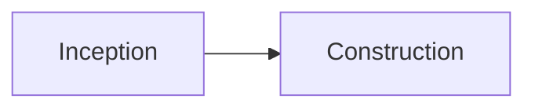

# 세미나 디자인 시스템 블로그 이식 Implementation Plan

> **For agentic workers:** REQUIRED SUB-SKILL: Use superpowers:subagent-driven-development (recommended) or superpowers:executing-plans to implement this plan task-by-task. Steps use checkbox (`- [ ]`) syntax for tracking.

**Goal:** 내부 세미나 HTML의 애플 스타일 디자인 토큰·타이포·컴포넌트를 Jekyll 블로그(minimal-mistakes) 전역에 이식한다.

**Architecture:** CSS 커스텀 프로퍼티 토큰(`:root` 라이트 / `html.dark-mode` 다크)을 `_sass/custom/` 파티셜 4개로 구조화하고, `assets/css/main.scss`는 임포트 오케스트레이션만 담당한다. 기존 801줄 커스텀은 `_layout.scss`로 이관하며 색만 토큰 참조로 교체한다.

**Tech Stack:** Jekyll 4.4.1, minimal-mistakes 4.26.2(remote_theme, air 스킨), jekyll-sass-converter 3.0.0(**dart-sass** — `rgb(var(--x) / .5)` 문법 그대로 통과됨), Pretendard Variable(jsdelivr CDN)

**Spec:** `docs/superpowers/specs/2026-07-13-seminar-design-port-design.md`

## Global Constraints

- 토큰 값(스펙 §1에서 그대로): 라이트 `--bg:255 255 255; --fg:29 29 31; --muted:122 122 122; --subtle:245 245 247; --line:224 224 224; --accent:0 102 204` / 다크 `--bg:0 0 0; --fg:245 245 247; --muted:134 134 139; --subtle:28 28 30; --line:52 52 54; --accent:41 151 255`
- 다크모드 셀렉터는 반드시 `html.dark-mode` (기존 theme-toggle.js가 쓰는 클래스. 세미나 원본의 `[data-theme=dark]` 아님)
- `_posts/` 아래 기존 포스트 본문은 절대 수정하지 않는다
- 기존 main.scss의 규칙은 삭제하지 않는다 — 이관 + 색 토큰화만
- SCSS 컴파일 변수는 `$primary-color: #0066cc` (테마 내부용). 단, 이관된 커스텀 규칙 안의 색상 참조는 다크모드 연동을 위해 `rgb(var(--accent))`로 교체
- 각 Task 완료 시 커밋. 커밋 메시지 끝에 `Co-Authored-By: Claude Fable 5 <noreply@anthropic.com>`
- 작업 디렉토리: `/Users/martin/Library/Mobile Documents/com~apple~CloudDocs/2026/03_Study/blog` (경로에 공백 있음 — 항상 따옴표로 감쌀 것)
- 검증 빌드 명령: `bundle exec jekyll build 2>&1 | tail -3` → `done in X seconds` 확인. CSS 산출물은 `_site/assets/css/main.css`

---

### Task 0: 로컬 빌드 환경 준비

**Files:** 없음 (gem 설치만)

**Interfaces:**
- Consumes: `Gemfile`, `Gemfile.lock` (저장소에 존재)
- Produces: 이후 모든 Task가 사용하는 `bundle exec jekyll build` 실행 가능 상태

- [ ] **Step 1: gem 설치**

```bash
cd "/Users/martin/Library/Mobile Documents/com~apple~CloudDocs/2026/03_Study/blog" && bundle install
```

Expected: `Bundle complete!` (실패 시 `bundle config set --local path vendor/bundle` 후 재시도. vendor/는 커밋 금지 — .gitignore에 `vendor/` 추가)

- [ ] **Step 2: 베이스라인 빌드 확인**

```bash
bundle exec jekyll build 2>&1 | tail -3
```

Expected: `done in X.XXX seconds.` — 여기서 실패하면 이후 Task 진행 불가, 원인 해결 먼저

- [ ] **Step 3: (vendor 경로를 썼다면) .gitignore 커밋**

```bash
git add .gitignore && git commit -m "chore: bundler vendor 경로 gitignore 추가" || echo "변경 없음 - 스킵"
```

---

### Task 1: 디자인 토큰 파티셜 + main.scss 재구성 + Pretendard 로드

**Files:**
- Create: `_sass/custom/_tokens.scss`
- Modify: `assets/css/main.scss:1-11` (front matter·변수·임포트 부분만)
- Modify: `_includes/head/custom.html` (Pretendard link 1줄 추가)

**Interfaces:**
- Produces: CSS 커스텀 프로퍼티 `--bg --fg --muted --subtle --line --accent --font-sans --font-mono` (이후 모든 Task가 `rgb(var(--fg))`, `var(--font-sans)` 형태로 소비)
- Produces: `@import "custom/tokens";` 임포트 패턴 (Task 2~4가 각자의 파티셜 임포트 줄을 이 뒤에 추가)

- [ ] **Step 1: `_sass/custom/_tokens.scss` 생성**

```scss
/* ── 디자인 토큰 (세미나 HTML에서 추출) ─────────────────
   RGB 삼중값 형태 유지 → rgb(var(--accent) / .5) 알파 조합 가능 */
:root {
  --bg: 255 255 255;
  --fg: 29 29 31;
  --muted: 122 122 122;
  --subtle: 245 245 247;
  --line: 224 224 224;
  --accent: 0 102 204;
  --font-sans: "Pretendard Variable", Pretendard, "SF Pro Text", "SF Pro Display",
    -apple-system, BlinkMacSystemFont, "Helvetica Neue", "Apple SD Gothic Neo",
    system-ui, sans-serif;
  --font-mono: ui-monospace, SFMono-Regular, Menlo, Monaco, Consolas, monospace;
}

html.dark-mode {
  --bg: 0 0 0;
  --fg: 245 245 247;
  --muted: 134 134 139;
  --subtle: 28 28 30;
  --line: 52 52 54;
  --accent: 41 151 255;
}
```

- [ ] **Step 2: `assets/css/main.scss` 상단 수정**

기존 1~11행:

```scss
---
---

/* 소라색 (하늘+보라 살짝) 테마 */
$primary-color: #B0BEF5;

/* 좌우 여백 축소 */
$max-width: 1400px;
$x-large: 1400px;

@import "minimal-mistakes/skins/{{ site.minimal_mistakes_skin | default: 'default' }}";
@import "minimal-mistakes";
```

를 다음으로 교체 (이하 14행부터의 기존 규칙은 이 Task에서는 그대로 둔다):

```scss
---
---

/* 애플 스타일 테마 (세미나 디자인 시스템 이식) */
$primary-color: #0066cc;

/* 좌우 여백 축소 */
$max-width: 1400px;
$x-large: 1400px;

@import "minimal-mistakes/skins/{{ site.minimal_mistakes_skin | default: 'default' }}";
@import "minimal-mistakes";

/* ── 세미나 디자인 시스템 ── */
@import "custom/tokens";
```

- [ ] **Step 3: `_includes/head/custom.html`에 Pretendard 추가**

파일 맨 위(기존 favicon link 앞)에 1줄 추가:

```html
<link rel="stylesheet" href="https://cdn.jsdelivr.net/gh/orioncactus/pretendard@v1.3.9/dist/web/variable/pretendardvariable-dynamic-subset.min.css" />
```

- [ ] **Step 4: 빌드 후 산출물 검증**

```bash
bundle exec jekyll build 2>&1 | tail -3
grep -c -- "--accent: 0 102 204" _site/assets/css/main.css
grep -c -- "--accent: 41 151 255" _site/assets/css/main.css
grep -c "pretendardvariable" _site/index.html
```

Expected: 빌드 성공, 세 grep 모두 `1` 이상

- [ ] **Step 5: 커밋**

```bash
git add _sass/custom/_tokens.scss assets/css/main.scss _includes/head/custom.html
git commit -m "feat: 디자인 토큰 도입 및 Pretendard 웹폰트 로드 (세미나 디자인 이식 1/5)"
```

---

### Task 2: 기존 커스텀 이관(`_layout.scss`) + 색 토큰화

**Files:**
- Create: `_sass/custom/_layout.scss`
- Modify: `assets/css/main.scss` (14행 이후 규칙 전부 제거, 임포트 1줄 추가)

**Interfaces:**
- Consumes: Task 1의 토큰
- Produces: 없음 (기존 기능 보존이 목적 — 사이드바 토글·프로필·TOC·푸터·다크모드 오버라이드)

- [ ] **Step 1: 규칙 블록을 새 파티셜로 이동**

`assets/css/main.scss`에서 `/* ── 프로필 사진 크기 및 원형 테두리 ── */` (14행)부터 파일 끝(801행)까지를 **그대로 잘라내어** `_sass/custom/_layout.scss`에 붙여넣는다. main.scss 끝에는 임포트 추가:

```scss
@import "custom/tokens";
@import "custom/layout";
```

- [ ] **Step 2: 중간 빌드 확인 (이동만으로 결과 동일해야 함)**

```bash
bundle exec jekyll build 2>&1 | tail -3
```

Expected: 빌드 성공

- [ ] **Step 3: `_layout.scss` 색 토큰화**

아래 매핑표대로 교체한다. **blind sed 금지** — 각 색을 `grep -n`으로 찾아 문맥(색상 값으로 쓰인 곳인지) 확인 후 Edit로 교체. `$primary-color`는 SCSS 함수 인자 형태까지 포함해 모두 교체한다.

| 기존 | 교체 | 비고 |
|---|---|---|
| `$primary-color` (color/border-color/background 값) | `rgb(var(--accent))` | 다크모드에서 밝은 블루로 자동 전환 |
| `rgba($primary-color, 0.6)` | `rgb(var(--accent) / .6)` | |
| `lighten($primary-color, 8%)` | `rgb(var(--accent))` | dart-sass 함수 → 토큰 |
| `#B0BEF5` (648행 TOC active) | `rgb(var(--accent))` | `!important` 유지 |
| `#181a1b` | `rgb(var(--bg))` | 다크 배경 → 순수 블랙 토큰 |
| `#1e2021`, `#1e2040`, `#252525` | `rgb(var(--subtle))` | |
| `#d4d4d4`, `#e8e8e8`, `#e0e0e0` | `rgb(var(--fg))` | 다크 본문 텍스트 |
| `#aaa`, `#bbb`, `#ccc`, `#888` | `rgb(var(--muted))` | 다크 보조 텍스트 |
| `#333`, `#444`, `#555` (다크 섹션의 border/배경) | `rgb(var(--line))` | 다크 섹션 밖에서 쓰였는지 문맥 확인 필수 |

- [ ] **Step 4: 교체 완료 검증**

```bash
grep -n "B0BEF5\|primary-color\|#181a1b\|#1e2021\|#252525" _sass/custom/_layout.scss
bundle exec jekyll build 2>&1 | tail -3
grep -c "B0BEF5" _site/assets/css/main.css || echo "OK: 소라색 완전 제거"
```

Expected: `_layout.scss`에 잔여 매치 0건, 빌드 성공, 컴파일 CSS에 B0BEF5 0건 (`OK` 출력)

- [ ] **Step 5: 커밋**

```bash
git add _sass/custom/_layout.scss assets/css/main.scss
git commit -m "refactor: 기존 커스텀 스타일을 _layout.scss로 이관하고 색상 토큰화 (2/5)"
```

---

### Task 3: 전역 베이스 스타일 (`_base.scss`)

**Files:**
- Create: `_sass/custom/_base.scss`
- Modify: `assets/css/main.scss` (임포트 1줄)

**Interfaces:**
- Consumes: Task 1의 토큰
- Produces: 기존 30개 포스트가 본문 수정 없이 자동으로 입는 전역 스타일 (특히 blockquote 콜아웃화)

- [ ] **Step 1: `_sass/custom/_base.scss` 생성**

```scss
/* ── 전역 베이스: 세미나 타이포·표·인용구·코드 ────────── */

body {
  font-family: var(--font-sans);
}

/* 본문 타이포 */
.page__content {
  font-size: 17px;
  line-height: 1.7;
  color: rgb(var(--fg));

  a:not(.btn) {
    color: rgb(var(--accent));
  }

  /* 헤딩: 타이트한 애플 톤 */
  h1, h2, h3, h4 {
    letter-spacing: -0.01em;
    color: rgb(var(--fg));
  }
  h2 {
    padding-bottom: 0.4em;
    border-bottom: 1px solid rgb(var(--line));
  }

  /* 인용구 → 세미나 콜아웃 톤 (기존 글의 > 💡 팁 자동 업그레이드) */
  blockquote {
    margin: 18px 0;
    padding: 18px 22px;
    background: rgb(var(--subtle));
    border: 1px solid rgb(var(--line) / 0.6);
    border-left: 3px solid rgb(var(--accent));
    border-radius: 10px;
    color: rgb(var(--fg) / 0.78);
    font-style: normal;
    font-size: 0.95em;

    p:last-child { margin-bottom: 0; }
    cite { color: rgb(var(--muted)); }
  }

  /* 표: 얇은 선 + subtle 헤더 */
  table {
    border: 1px solid rgb(var(--line));
    font-size: 0.85em;

    th {
      background: rgb(var(--subtle));
      border: 1px solid rgb(var(--line));
      padding: 10px 14px;
    }
    td {
      border: 1px solid rgb(var(--line));
      padding: 10px 14px;
    }
  }

  /* 인라인 코드 */
  :not(pre) > code {
    font-family: var(--font-mono);
    background: rgb(var(--subtle));
    border: 1px solid rgb(var(--line) / 0.6);
    border-radius: 5px;
    padding: 0.1em 0.4em;
    font-size: 0.8em;
  }

  /* 코드블록 컨테이너 */
  div.highlighter-rouge {
    border-radius: 10px;
  }
}

pre, code {
  font-family: var(--font-mono);
}
```

- [ ] **Step 2: main.scss에 임포트 추가**

```scss
@import "custom/tokens";
@import "custom/base";
@import "custom/layout";
```

(base는 tokens 뒤, layout 앞 — layout의 다크 오버라이드가 이겨야 함)

- [ ] **Step 3: 빌드 + 산출물 검증**

```bash
bundle exec jekyll build 2>&1 | tail -3
grep -c "border-radius: 10px" _site/assets/css/main.css
grep -c "var(--font-sans)" _site/assets/css/main.css
```

Expected: 빌드 성공, 두 grep 모두 1 이상

- [ ] **Step 4: 커밋**

```bash
git add _sass/custom/_base.scss assets/css/main.scss
git commit -m "feat: 전역 베이스 스타일 - 타이포·표·인용구 콜아웃화·코드 토큰 연동 (3/5)"
```

---

### Task 4: 컴포넌트 (`_components.scss`)

**Files:**
- Create: `_sass/custom/_components.scss`
- Modify: `assets/css/main.scss` (임포트 1줄)

**Interfaces:**
- Consumes: Task 1의 토큰
- Produces: 마크다운에서 쓰는 클래스 — `.callout`, `.card`, `.card-grid`, `.card.dk`, `.chip`, `.chips`, `.compare`, `.compare-good`, `.compare-bad` (Task 6 쇼케이스가 소비)

- [ ] **Step 1: `_sass/custom/_components.scss` 생성**

```scss
/* ── 재사용 컴포넌트 (세미나 HTML 이식) ─────────────────
   사용법: 마크다운 안에서 <div class="..." markdown="1"> */

/* 콜아웃 */
.page__content .callout {
  display: flex;
  gap: 14px;
  align-items: flex-start;
  padding: 18px 22px;
  margin: 18px 0;
  background: rgb(var(--subtle));
  border: 1px solid rgb(var(--line) / 0.6);
  border-radius: 10px;
  font-size: 15px;
  line-height: 1.6;

  p { margin: 0 0 0.5em; }
  p:last-child { margin-bottom: 0; }
}

/* 카드 + 그리드 */
.page__content .card-grid {
  display: grid;
  grid-template-columns: repeat(2, 1fr);
  gap: 14px;
  margin: 18px 0;

  @media (max-width: 768px) {
    grid-template-columns: 1fr;
  }
}

.page__content .card {
  border: 1px solid rgb(var(--line));
  border-radius: 12px;
  padding: 24px;
  background: rgb(var(--bg));

  /* 첫 문단의 strong = 카드 제목 */
  p:first-child strong {
    display: block;
    font-size: 15px;
    margin-bottom: 6px;
    color: rgb(var(--fg));
  }
  p {
    margin: 0 0 0.5em;
    font-size: 14px;
    color: rgb(var(--fg) / 0.7);
  }
  p:last-child { margin-bottom: 0; }

  /* 반전(강조) 카드 */
  &.dk {
    background: rgb(var(--fg));
    border-color: transparent;

    p { color: rgb(var(--bg) / 0.65); }
    p:first-child strong { color: rgb(var(--bg)); }
  }
}

/* 칩 */
.page__content .chips {
  display: flex;
  flex-wrap: wrap;
  gap: 6px;
  margin: 12px 0;
}

.page__content .chip {
  display: inline-flex;
  align-items: center;
  padding: 3px 11px;
  border: 1px solid rgb(var(--line));
  border-radius: 100px;
  font-size: 12px;
  font-weight: 500;
  color: rgb(var(--muted));
}

/* 비교 (그린필드 vs 브라운필드 레이아웃) */
.page__content .compare {
  display: grid;
  grid-template-columns: 1fr 1fr;
  gap: 14px;
  margin: 18px 0;

  @media (max-width: 768px) {
    grid-template-columns: 1fr;
  }
}

.page__content .compare-good,
.page__content .compare-bad {
  border-radius: 12px;
  padding: 22px;
  font-size: 14px;

  p:first-child strong {
    display: block;
    font-size: 15px;
    margin-bottom: 8px;
  }

  ul {
    list-style: none;
    margin: 10px 0 0;
    padding: 0;

    li { margin-bottom: 6px; }
  }
}

.page__content .compare-good {
  border: 1px solid rgb(var(--accent) / 0.45);

  li::before {
    content: "✓ ";
    color: rgb(var(--accent));
    font-weight: 600;
  }
}

.page__content .compare-bad {
  border: 1px solid rgb(var(--line));
  color: rgb(var(--fg) / 0.75);

  li::before {
    content: "✕ ";
    color: rgb(var(--muted));
    font-weight: 600;
  }
}
```

- [ ] **Step 2: main.scss 임포트 (최종 순서)**

```scss
@import "custom/tokens";
@import "custom/base";
@import "custom/components";
@import "custom/layout";
```

- [ ] **Step 3: 빌드 + 산출물 검증**

```bash
bundle exec jekyll build 2>&1 | tail -3
for cls in callout card-grid chip compare-good compare-bad; do grep -c "\.$cls" _site/assets/css/main.css; done
```

Expected: 빌드 성공, 5개 클래스 모두 1 이상

- [ ] **Step 4: 커밋**

```bash
git add _sass/custom/_components.scss assets/css/main.scss
git commit -m "feat: 콜아웃·카드·칩·비교 컴포넌트 추가 (4/5)"
```

---

### Task 5: mermaid 팔레트 교체

**Files:**
- Modify: `assets/js/mermaid-init.js:20-52` (themeVariables 두 객체)
- Modify: `assets/js/theme-toggle.js` (동일한 themeVariables 두 객체 — 20~50행 부근)

**Interfaces:**
- Consumes: 없음 (JS 리터럴 — CSS 토큰과 값만 일치시킴)
- Produces: 없음

- [ ] **Step 1: 두 파일의 다크 팔레트 객체를 다음으로 교체**

두 파일에서 소라색 계열(`#2a3060`, `#B0BEF5`, `#8892c8`, `#1e2040`, `#252545`, `#181a1b`, `#6878C4`, `#1e2021`) 다크 객체를:

```js
{
  // 다크모드 (악센트 블루 #2997ff 계열)
  primaryColor: "#0d2a45",
  primaryTextColor: "#f5f5f7",
  primaryBorderColor: "#2997ff",
  lineColor: "#5b8bc4",
  secondaryColor: "#101f30",
  tertiaryColor: "#15263a",
  background: "#000000",
  mainBkg: "#0d2a45",
  nodeBorder: "#2997ff",
  clusterBkg: "#101f30",
  clusterBorder: "#1d5c99",
  titleColor: "#f5f5f7",
  edgeLabelBackground: "#1c1c1e",
  nodeTextColor: "#f5f5f7",
}
```

- [ ] **Step 2: 두 파일의 라이트 팔레트 객체를 다음으로 교체**

라이트 객체(`#dce3fb`, `#6878C4`, `#eef1fd`, `#f4f6fe`, `#B0BEF5` 계열)를:

```js
{
  // 라이트모드 (악센트 블루 #0066cc 계열)
  primaryColor: "#e5f0fb",
  primaryTextColor: "#1d1d1f",
  primaryBorderColor: "#0066cc",
  lineColor: "#5b8bc4",
  secondaryColor: "#f0f6fd",
  tertiaryColor: "#f5f5f7",
  background: "#ffffff",
  mainBkg: "#e5f0fb",
  nodeBorder: "#0066cc",
  clusterBkg: "#f0f6fd",
  clusterBorder: "#9ec4e8",
  titleColor: "#1d1d1f",
  edgeLabelBackground: "#ffffff",
  nodeTextColor: "#1d1d1f",
}
```

- [ ] **Step 3: 잔여 소라색 검증**

```bash
grep -n "B0BEF5\|6878C4\|8892c8\|2a3060\|dce3fb" assets/js/mermaid-init.js assets/js/theme-toggle.js
```

Expected: 매치 0건

- [ ] **Step 4: 커밋**

```bash
git add assets/js/mermaid-init.js assets/js/theme-toggle.js
git commit -m "feat: mermaid 팔레트를 악센트 블루 계열로 교체 (5/5)"
```

---

### Task 6: 쇼케이스 포스트로 로컬 시각 검증

**Files:**
- Create(임시, 커밋 금지): `_posts/2026-07-13-design-showcase.md`

**Interfaces:**
- Consumes: Task 4의 컴포넌트 클래스 전부

- [ ] **Step 1: 임시 쇼케이스 포스트 생성**

```markdown
---
title: "디자인 쇼케이스 (임시 - 커밋 금지)"
date: 2026-07-13 09:00:00 +0900
categories: [Tech Insights]
tags: [design]
toc: true
---

## 콜아웃

<div class="callout" markdown="1">
💡 **Inception에 시간을 아끼지 마세요.** 여기 쓰는 시간은 Construction에서 수십 배로 돌아옵니다.
</div>

> ⚠️ 기존 인용구 스타일 자동 업그레이드 확인용.

## 카드

<div class="card-grid" markdown="1">
<div class="card" markdown="1">
**유사도 분석 엔진**
속성 기반 가중합으로 Top-5 도출
</div>
<div class="card dk" markdown="1">
**반전 카드**
강조용 다크 카드입니다
</div>
</div>

## 칩

<div class="chips">
<span class="chip">AWS Bedrock</span>
<span class="chip">DynamoDB</span>
<span class="chip">Lambda</span>
</div>

## 비교

<div class="compare" markdown="1">
<div class="compare-good" markdown="1">
**그린 필드**

- 요구사항 완전 정의
- 일관성 있는 구현
</div>
<div class="compare-bad" markdown="1">
**브라운 필드**

- Inception 정의 불완전
- 충돌·회귀 누적
</div>
</div>

## 표와 코드

| 단계 | 핵심 |
|---|---|
| Inception | 무엇을, 왜 |

`inline code` 그리고:


```

- [ ] **Step 2: 로컬 서버 실행 및 확인**

```bash
bundle exec jekyll serve --port 4000 &
sleep 15
curl -s "http://127.0.0.1:4000/tech%20insights/2026/07/13/design-showcase.html" | grep -c "callout\|card-grid\|chip\|compare-good"
```

Expected: 4 이상. 이후 브라우저에서 `http://127.0.0.1:4000` 접속해 체크리스트 확인:
1. 쇼케이스: 콜아웃·카드(2열)·반전카드·칩·비교(✓/✕) 렌더링
2. 다크 토글(🌙): 배경 순흑 전환, 악센트 밝은 블루, mermaid 재렌더 색 확인
3. 기존 포스트 1개(예: `/tech insights/ai engineering/2026/06/15/aidlc-hands-on-retail-mvp-lessons.html`): 표·인용구·코드·TOC 정상
4. 홈: 사이드바 프로필·카테고리·페이지네이션 정상
5. 브라우저 폭 375px: 카드/비교 1열 스택
6. 폰트가 Pretendard로 렌더링되는지 (개발자도구 Computed → font-family)

- [ ] **Step 3: 서버 종료 및 임시 포스트 삭제**

```bash
kill %1 2>/dev/null; rm "_posts/2026-07-13-design-showcase.md"
git status --short   # 쇼케이스가 스테이징에 없는지 확인
```

Expected: `_posts/2026-07-13-design-showcase.md` 미표시

---

### Task 7: 배포 및 라이브 검증

**Files:** 없음 (push + 검증만)

- [ ] **Step 1: 미커밋 변경 확인 후 push**

```bash
git status --short   # 이 작업 외 파일(package.json 등)이 섞이지 않았는지 확인
git log --oneline origin/main..HEAD   # 이번 작업 커밋들만 있는지 확인
git push origin main
```

- [ ] **Step 2: Actions 빌드 완료 대기**

```bash
gh run watch $(gh run list --limit 1 --json databaseId --jq '.[0].databaseId') --exit-status
```

Expected: 성공 (실패 시 로그 확인 후 수정 커밋)

- [ ] **Step 3: 라이브 검증**

```bash
sleep 20
curl -s "https://martinmlops.github.io/assets/css/main.css" | grep -c -- "--accent: 0 102 204"
curl -s "https://martinmlops.github.io/" | grep -c "pretendardvariable"
curl -s "https://martinmlops.github.io/assets/css/main.css" | grep -c "B0BEF5" || echo "OK: 소라색 제거 확인"
```

Expected: 1 / 1 / `OK` 출력. 마지막으로 브라우저에서 라이브 사이트 라이트·다크 확인을 사용자에게 요청

---

## Self-Review 결과

- **스펙 커버리지**: §1 토큰→Task 1, §2 아키텍처→Task 1·2, §3 베이스→Task 3, §4 컴포넌트→Task 4, §5 mermaid→Task 5, §6 검증→Task 6·7, 부수 변경(docs exclude)→스펙 커밋에서 완료됨. 갭 없음
- **플레이스홀더**: 전체 코드 인라인 완료. Task 2만 이관 특성상 매핑표 방식 — 대상 위치를 grep으로 특정하는 절차 명시
- **타입/네이밍 일관성**: 클래스명 `.callout .card .card-grid .dk .chip .chips .compare .compare-good .compare-bad` — Task 4 정의와 Task 6 쇼케이스 사용 일치. 토큰명 6종 전 Task 일치
